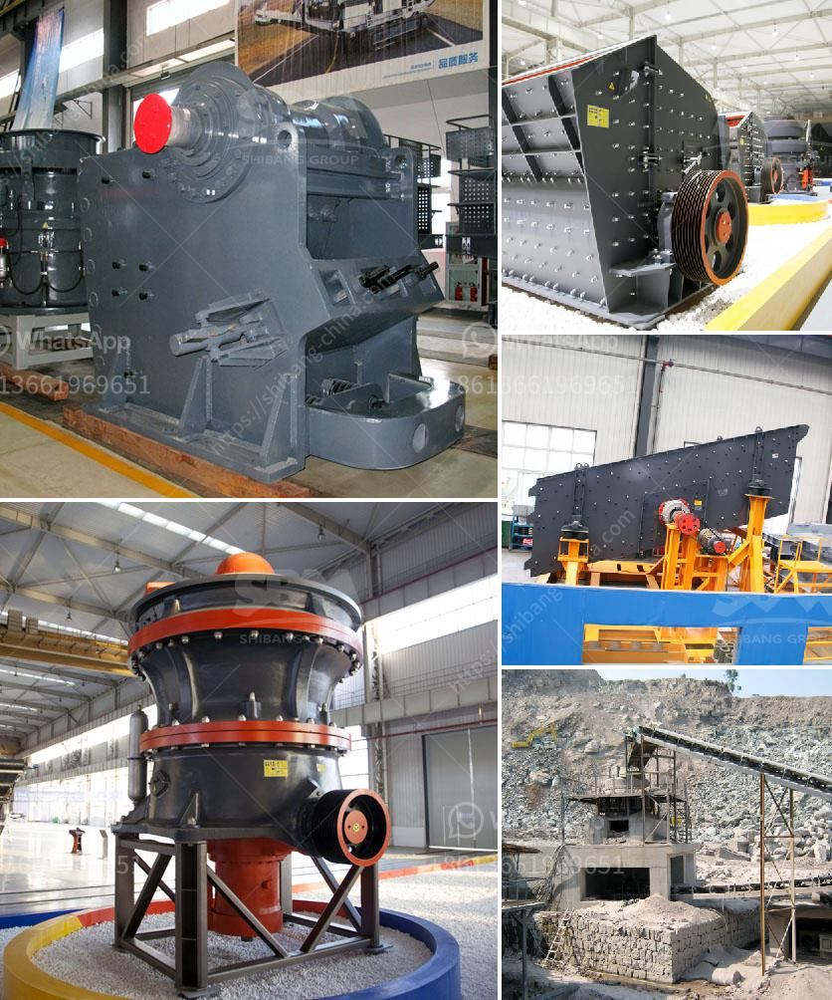

<h3>limestone plant manufacturer in turkey</h3>
Turkey is known for its rich limestone reserves and has a robust limestone industry. The country is a major limestone producer and exporter, and many limestone plant manufacturers are located in Turkey. These manufacturers play a crucial role in the limestone industry by providing high-quality equipment and machinery used in limestone processing and production.

Limestone, a sedimentary rock composed mainly of calcium carbonate, is widely used in various industries. It is used as a raw material in the production of cement, steel, lime, and other chemicals. Limestone is also used as a construction material for buildings, roads, and other infrastructure projects. With such diverse applications, the demand for limestone plants and equipment is consistently high.

Limestone plant manufacturers in Turkey offer a wide range of machinery for various stages of limestone processing. These manufacturers provide crushers, mills, and other equipment used in the crushing and grinding process of limestone. They also offer limestone kilns and furnaces for the production of lime, an essential ingredient in various industries.

What sets Turkish limestone plant manufacturers apart is their expertise and experience in the industry. They have been serving the limestone industry for many years and have a deep understanding of the requirements and challenges faced by limestone producers. This allows them to design and manufacture equipment that meets the specific needs of their clients.

Moreover, limestone plant manufacturers in Turkey adhere to international quality standards and use advanced technology in their manufacturing process. This ensures that their equipment is efficient, durable, and reliable, thereby maximizing productivity and minimizing downtime for their clients.

The limestone industry in Turkey is thriving, thanks to the contributions of limestone plant manufacturers. Their high-quality machinery and equipment enable limestone producers to efficiently process and produce limestone for various applications. With increasing demand for limestone, these manufacturers continue to play a crucial role in Turkey's limestone industry and help the country maintain its position as a leading limestone producer and exporter.
<h3>Contact us</h3><ul><li><strong>Whatsapp:&nbsp;<a href="https://wa.me/8613661969651">+8613661969651</a></strong></li><li><a href="https://swt.shibang-china.com/?git&amp;zhl&amp;limestone plant manufacturer in turkey"><strong>Online Service(chat now)</strong></a></li></ul><h3>Related</h3><ul><li><a href='kenya cement plant.md'>kenya cement plant</a></li><li><a href='gravel pebbles mining south africa.md'>gravel pebbles mining south africa</a></li><li><a href='buy mobile crusher.md'>buy mobile crusher</a></li><li><a href='mobile crusher japan.md'>mobile crusher japan</a></li><li><a href='how to maintain stone crusher daily accounts in tally.md'>how to maintain stone crusher daily accounts in tally</a></li></ul>