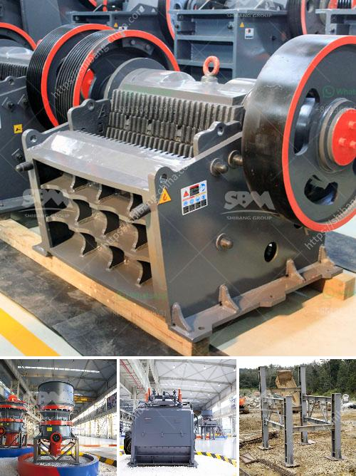

<h3>limestone powder conveying system</h3>
Limestone powder conveying systems are widely used in various industries to efficiently and quickly transport bulk materials from one location to another. These systems are especially popular in industries such as mining, construction, and agriculture where limestone powder is commonly used as a raw material.

Limestone powder is a versatile material that is used in a multitude of applications. It is a key ingredient in cement production, acting as a filler and providing strength to the final product. Additionally, limestone powder is used in the manufacturing of glass, ceramics, and fertilizers.

To effectively convey limestone powder, it is essential to have a reliable conveying system in place. The system needs to be able to handle the abrasive nature of limestone powder and transport it without causing excessive wear or damage to the equipment.

One commonly used type of conveying system for limestone powder is the pneumatic conveying system. This system works by using air to transport the powder through a pipeline. A blower or compressor is used to generate the air flow, which carries the powder from the source to the destination.

Pneumatic conveying systems are preferred for limestone powder because they are highly flexible and can easily transport the material over long distances. They are also able to handle high capacities, making them suitable for large-scale operations.

To ensure the efficient operation of a pneumatic conveying system for limestone powder, several components need to be considered. These include the blower or compressor, the pipeline, and the air filtration system.

The blower or compressor is responsible for generating the air flow that carries the limestone powder through the pipeline. It needs to be sized appropriately to handle the required capacity and pressure. The pipeline should be selected based on factors such as the material's flow characteristics and the desired conveying velocity.

Additionally, an air filtration system is essential to prevent the escape of limestone dust into the surrounding environment. This is especially important in industries where dust control is a regulatory requirement. The filtration system should be designed to efficiently remove dust particles from the conveying air and ensure a clean working environment.

Regular maintenance and monitoring of the conveying system are crucial to ensure its optimal performance. This includes inspecting the pipeline for any signs of wear or blockages, checking the blower or compressor for proper functioning, and cleaning the filtration system as necessary.

In conclusion, limestone powder conveying systems play a vital role in various industries by efficiently transporting bulk materials. Pneumatic conveying systems are commonly used due to their flexibility, high capacity, and ability to handle abrasive materials. Properly sizing and maintaining the system's components, such as the blower or compressor, pipeline, and air filtration system, are essential for optimal performance. By implementing an effective conveying system, industries can enhance their operational efficiency and ensure the safe and efficient transportation of limestone powder.
<h3>Contact us</h3><ul><li><strong>Whatsapp:&nbsp;<a href="https://wa.me/8613661969651">+8613661969651</a></strong></li><li><a href="https://swt.shibang-china.com/?git&amp;zhl&amp;limestone powder conveying system"><strong>Online Service(chat now)</strong></a></li></ul><h3>Related</h3><ul><li><a href='company in japan dealing in portable crusher machine.md'>company in japan dealing in portable crusher machine</a></li><li><a href='manganese processing plant in india.md'>manganese processing plant in india</a></li><li><a href='gold processing per hour.md'>gold processing per hour</a></li><li><a href='crusher machine for sale philippines.md'>crusher machine for sale philippines</a></li><li><a href='small scale gold mining using stamp mill.md'>small scale gold mining using stamp mill</a></li></ul>