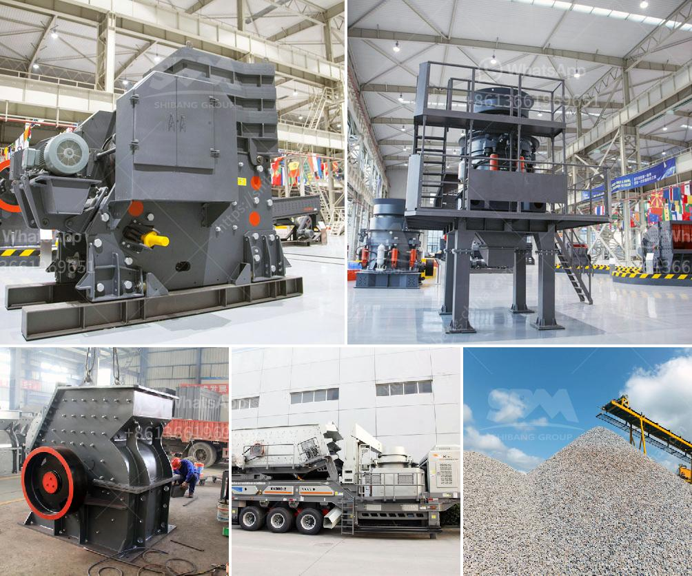

<h3>limestone production equipment</h3>
Limestone is a sedimentary rock composed mostly of calcium carbonate in the form of calcite or aragonite. It is used as a raw material in the production of cement, building stones, and lime, as well as in agriculture to enhance the fertility of soil. To meet the high demand for limestone, specialized equipment is needed to efficiently mine and process the mineral.

One crucial piece of equipment in limestone production is the crusher, which is primarily used to crush the limestone into smaller particles. This machine consists of a stationary plate and a pivoting arm, with the plate exerting pressure on the limestone as it moves against the arm. Crushers reduce the size of the limestone by breaking it into smaller fragments, making it easier to transport and process.

Once the limestone is crushed, it needs to undergo further processing. One common method is calcination, which involves heating the limestone at high temperatures to produce lime. Lime is used in a variety of applications, including making cement, purifying iron ore, and treating wastewater. To perform calcination, limestone production equipment includes rotary kilns, which are large cylindrical furnaces where the limestone is heated.

Another essential equipment in limestone production is the ball mill, a horizontal machine with rotating cylinders filled with steel balls. In this grinding process, the balls crush and grind the limestone into a fine powder. The resulting limestone powder can be used in various applications, such as in construction materials and agriculture.

Lastly, specialized equipment like dust collectors may also be necessary in limestone production to minimize the release of particulate matter into the environment. Dust collectors help capture and filter out the dust generated during the mining, crushing, and grinding processes, ensuring a cleaner and safer working environment.

In conclusion, limestone production requires specialized equipment to efficiently mine, crush, and process the mineral. Crushers, rotary kilns, ball mills, and dust collectors are among the primary equipment used in limestone production. With these machines, limestone can be transformed into various products used in construction, industry, agriculture, and more.
<h3>Contact us</h3><ul><li><strong>Whatsapp:&nbsp;<a href="https://wa.me/8613661969651">+8613661969651</a></strong></li><li><a href="https://swt.shibang-china.com/?git&amp;zhl&amp;limestone production equipment"><strong>Online Service(chat now)</strong></a></li></ul><h3>Related</h3><ul><li><a href='hammer mill nigeria.md'>hammer mill nigeria</a></li><li><a href='portal gold mining machine.md'>portal gold mining machine</a></li><li><a href='aggregate washing plant.md'>aggregate washing plant</a></li><li><a href='clinker grinding machine.md'>clinker grinding machine</a></li><li><a href='impact crusher in lima peru.md'>impact crusher in lima peru</a></li></ul>