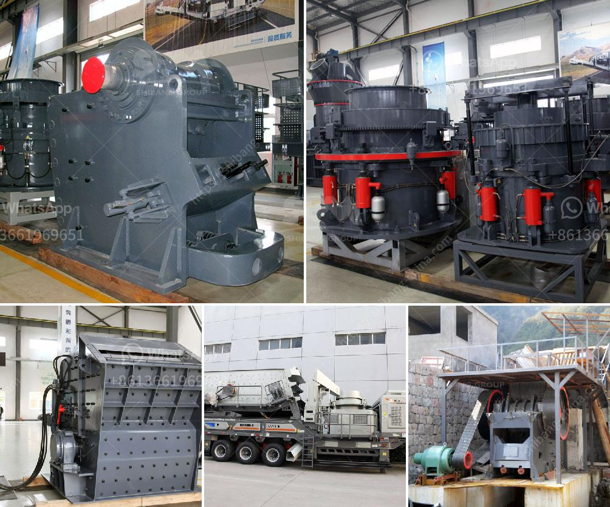

<h3>limestone production process</h3>
Limestone is a sedimentary rock composed mainly of calcium carbonate (CaCO3) that is formed over millions of years. It is a primary component in the construction industry as it is widely used in the production of cement, lime, and crushed stone.

The process of extracting limestone from the ground involves blasting rocks from underground and transporting them to a crushing plant, where they are crushed and divided into different sizes. The crushed limestone is then stored in stockpiles before being ground to a fine powder for use in various applications.

One of the primary uses of limestone is the production of cement. In this process, limestone is combined with other materials, such as clay or shale, and heated to a high temperature in a rotary kiln. This heating process, known as calcination, removes carbon dioxide from the limestone, resulting in the formation of calcium oxide or quicklime. The quicklime is then combined with water to produce hydrated lime, which is used in various construction applications, including mortar and plaster.

Limestone is also used in the manufacturing of glass and steel. When heated at high temperatures, limestone decomposes to release carbon dioxide, leaving behind calcium oxide or lime. This lime reacts with silica present in sand to form a type of glass known as soda-lime glass. Additionally, limestone is used as a flux in steel production to remove impurities and improve the quality of steel.

Overall, limestone production is a complex process that involves various stages, from the extraction of the raw material to the final product. Its versatile nature makes limestone an essential ingredient in many industries, contributing to the construction and manufacturing sectors worldwide.
<h3>Contact us</h3><ul><li><strong>Whatsapp:&nbsp;<a href="https://wa.me/8613661969651">+8613661969651</a></strong></li><li><a href="https://swt.shibang-china.com/?git&amp;zhl&amp;limestone production process"><strong>Online Service(chat now)</strong></a></li></ul><h3>Related</h3><ul><li><a href='price of roller crusher.md'>price of roller crusher</a></li><li><a href='cement plants for sale.md'>cement plants for sale</a></li><li><a href='roler mill 10 ton per hoursprice.md'>roler mill 10 ton per hoursprice</a></li><li><a href='raymond grinding mill manufacturers in udaipur.md'>raymond grinding mill manufacturers in udaipur</a></li><li><a href='mobile crusher plant for sale.md'>mobile crusher plant for sale</a></li></ul>