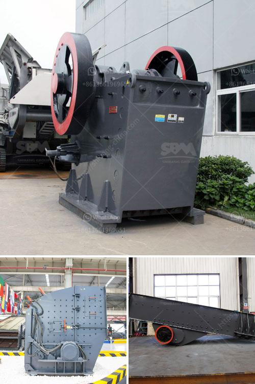

<h3>limestone used for making glass</h3>
When you think of glass, you may envision your favorite drinking glass, a beautiful window, or the shimmering screen of your smartphone. But have you ever wondered how glass is made and what materials are involved in this intricate process? One essential component in the manufacturing of glass is limestone, a versatile and abundant sedimentary rock that plays a crucial role in the transformation of sand into this timeless material.

Limestone, primarily composed of calcium carbonate (CaCO3), is excavated from mines or quarries. Its formation throughout millions of years involves the accumulation of marine organisms, shells, and minerals. With its high calcium content, limestone becomes an integral part of the glassmaking process due to calcium's ability to reduce the melting temperature of silica found in sand.

To create glass, silica sand is the main ingredient. However, silica's melting point is extremely high, reaching nearly 1700 degrees Celsius. By incorporating limestone, the process becomes more efficient as it helps lower the silica's melting point, making the glass production more energy-efficient and cost-effective.

The limestone-silica interaction begins during the fusion stage. As temperatures rise, the limestone decomposes, releasing carbon dioxide (CO2) gas in a process known as calcination. The calcium oxide (CaO), or lime, formed during calcination reacts with the silica, forming calcium silicate (CaSiO3). This reaction is crucial as it reduces the amount of energy required to melt the silica, thus making the glassmaking process more manageable.

Moreover, limestone offers another critical advantage in glass production, providing stability and durability to the material. With the addition of limestone, the glass becomes stronger and more resistant to external forces. This enhanced strength allows manufacturers to create a wide variety of glass products, ranging from delicate glassware to sturdy architectural structures like windows and skyscrapers.

The versatility of limestone does not end there; it also serves as a fluxing agent. A fluxing agent is a substance that promotes the fusion of materials when heated. In the case of glass production, limestone acts as a flux, aiding in the removal of impurities and enhancing the clarity of the final product. By lowering the melting point of the glass mixture, limestone facilitates the melting process, allowing impurities to fuse together and be easily removed. This results in a clear and transparent glass, perfect for applications such as windows, display panels, and lenses.

Aside from its crucial role in the glass industry, limestone finds application in various other fields. Its versatility is evident in construction, where it is widely used as a building material due to its durability and weather resistance. Limestone is also utilized in agriculture to balance soil pH levels, ensuring optimal conditions for plant growth. Moreover, limestone is a key ingredient in cement production, where its calcium content contributes to the chemical reaction that hardens concrete.

In conclusion, limestone is an indispensable component in the glassmaking process. Its presence helps reduce the melting point of silica, making the production of glass more energy-efficient and cost-effective. Additionally, it enhances the stability, strength, and clarity of glass, allowing for the creation of a multitude of glass products that play a vital role in our daily lives. As we appreciate the beauty and functionality of glass around us, let us not forget the essential role limestone plays in transforming sand into this remarkable material.
<h3>Contact us</h3><ul><li><strong>Whatsapp:&nbsp;<a href="https://wa.me/8613661969651">+8613661969651</a></strong></li><li><a href="https://swt.shibang-china.com/?git&amp;zhl&amp;limestone used for making glass"><strong>Online Service(chat now)</strong></a></li></ul><h3>Related</h3><ul><li><a href='white cement plant machinery manufacturers.md'>white cement plant machinery manufacturers</a></li><li><a href='impact crusher korea.md'>impact crusher korea</a></li><li><a href='coal machinery for coal processing crusher.md'>coal machinery for coal processing crusher</a></li><li><a href='hydraulic jaw crusher 30 x 40.md'>hydraulic jaw crusher 30 x 40</a></li><li><a href='vertical grinding process.md'>vertical grinding process</a></li></ul>