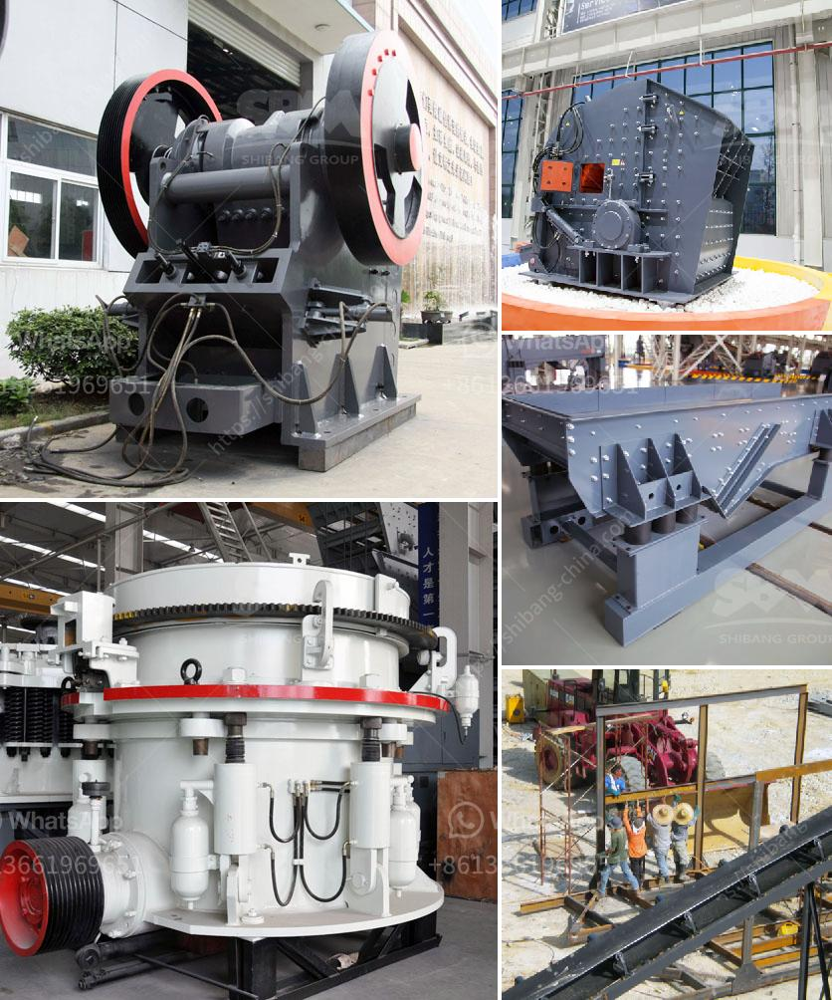

<h3>list of cement factories in nepal</h3>
Nepal, a landlocked country in South Asia, is home to a booming cement industry. The country has seen rapid growth in its infrastructure in recent years, thanks to increasing investments in the cement sector. Today, Nepal has many cement factories that are contributing to the development of the nation's infrastructure.

1. Dangote Cement Nepal Pvt. Ltd.: Dangote Cement Nepal is a subsidiary of the Dangote Group, a multinational conglomerate based in Nigeria. The company has set up a cement plant in Nepal with an investment of around USD 300 million. With a production capacity of 2.2 million tonnes per annum, Dangote Cement Nepal has become one of the largest cement factories in the country.

2. Jagdamba Cement Industries Pvt. Ltd.: Established in 2001, Jagdamba Cement Industries is one of the leading cement manufacturers in Nepal. The company produces various types of cement, including Portland Pozzolana Cement (PPC), Ordinary Portland Cement (OPC), and Sulphate Resistant Cement (SRC). With two cement plants located in Birgunj and Bardiya, Jagdamba Cement has a combined production capacity of 1.7 million tonnes per annum.

3. Shivam Cement Pvt. Ltd.: Shivam Cement, a subsidiary of Shivam Group, is another prominent cement manufacturer in Nepal. Established in 2003, the company has a state-of-the-art cement plant located in Hetauda. With a production capacity of 1.5 million tonnes per annum, Shivam Cement has been supplying cement to various construction projects across the country.

4. Saurabh Group: Saurabh Group is a conglomerate with diversified business interests, including cement manufacturing. The group operates two cement plants in Nepal – Hetauda Cement Industries Ltd. and Makwanpur Cement Ltd. The combined production capacity of these plants is around 1.8 million tonnes per annum.

5. Ambe Cement Pvt. Ltd.: Ambe Cement is a relatively new player in the Nepalese cement industry. The company started its commercial production in 2019 and has already become a popular choice among builders and contractors. Ambe Cement has a modern plant located in Parsa with a capacity of producing 1.2 million tonnes per annum.

6. Sarbottam Cement Pvt. Ltd.: Sarbottam Cement, established in 2010, is known for its high-quality cement products. The company operates a modern plant in Nawalparasi district with a production capacity of 1 million tonnes per annum. Sarbottam Cement has been contributing to the development of the infrastructure sector in Nepal with its innovative and sustainable cement solutions.

These are just a few examples of the many cement factories in Nepal. The cement industry in the country has experienced significant growth in recent years, driven by the government's focus on infrastructure development. Nepal's strategic location, abundance of limestone reserves, and supportive policies have also attracted foreign investment in the cement sector.

The presence of these cement factories has not only boosted the domestic economy but also created employment opportunities for thousands of Nepalese citizens. Moreover, the increased production capacity has reduced the country's reliance on imported cement, making it more self-sufficient in meeting its cement requirements.

As the cement industry in Nepal continues to thrive, it is expected to play a pivotal role in the nation's journey towards economic prosperity and sustainable development. The cement factories listed here are actively contributing to this journey by providing high-quality cement that is essential for the construction of roads, bridges, buildings, and other infrastructure projects.
<h3>Contact us</h3><ul><li><strong>Whatsapp:&nbsp;<a href="https://wa.me/8613661969651">+8613661969651</a></strong></li><li><a href="https://swt.shibang-china.com/?git&amp;zhl&amp;list of cement factories in nepal"><strong>Online Service(chat now)</strong></a></li></ul><h3>Related</h3><ul><li><a href='limestone used for making glass.md'>limestone used for making glass</a></li><li><a href='stone crushers machine price in nepal.md'>stone crushers machine price in nepal</a></li><li><a href='hammer crushers price.md'>hammer crushers price</a></li><li><a href='manufacturers of coal mill in india.md'>manufacturers of coal mill in india</a></li><li><a href='vertical grinder mill machine.md'>vertical grinder mill machine</a></li></ul>