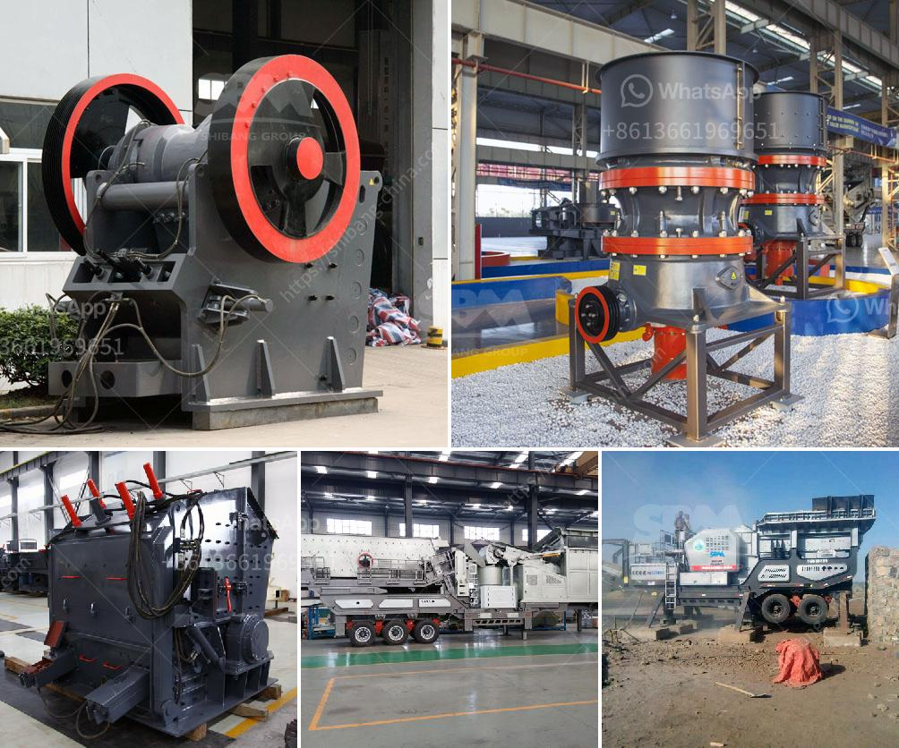

<h3>list of cement plants and their capacities</h3>
Cement is a crucial building material that plays a vital role in the construction industry. It is manufactured through a finely-controlled chemical process, utilizing a combination of limestone, clay, and other minerals. In this article, we will explore a list of notable cement plants worldwide, highlighting their respective capacities and the significance they possess in meeting the growing global demand for cement.

China is the largest producer and consumer of cement globally, representing approximately 57% of the total cement production. The country hosts numerous prominent cement plants, and some of the notable ones include the Taiheiyo Cement Corporation, Anhui Conch Cement Company, and China National Building Material Group Corporation (CNBM). These companies boast massive production capacities ranging between 100 and 200 million metric tons per year.

India holds the second spot in cement production, constituting around 7% of global production capacity. The country has several renowned companies, such as UltraTech Cement, Shree Cement, and Ambuja Cements, with capacities varying from 20 million metric tons per annum to over 100 million metric tons.

The United States is a significant player in the cement industry, producing approximately 2% of the worldwide cement output. Among the prominent cement manufacturers in the US are Cemex, LafargeHolcim, and Heidelberg Cement. With an average production capacity of 10-20 million metric tons per year, these plants cater to both domestic and international markets.

Iran is known for its vast cement industry, shaped by companies like Iran Cement (Iran’s largest cement producer), Sepahan Cement, and Fars & Khuzestan Cement. Iran's cement production capacity stands at approximately 90 million metric tons annually.

Nigeria boasts several cement plants producing millions of metric tons yearly, including Dangote Cement, Lafarge Africa Plc, and BUA Cement, among others. These companies have extensive distribution networks, enabling them to meet the cement demands of not only Nigeria but also the neighboring countries within West Africa.

As the largest cement producer in Latin America, Brazil houses prominent companies like Votorantim Cimentos, InterCement, and CRH, with capacities ranging from 6 to 60 million metric tons per year. Brazil's strategic geographic location bolsters its position as a cement exporter, fulfilling demands in nearby regional markets as well.

Cement plants worldwide contribute significantly to the construction industry, enabling the creation of vital infrastructure. The list mentioned above highlights some of the notable countries and their cement production capacities. The cement industry's constant growth is fueled by the increasing urbanization, infrastructure development, and population growth experienced globally. As cement consumption continues to rise, these plants and their capacities serve as pillars for meeting the surging global demand for construction materials.
<h3>Contact us</h3><ul><li><strong>Whatsapp:&nbsp;<a href="https://wa.me/8613661969651">+8613661969651</a></strong></li><li><a href="https://swt.shibang-china.com/?git&amp;zhl&amp;list of cement plants and their capacities"><strong>Online Service(chat now)</strong></a></li></ul><h3>Related</h3><ul><li><a href='calcium carbonate crushers.md'>calcium carbonate crushers</a></li><li><a href='hammer mill machines in indonesia.md'>hammer mill machines in indonesia</a></li><li><a href='gypsum portland cement retarder manufacturer usa.md'>gypsum portland cement retarder manufacturer usa</a></li><li><a href='cement plant price in pakistan.md'>cement plant price in pakistan</a></li><li><a href='mobile crusher plant for sale.md'>mobile crusher plant for sale</a></li></ul>