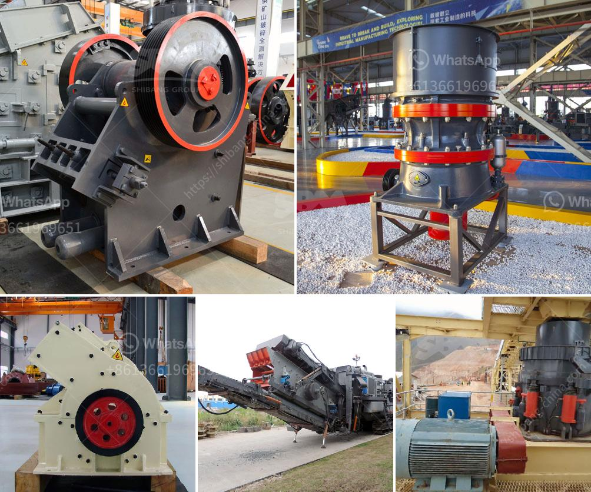

<h3>list of cement plants in nalgonda district</h3>
Nalgonda district, located in the southern state of Telangana, is a prominent industrial hub with several cement plants operating in the region. The presence of these cement plants has not only boosted the local economy but has also contributed to the overall development of the district.

1. Deccan Cements Limited: Established in 1984, Deccan Cements Limited is one of the leading cement manufacturers in Nalgonda district. The company has a production capacity of 2.3 million tons per annum and produces quality cement used in various construction projects across the region.

2. Priya Cement: Priya Cement is a subsidiary of Rain Industries Limited and is known for its advanced manufacturing processes and sustainable practices. With a capacity of 2 million tons per annum, the company has become a trusted name in the cement industry.

3. KCP Limited: KCP Limited, a diversified business group, has a prominent presence in the cement sector. Their cement plant in Nalgonda district has an annual capacity of 1.5 million tons and is known for its high-quality products and commitment to environmental sustainability.

4. Vaishnavi Cements: Vaishnavi Cements, another key player in the cement industry, has a manufacturing unit in Nalgonda. The company is committed to producing eco-friendly cement and has a capacity of 1.2 million tons per annum.

5. Bharathi Cement: Bharathi Cement is a leading cement manufacturer in Nalgonda district and offers a wide range of cement products suitable for various construction purposes. With an annual production capacity of 5 million tons, the company ensures the highest quality standards.

6. My Home Industries Limited: My Home Industries Limited is a renowned cement manufacturer in Nalgonda district. It operates a state-of-the-art cement plant with a capacity of 5 million tons per annum and is known for its innovative and sustainable practices.

These cement plants have not only generated employment opportunities for the local population but have also contributed to the infrastructural growth of Nalgonda district. They play a crucial role in meeting the increasing demand for cement in the region and are committed to maintaining the highest quality standards.

Additionally, these cement plants are actively engaged in various corporate social responsibility initiatives, such as education and healthcare programs for the local communities. They are also committed to adopting environmentally friendly practices and minimizing their carbon footprint.

In conclusion, Nalgonda district is home to several renowned cement plants that have significantly contributed to the development of the region. With their high production capacities and commitment to quality and sustainability, these cement plants have become vital contributors to the growth of the district's industrial sector.
<h3>Contact us</h3><ul><li><strong>Whatsapp:&nbsp;<a href="https://wa.me/8613661969651">+8613661969651</a></strong></li><li><a href="https://swt.shibang-china.com/?git&amp;zhl&amp;list of cement plants in nalgonda district"><strong>Online Service(chat now)</strong></a></li></ul><h3>Related</h3><ul><li><a href='manufacturer of vertical coal pulverizer mill.md'>manufacturer of vertical coal pulverizer mill</a></li><li><a href='feasibility study for stone crusher plants.md'>feasibility study for stone crusher plants</a></li><li><a href='ball mill supplier in pune.md'>ball mill supplier in pune</a></li><li><a href='ball mill in hindi.md'>ball mill in hindi</a></li><li><a href='low cost gold mining equipment.md'>low cost gold mining equipment</a></li></ul>