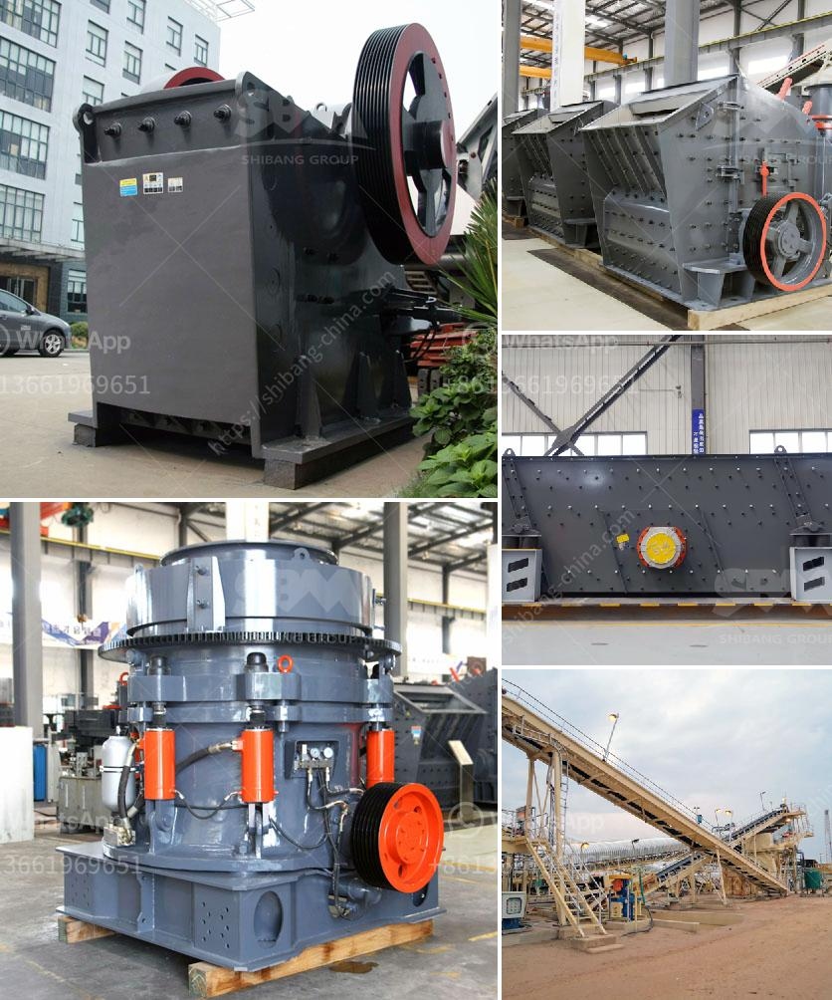

<h3>list of iron ore mining companies in china</h3>
China is arguably the world's largest producer of iron ore, accounting for a significant amount of global output. The country's rapid economic development has led to a surge in demand for iron ore, making it a key player in the global market. As a result, China has established numerous iron ore mining companies, contributing to its dominance in the industry.

One of the largest iron ore mining companies in China is Vale, a Brazilian multinational mining corporation. It is the world's largest producer of iron ore and nickel. In China, Vale operates the Wuhan Iron and Steel Corporation (WISCO) in partnership with local government-owned companies. Through this joint venture, Vale has access to the rich iron ore resources in China.

Another major player in China's iron ore mining industry is BHP, an Anglo-Australian multinational mining, metals, and petroleum company. BHP is known for its extensive operations in Pilbara, Western Australia, which contributes to a significant portion of global iron ore supply. In China, BHP operates the Yandi, Mining Area C, and Southern Flank iron ore projects.

Among the domestic Chinese iron ore mining companies, one notable player is Ansteel Group. Ansteel is a state-owned enterprise involved in the production of iron, steel, and other metal products. It operates several iron ore mines in China and has joint ventures with other mining companies, such as Vale.

Shandong Iron and Steel Group is another prominent Chinese iron ore mining company. It is a state-owned enterprise with operations in mining, steel production, and processing. Shandong Iron and Steel Group has numerous iron ore mines in China and also holds stakes in overseas mining projects.

China National Steel Group Corporation (CNSGC), formerly known as Wuhan Iron and Steel Corporation (WISCO), is also a significant player in the Chinese iron ore mining industry. It is a state-owned enterprise that operates mines in China and has investments in mining projects overseas. CNSGC is involved in the full supply chain of iron ore, from mining and beneficiation to steel production.

These are just a few examples of the many iron ore mining companies in China. The country's vast resources, coupled with its manufacturing and construction activities, have fueled the growth of the iron ore industry. China's demand for iron ore is expected to remain strong in the coming years, driving further investment in these mining companies. With the continuous expansion and modernization of their operations, Chinese iron ore mining companies will continue to be at the forefront of the global iron ore market.
<h3>Contact us</h3><ul><li><strong>Whatsapp:&nbsp;<a href="https://wa.me/8613661969651">+8613661969651</a></strong></li><li><a href="https://swt.shibang-china.com/?git&amp;zhl&amp;list of iron ore mining companies in china"><strong>Online Service(chat now)</strong></a></li></ul><h3>Related</h3><ul><li><a href='concrete crusher price.md'>concrete crusher price</a></li><li><a href='china stone crusher machine.md'>china stone crusher machine</a></li><li><a href='iron sand arator in philippines.md'>iron sand arator in philippines</a></li><li><a href='dolomite refractory processing.md'>dolomite refractory processing</a></li><li><a href='marble crushing plants.md'>marble crushing plants</a></li></ul>