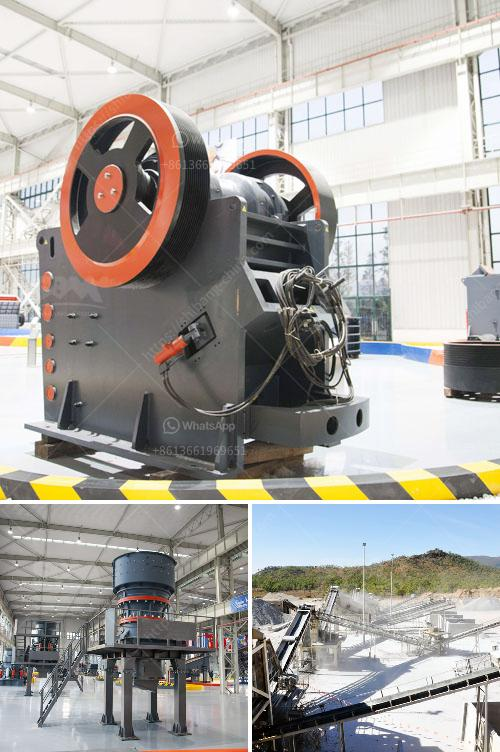

<h3>list of manufacturers vertical milling machines in europe</h3>
Vertical milling machines are essential tools in the manufacturing industry. These machines are used to shape and cut solid materials such as metal, wood, and plastic, and are widely used in various sectors including automotive, aerospace, and construction. Europe is known for its strong manufacturing base, and many top-quality vertical milling machine manufacturers are based in this region. In this article, we will explore a list of manufacturers of vertical milling machines in Europe.

1. DMG MORI: DMG MORI is a global player in the machine tool industry, with its headquarters in Germany. The company offers a wide range of vertical milling machines suitable for various applications and industries. Their machines are known for their high precision, reliability, and technological innovation.

2. Haas Automation: Based in the United States, Haas Automation has a strong presence in Europe with its manufacturing facilities in Belgium and the United Kingdom. Their vertical milling machines are known for their flexibility, speed, and accuracy. Haas machines are widely used in the automotive and aerospace industries.

3. Hurco: Hurco is a leading manufacturer of vertical milling machines with its European headquarters in Germany. The company specializes in designing and manufacturing machines with advanced control technology for increased productivity and accuracy.

4. Fadal: Fadal is a well-known American manufacturer of vertical machining centers, with a strong presence in Europe. Their machines are known for their ruggedness, reliability, and high precision. Fadal machines are widely used in the aerospace, automotive, and mold-making industries.

5. Bridgeport: Bridgeport is a historic brand in the milling machine industry, known for its iconic bevel gear head design. Although the original Bridgeport company is American, they have a strong presence in Europe through their authorized distributors. Bridgeport machines are known for their durability, accuracy, and versatility.

6. Amada: Amada is a Japanese manufacturer with a strong presence in Europe. They specialize in vertical milling machines for the metalworking industry and are renowned for their precision, speed, and reliability. Amada machines are widely used in the automotive, aerospace, and electronics sectors.

7. DMG MORI: DMG MORI, as mentioned earlier, also has a strong presence in Europe, with several manufacturing facilities across the region. Their vertical milling machines offer advanced features such as multitasking capabilities, automated tool changers, and high-speed spindles.

8. Makino: Makino is a Japanese manufacturer known for its advanced technology and high-quality vertical milling machines. They have a strong presence in Europe and offer machines that are capable of high-speed machining, high precision, and excellent surface finishes.

9. Mazak: Mazak is a globally recognized brand in the machine tool industry, with its European headquarters in the United Kingdom. Mazak vertical milling machines are known for their advanced control systems, high accuracy, and flexibility. They are widely used in industries such as aerospace, automotive, and medical.

10. Okuma: Okuma is a Japanese manufacturer of vertical milling machines with a strong presence in Europe. Their machines are renowned for their durability, reliability, and advanced features such as multitasking capabilities and high-speed cutting.

In conclusion, Europe is home to several top-notch manufacturers of vertical milling machines. These manufacturers offer a wide range of machines with advanced features, high precision, and reliability. Whether you are in the automotive, aerospace, or any other manufacturing sector, vertical milling machines from European manufacturers are a reliable choice for your machining needs.
<h3>Contact us</h3><ul><li><strong>Whatsapp:&nbsp;<a href="https://wa.me/8613661969651">+8613661969651</a></strong></li><li><a href="https://swt.shibang-china.com/?git&amp;zhl&amp;list of manufacturers vertical milling machines in europe"><strong>Online Service(chat now)</strong></a></li></ul><h3>Related</h3><ul><li><a href='sample proposal to supply mining equipment.md'>sample proposal to supply mining equipment</a></li><li><a href='portable mobile stone crushing plants.md'>portable mobile stone crushing plants</a></li><li><a href='gold mining business plan ghana.md'>gold mining business plan ghana</a></li><li><a href='to calculate cost of limestone production in mining.md'>to calculate cost of limestone production in mining</a></li><li><a href='ball grinding mill.md'>ball grinding mill</a></li></ul>