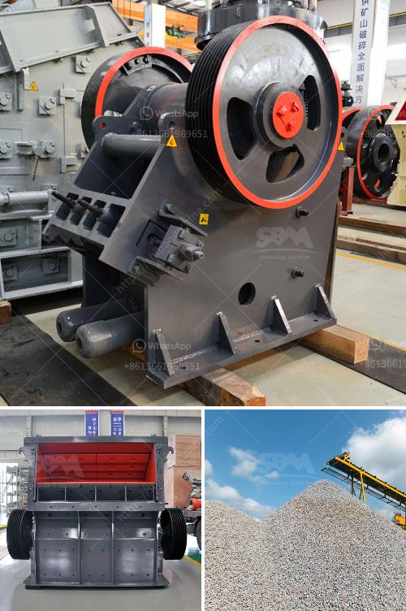

<h3>lme copper ore price calculations</h3>
The London Metal Exchange (LME) is a prominent global marketplace for trading base metals, including copper. LME copper prices serve as a benchmark for copper traders and producers worldwide as they determine the value of the red metal in the market. Understanding the intricacies of LME copper ore price calculations is crucial for industry participants to make informed trading decisions.

The LME copper price calculations are based on several factors, including supply and demand dynamics, macroeconomic variables, and market sentiment. The basic principle behind these calculations is to determine the equilibrium between the copper supply and demand, thereby estimating its fair value in the market.

The primary reference point for LME copper prices is the cash price, which represents the current market value of immediate delivery of copper. It is determined by the balance of the physical supply and demand for copper at a specific point in time. Traders use the cash price as a benchmark to negotiate long-term contracts and settle forward contracts.

Although the cash price serves as the starting point, LME copper prices also incorporate the cost of carrying copper inventory. This is represented by the 3-month price, which reflects the cost of warehousing and financing the metal for three months. The 3-month price includes the cost of interest, insurance, and storage fees. It is typically higher than the cash price due to the additional expenses associated with holding copper inventory.

The LME copper prices are denominated in US dollars per metric ton, which allows for easy comparison among different currencies. However, the exchange rate between the US dollar and other currencies can significantly impact the price of copper for market participants outside the United States. Fluctuations in exchange rates can introduce additional uncertainty into the pricing calculations and influence the decision-making process of traders.

To calculate the LME copper ore price, traders and industry participants should also consider the various fees and charges associated with trading on the LME. These include transaction fees, delivery fees, and membership fees, among others. These costs are typically factored into the final price paid or received in the market.

Furthermore, macroeconomic variables such as interest rates, inflation, and economic growth play a crucial role in determining LME copper prices. Changes in these factors can impact the level of demand for copper, leading to fluctuations in prices. For instance, during periods of economic expansion, demand for copper from industries such as construction and manufacturing tends to increase, driving up prices. Conversely, during economic downturns, demand may decrease, causing copper prices to decline.

Lastly, market sentiment and investor behavior can also influence LME copper ore price calculations. Sentiment is often driven by geopolitical events, government policies, and speculator activity. Positive sentiment can lead to higher prices, while negative sentiment can result in lower prices. Therefore, staying updated with the latest news, market trends, and investor sentiment is crucial for accurately assessing LME copper prices.

In conclusion, understanding the intricacies of LME copper ore price calculations is vital for industry participants to navigate the dynamic copper marketplace. Factors such as supply and demand dynamics, inventory costs, exchange rates, fees and charges, macroeconomic variables, and market sentiment all play a role in determining LME copper prices. By keeping a close eye on these factors, traders and producers can make informed decisions and effectively manage their copper-related activities.
<h3>Contact us</h3><ul><li><strong>Whatsapp:&nbsp;<a href="https://wa.me/8613661969651">+8613661969651</a></strong></li><li><a href="https://swt.shibang-china.com/?git&amp;zhl&amp;lme copper ore price calculations"><strong>Online Service(chat now)</strong></a></li></ul><h3>Related</h3><ul><li><a href='coal grinding plant.md'>coal grinding plant</a></li><li><a href='cement plant for sale south africa.md'>cement plant for sale south africa</a></li><li><a href='quartz stone machine price.md'>quartz stone machine price</a></li><li><a href='jaw crusher for sale uk.md'>jaw crusher for sale uk</a></li><li><a href='barite jaw crusher manufacturing companies.md'>barite jaw crusher manufacturing companies</a></li></ul>