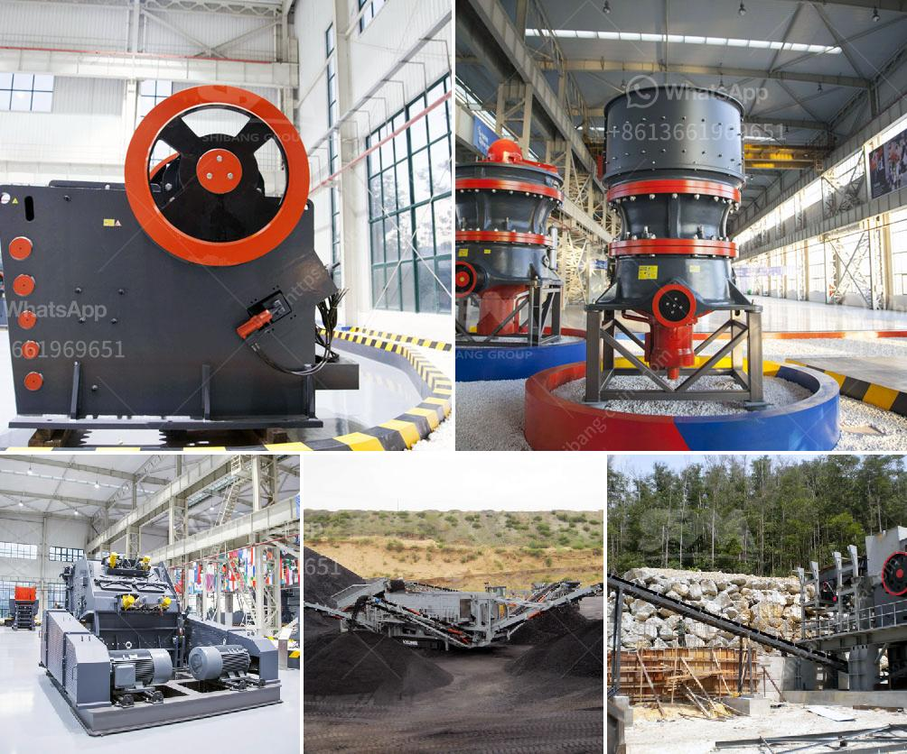

<h3>lokomo jaw crusher</h3>
The Lokomo Jaw Crusher is a reliable and efficient piece of equipment that can serve many different industries. This jaw crusher has the benefits of dependable operation, easy maintenance and low operating costs. It is built for high crushing performance and can handle any hard or abrasive material.

Lokomo is known for its sturdy and durable construction, which results in the crusher being able to withstand even the toughest of materials. It is made from high-quality materials, including manganese steel, which is renowned for its wear resistance. This ensures that the Lokomo jaw crusher is able to handle heavy-duty tasks without wearing down or breaking.

The Lokomo jaw crusher is available in two different configurations: stationary and portable. The stationary model is suitable for those looking for high performance crushing in a fixed position, while the portable model offers the flexibility to be moved around different worksites. This makes it an ideal choice for construction projects or for companies needing a crusher that can be easily transported.

One of the key features of the Lokomo jaw crusher is its ease of maintenance. The crusher is designed with a hydraulically adjustable jaw setting, allowing you to optimize the crushing performance and capacity based on your specific needs. This feature also makes it easier to adjust the jaw plate, ensuring a uniform crushing result and reducing any potential downtime for maintenance.

In addition, the Lokomo jaw crusher has a unique and easy-to-use control panel that allows for simple operation and monitoring of the crusher's performance. This makes it easy for operators to adjust the settings and maintain peak performance without the need for extensive technical knowledge.

The Lokomo jaw crusher is also known for its low operating costs. It consumes less energy compared to other crushers in its class, which translates to lower fuel consumption and reduced operational expenses. This makes it a cost-effective solution for companies seeking a jaw crusher that not only delivers exceptional performance but also helps save on operating costs.

Overall, the Lokomo jaw crusher is a reliable and efficient piece of equipment that offers exceptional performance, durability and value for money. Whether you need a crusher for a construction project or for your company's mining operations, the Lokomo jaw crusher is a reliable choice. Its sturdy construction, easy maintenance and low operating costs make it a cost-effective solution that can handle even the toughest materials.

In conclusion, the Lokomo jaw crusher is a versatile and reliable machine that offers the performance and durability needed for demanding crushing applications. Its ease of maintenance, low operating costs and high crushing capacity make it a valuable asset for any industry needing a reliable crushing solution.
<h3>Contact us</h3><ul><li><strong>Whatsapp:&nbsp;<a href="https://wa.me/8613661969651">+8613661969651</a></strong></li><li><a href="https://swt.shibang-china.com/?git&amp;zhl&amp;lokomo jaw crusher"><strong>Online Service(chat now)</strong></a></li></ul><h3>Related</h3><ul><li><a href='fly ash processing plant for sale.md'>fly ash processing plant for sale</a></li><li><a href='how to made talcum powder.md'>how to made talcum powder</a></li><li><a href='clay processing clay processing south africa.md'>clay processing clay processing south africa</a></li><li><a href='stone crusher plant in westbengal.md'>stone crusher plant in westbengal</a></li><li><a href='vibrating screen manufacturers in china.md'>vibrating screen manufacturers in china</a></li></ul>