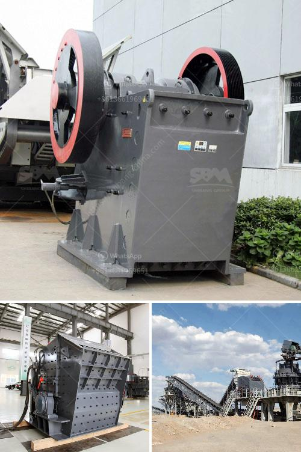

<h3>low cost gold mining equipment gold mining equipment</h3>
Gold mining has been a lucrative investment opportunity for ages. With the soaring prices of gold and the increasing demand for this precious metal, individuals and companies have ventured into gold mining to reap the profits. However, to engage in successful gold mining, one must have the right equipment. In this article, we will discuss low-cost gold mining equipment that can aid in maximizing profits while reducing expenses.

One essential piece of gold mining equipment is the gold pan, a simple and effective tool for capturing gold particles from water. With prices as low as $10, a gold pan is a practical investment for both amateur and professional gold miners. This versatile tool can be used in various locations such as rivers, streams, and even in the comfort of one's backyard.

Another low-cost gold mining equipment is the gold sluice box. This long, narrow channel is placed in rivers or streams to capture gold particles from water flow. The gold sluice box uses the natural flow of water to separate gold from other sediments and materials. Starting at as low as $50, a gold sluice box can be a valuable addition to any gold mining operation.

Investing in a gold trommel is another low-cost option for gold mining equipment. A gold trommel is a rotating drum that separates gold-bearing materials from other unwanted rocks, stones, and sediments. This tool is especially useful in large-scale mining operations where tons of materials need to be processed. With prices starting at $500, a gold trommel can be a sound investment for those looking to maximize their gold mining production.

For those with a higher budget, investing in a gold dredge can significantly increase gold recovery capabilities. A gold dredge is a machine that extracts gold from gravel and sand using a suction system. This powerful tool can process large amounts of gold-bearing materials in a short period. While a gold dredge can be costly, with prices ranging from $2,000 to $10,000, the potential profits it brings make it a worthwhile investment for serious gold miners.

Finally, investing in gold mining equipment allows for better efficiency and higher productivity. Utilizing efficient and cost-effective equipment is essential for maximizing profits in gold mining. Therefore, low-cost gold mining equipment can be an excellent option for individuals or companies looking to enter the gold mining industry or expand their current operations without breaking the bank.

In conclusion, there are several low-cost gold mining equipment options available for both amateur and professional gold miners. The gold pan, gold sluice box, gold trommel, and gold dredge are all valuable tools that can aid in maximizing profits while reducing expenses. By investing in low-cost gold mining equipment, individuals and companies can enter the gold mining industry or expand their operations without significant financial burdens. Whether you are a seasoned gold miner or a beginner, choosing the right equipment can make a significant difference in your gold mining success.
<h3>Contact us</h3><ul><li><strong>Whatsapp:&nbsp;<a href="https://wa.me/8613661969651">+8613661969651</a></strong></li><li><a href="https://swt.shibang-china.com/?git&amp;zhl&amp;low cost gold mining equipment gold mining equipment"><strong>Online Service(chat now)</strong></a></li></ul><h3>Related</h3><ul><li><a href='limestone milling machine made in russia.md'>limestone milling machine made in russia</a></li><li><a href='gold wash plant machine in ghana.md'>gold wash plant machine in ghana</a></li><li><a href='slag crushing machine.md'>slag crushing machine</a></li><li><a href='double roller crusher advantages.md'>double roller crusher advantages</a></li><li><a href='kaolin grinding mill.md'>kaolin grinding mill</a></li></ul>