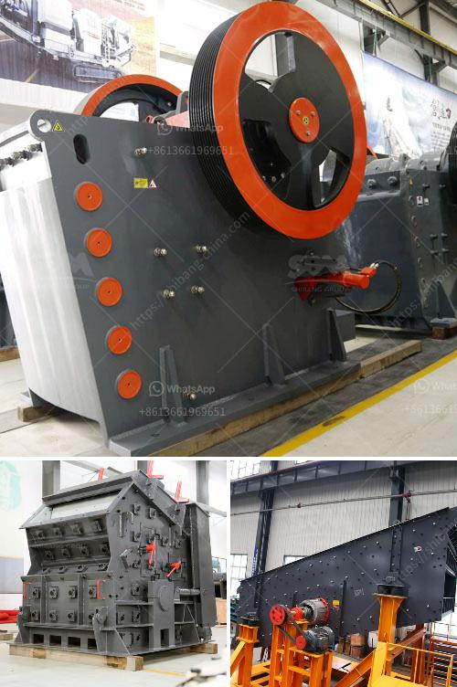

<h3>low cost gold mining equipment</h3>
Finding gold is no easy task. Luckily, there is a wide range of low-cost gold mining equipment available in the market today. Gone are the days where you had to spend a fortune on expensive machinery just to hunt for this valuable metal. With the right tools and equipment, anyone can become a successful gold miner without breaking the bank.

One essential piece of equipment for gold mining is a pan. This traditional tool is inexpensive and highly effective in separating gold from other sediments. Simply submerge the pan in a stream or river and shake it back and forth to allow the water to wash away the dirt and gravel. The gold, being heavier, will settle to the bottom of the pan. With practice, one can quickly master the art of panning and begin finding gold nuggets.

For those looking to take their gold mining efforts to the next level, a sluice box is a must-have. A sluice box is a long, narrow channel with riffles or obstructions along the bottom that is used to trap gold particles. By running water through the box, the heavier gold is caught in the riffles, while the lighter materials wash away. Sluice boxes come in various sizes and materials, but affordable options made of plastic are widely available. They are easy to set up and provide an excellent method for processing larger amounts of material in a short amount of time.

Another low-cost piece of equipment ideal for gold mining is a highbanker. This is a sluice box with a smaller box sitting on top, which is used to classify the material before processing it. Highbankers are an excellent choice for those who want to process larger quantities of material more efficiently. With the addition of a water pump and hoses, a highbanker can be set up to process large volumes of sediment, trapping gold particles in the riffles, just like a traditional sluice box.

While panning, sluicing, and highbanking are three popular methods of gold mining, there are other tools available for different mining scenarios. For instance, a gold concentrator is a device that uses gravity separation to collect fine gold from the sediments. These concentrators are suited for areas where the gold is very fine and difficult to capture using traditional methods.

It’s important to note that no matter the cost or quality of the equipment, success in gold mining largely depends on the individual’s dedication, patience, and knowledge of the area being mined. Proper research and understanding of geological formations, where gold is likely to accumulate, can significantly increase the chances of finding this precious metal.

In conclusion, gold mining doesn't have to be an expensive endeavor. With an array of cost-effective equipment available, anyone can embark on this exciting adventure and potentially strike it rich. From basic panning to more advanced techniques, there is something for every aspiring gold miner. So grab a pan, pick a spot, and start your hunt for that elusive gold today.
<h3>Contact us</h3><ul><li><strong>Whatsapp:&nbsp;<a href="https://wa.me/8613661969651">+8613661969651</a></strong></li><li><a href="https://swt.shibang-china.com/?git&amp;zhl&amp;low cost gold mining equipment"><strong>Online Service(chat now)</strong></a></li></ul><h3>Related</h3><ul><li><a href='two roller mill.md'>two roller mill</a></li><li><a href='components cone crusher and hydraulic system.md'>components cone crusher and hydraulic system</a></li><li><a href='crushers for sale in uae.md'>crushers for sale in uae</a></li><li><a href='hammer mill clays price.md'>hammer mill clays price</a></li><li><a href='vertical grinding process.md'>vertical grinding process</a></li></ul>