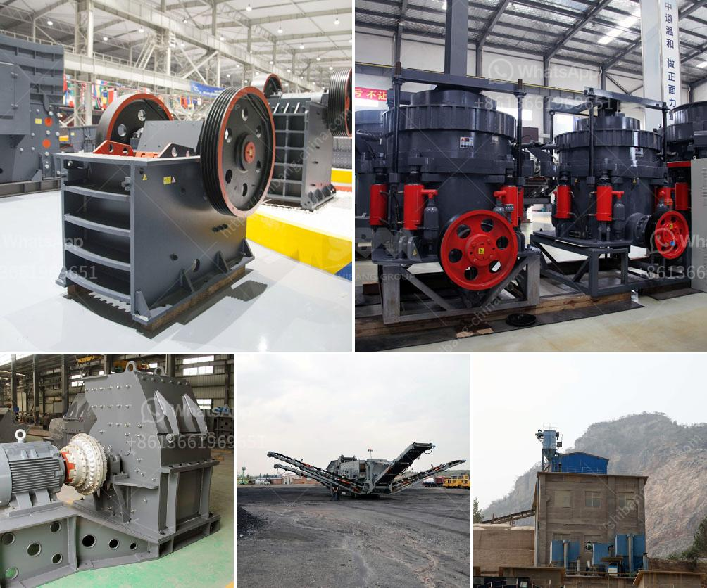

<h3>machine price list ball mill for silica sand</h3>
Silica sand, a natural raw material, is an important component in the production of various industrial products and processes. Silica sand has unique properties that allow it to be used in a wide range of applications, including glass making, foundries, ceramics, construction materials, abrasives, and water filtration systems. One of the key equipment in the silica sand processing industry is the ball mill.

The ball mill is widely used in both wet and dry grinding processes, and it plays a key role in the cement manufacturing process, lime, minerals, coal, and many other industries. With the advancement of technology, the industrial mills are also equipped with advanced features to ensure high performance, excellent durability, and energy efficiency.

When it comes to choosing the right ball mill for silica sand processing, quality, reliability, and budget are key considerations. There are several factors to consider when purchasing a ball mill, such as the equipment's capacity, the industry's specific requirements, and the materials to be processed.

It is important to note that different mills may have unique specifications and capacities. For example, a larger mill with higher capacity may be necessary for high-volume processing plants, while smaller and more portable mills may be suitable for smaller operations. Additionally, the choice between dry or wet milling may affect the selection process, as some mills are specifically designed for one or the other.

The price of a ball mill for silica sand can vary greatly depending on the size, the quality, and the suppliers. However, it is important to consider all the factors that influence the price, such as the reputation of the supplier, the after-sales service provided, and the overall quality of the equipment.

As a general reference, the price range for a high-quality ball mill designed for grinding silica sand can range from $3,000 to $15,000. Smaller mills generally have lower prices, while larger mills tend to be more expensive due to their robust construction and high capacity.

In conclusion, the ball mill is an essential tool in the silica sand processing industry. It is a versatile and efficient machine that helps to reduce operating costs while ensuring high-quality end products. When choosing a ball mill, it is crucial to consider factors such as capacity, specific requirements of the industry, and the materials being processed. The price of the machine varies depending on its size, quality, and suppliers. Therefore, it is important to conduct thorough research and connect with reliable suppliers to make an informed purchasing decision.
<h3>Contact us</h3><ul><li><strong>Whatsapp:&nbsp;<a href="https://wa.me/8613661969651">+8613661969651</a></strong></li><li><a href="https://swt.shibang-china.com/?git&amp;zhl&amp;machine price list ball mill for silica sand"><strong>Online Service(chat now)</strong></a></li></ul><h3>Related</h3><ul><li><a href='tph jaw crusher price.md'>tph jaw crusher price</a></li><li><a href='stone crushing machine suppliers.md'>stone +crushing +machine +suppliers</a></li><li><a href='quarry crusher zimbabwe.md'>quarry crusher zimbabwe</a></li><li><a href='chrome sands washing plant with prices.md'>chrome sands washing plant with prices</a></li><li><a href='quarry machines repairing centre in chennai.md'>quarry machines repairing centre in chennai</a></li></ul>