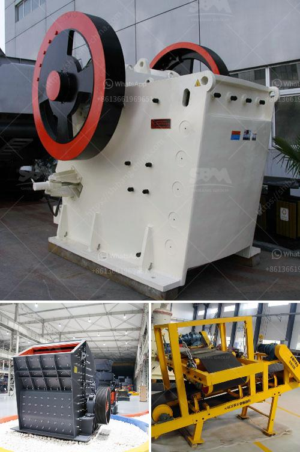

<h3>machine to crush limestone in south africa</h3>
In recent years, South Africa has witnessed a significant growth in the production of lime-based products such as cement, paint, paper, and chemicals due to an increase in demand. This surge in demand has led to the need for efficient limestone crushing machines that can handle large volumes of raw materials effectively.

Limestone is a sedimentary rock composed mostly of calcium carbonate, which is a key component in the manufacturing of cement and lime. It is extracted from quarries and mines all over the world and converted into different grades of stone for various applications. The extraction process involves blasting, drilling, and crushing the stone, which creates dust, emissions, and noise pollution. Therefore, adopting advanced technology in the crushing process is crucial to minimize the negative impact on the environment and the safety of workers.

One of the most efficient machines for crushing limestone is a compression crusher. This equipment can generate tremendous amount of pressure, allowing it to break the stone into smaller pieces. Compression crushers typically have lower horsepower as they do not require the same level of impact energy as impact crushers or hammer mills. This makes them more energy-efficient and cost-effective.

A popular compression crusher model used in the crushing process of limestone in South Africa is the Jaw crusher. This machine is specifically designed for crushing stone and compressing it into smaller pieces. Hardness, such as limestone, is ideal for crushing, as it does not cause significant wear on the crusher itself. With advancements in technologies, manufacturers have improved the jaw crusher to provide greater strength and high crushing capacity.

In addition to jaw crushers, another popular type of limestone crushing machine is the impact crusher. This machine is suitable for crushing and reshaping soft or medium-hard stones. Additionally, it can remove any soluble salts and other impurities present in the limestone. The impact crusher uses striking technique to break down the stone, and it provides superior reduction ratios compared to other types of crushers.

Moreover, apart from jaw and impact crushers, lime production plants in South Africa also use hammer mills to crush limestone. These are high-speed rotating machines that are equipped with hammers and impact plates. They collide with the material, causing it to break apart into smaller pieces. Hammer mills are known for their ability to produce a consistent and uniform particle size distribution, ensuring the quality of the final product.

Machine manufacturers and suppliers in South Africa are constantly striving to improve the efficiency and productivity of their machines. They are investing in research and development to introduce innovative features and implement state-of-the-art technologies. From automated control systems to remote monitoring capabilities, these advancements are making the crushing process more precise, reliable, and safer.

In conclusion, the crushing of limestone is an essential step in the production of lime-based products. A machine that can efficiently crush limestone will significantly contribute to the growth of the lime industry in South Africa. By adhering to the latest technological advancements and ensuring safety during the crushing process, manufacturers and suppliers can continue to meet the increasing demand and promote sustainable development.
<h3>Contact us</h3><ul><li><strong>Whatsapp:&nbsp;<a href="https://wa.me/8613661969651">+8613661969651</a></strong></li><li><a href="https://swt.shibang-china.com/?git&amp;zhl&amp;machine to crush limestone in south africa"><strong>Online Service(chat now)</strong></a></li></ul><h3>Related</h3><ul><li><a href='small mobile crushers.md'>small mobile crushers</a></li><li><a href='vertical mill operating principle.md'>vertical mill operating principle</a></li><li><a href='how to design iron ore plant.md'>how to design iron ore plant</a></li><li><a href='crusehr processing plant malaysia.md'>crusehr processing plant malaysia</a></li><li><a href='mobile rock crusher granulator jaw type ballitoville.md'>mobile rock crusher granulator jaw type ballitoville</a></li></ul>