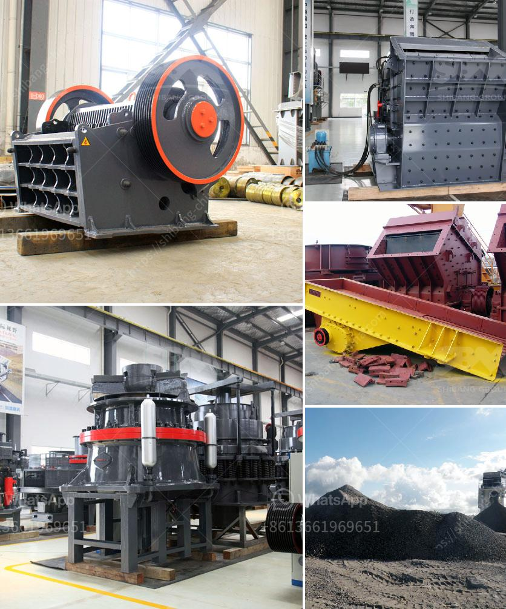

<h3>machinery for quartz stone</h3>
Quartz stone has gained immense popularity in the construction and interior design industries due to its durability, beauty, and low maintenance. As the demand for quartz stone increases, so does the need for efficient machinery that can process and shape this remarkable material. In this article, we will explore the machinery used for quartz stone and how it has revolutionized the stone industry.

One of the key aspects of machinery for quartz stone is its ability to cut and shape the stone with precision and accuracy. Traditional methods such as manual cutting and carving are time-consuming, labor-intensive, and prone to human errors. However, with the advent of sophisticated machinery, the process has become significantly streamlined.

One of the primary machines used in quartz stone processing is the CNC machine. CNC, short for Computer Numerical Control, is a technology that utilizes computer programs to control the movement of machinery. In the case of quartz stone, CNC machines use diamond-tipped cutting tools to carve out intricate designs and shapes. The precision achieved by these machines is astounding, allowing for complex patterns and detailed engravings that were once impossible to achieve.

The CNC machine not only saves time and labor but also enhances the creativity and versatility of quartz stone applications. It enables the creation of unique and customized designs, making quartz stone an ideal choice for interior designers and architects.

Another crucial machine in the quartz stone industry is the polishing machine. After the initial cutting, the stone surface requires polishing to achieve a smooth, glossy finish. Polishing machines are specially designed to rotate abrasive pads at high speeds, removing imperfections and giving the stone a refined appearance.

The introduction of automatic polishing machines has greatly improved the efficiency of the polishing process. These machines can polish multiple slabs simultaneously, reducing the time required for the job. Furthermore, automatic polishing machines ensure consistent quality throughout all the quartz stone slabs, eliminating variations that can occur with manual polishing.

In addition to cutting and polishing, machinery for quartz stone also includes equipment for edge profiling, chamfering, and hole drilling. These machines further enhance the versatility of quartz stone, allowing for a wide range of applications in kitchens, bathrooms, and commercial spaces.

The use of advanced machinery in the quartz stone industry has not only revolutionized the manufacturing process but also increased productivity and reduced costs. The efficiency and precision achieved by these machines have made quartz stone more accessible and affordable for consumers worldwide.

Furthermore, the use of machinery ensures a higher level of quality control in the production of quartz stone. Manufacturers can detect and rectify any defects or inconsistencies, ensuring that the final product meets the highest standards.

In conclusion, the machinery used for quartz stone has significantly transformed the stone industry. From cutting and shaping to polishing and profiling, these machines have revolutionized the manufacturing process, allowing for intricate designs, improved efficiency, and enhanced quality control. As the demand for quartz stone continues to rise, advancements in technology will continue to refine and optimize machinery, further propelling the quartz stone industry forward.
<h3>Contact us</h3><ul><li><strong>Whatsapp:&nbsp;<a href="https://wa.me/8613661969651">+8613661969651</a></strong></li><li><a href="https://swt.shibang-china.com/?git&amp;zhl&amp;machinery for quartz stone"><strong>Online Service(chat now)</strong></a></li></ul><h3>Related</h3><ul><li><a href='quartz powder machine.md'>quartz powder machine</a></li><li><a href='grinding a stone crusher.md'>grinding a stone crusher</a></li><li><a href='toggle jaw crusher.md'>toggle jaw crusher</a></li><li><a href='coal fired power plants contractors in vietnam.md'>coal fired power plants contractors in vietnam</a></li><li><a href='hammer mills price.md'>hammer mills price</a></li></ul>