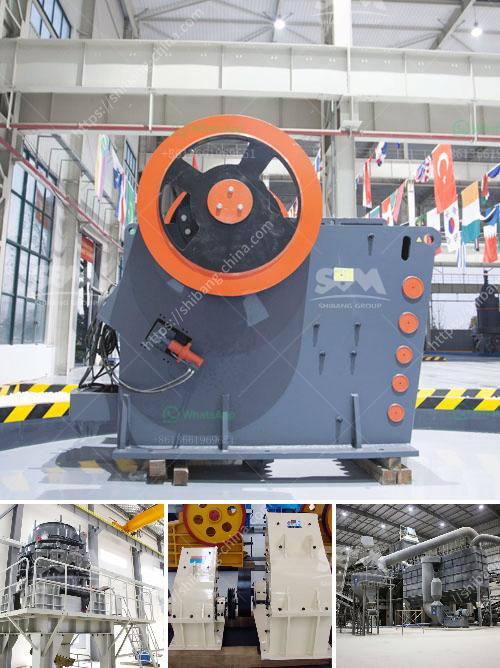

<h3>machines used in sand and gravel quarry philippines</h3>
In the Philippines, sand and gravel quarrying has become a booming industry with the increasing demand for construction materials. In order to meet this demand, quarry operators rely heavily on various types of machinery to extract, crush, and sift through the sand and gravel.

Depending on the specific needs of the project, different machines are used in the quarrying process. For example, a bulldozer can be used to remove overburden before extraction, and a hydraulic excavator can then be used to directly extract the sand and gravel deposits. These machines are equipped with powerful engines and hydraulic systems to enable efficient and precise operations.

Once the materials are extracted, they are usually transported to a crushing plant where they are processed into smaller sizes suitable for construction purposes. Crushers such as jaw crushers and cone crushers are commonly used in these plants to crush the extracted materials into the desired size. Additionally, screens are used to separate the crushed materials into different grades.

Other machines commonly used in sand and gravel quarrying include wheel loaders for loading the materials into trucks or onto conveyor belts, and dump trucks for transporting the materials to their destination. These machines help to streamline the quarrying process and increase overall productivity.

It is worth noting that the use of machines in sand and gravel quarrying has greatly improved efficiency and safety in the industry. They can handle large volumes of materials at a faster pace compared to manual labor, reducing the time and effort required to extract and process the materials. Additionally, the use of machines reduces the risk of workplace accidents, ensuring a safer working environment for quarry workers.

In conclusion, machines play a crucial role in the sand and gravel quarrying industry in the Philippines. They are used to extract, crush, and process the materials efficiently, contributing to the booming construction sector. With the continuous development and advancement of technology, we can expect further improvements in the machinery used in quarrying operations, leading to increased productivity and sustainability in the industry.
<h3>Contact us</h3><ul><li><strong>Whatsapp:&nbsp;<a href="https://wa.me/8613661969651">+8613661969651</a></strong></li><li><a href="https://swt.shibang-china.com/?git&amp;zhl&amp;machines used in sand and gravel quarry philippines"><strong>Online Service(chat now)</strong></a></li></ul><h3>Related</h3><ul><li><a href='iron mining machine manufacturer.md'>iron mining machine manufacturer</a></li><li><a href='kaolin clay processing machinery.md'>kaolin clay processing machinery</a></li><li><a href='cone crusher 250tph.md'>cone crusher 250tph</a></li><li><a href='how to align to horizontal ball mill.md'>how to align to horizontal ball mill</a></li><li><a href='turkey ball mill company.md'>turkey ball mill company</a></li></ul>