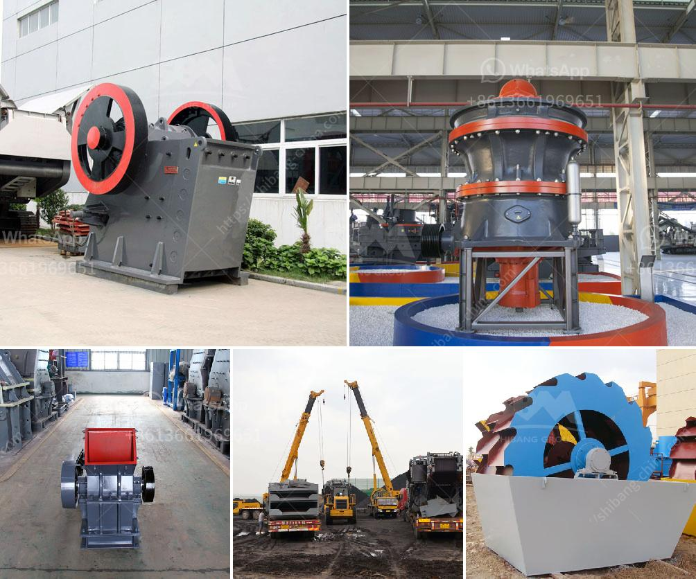

<h3>magnesite mining analysis south africa</h3>
South Africa is home to vast mineral resources, including magnesite, which provides a crucial raw material for various industries. Magnesite is a carbonate mineral composed of magnesium carbonate (MgCO3), making it an essential component for steel, cement, and glass manufacturing. It is also used in the production of agricultural fertilizers and fire-resistant materials, contributing significantly to economic growth and development.

The magnesite mining sector in South Africa has a rich history, dating back to the 1920s when large-scale magnesite deposits were discovered in the Northern Cape province. Over the years, several mining companies have operated in the region, exploiting these valuable mineral resources. However, the industry has faced numerous challenges, including fluctuating global demand and limited investment.

One of the primary concerns in magnesite mining in South Africa is the environmental impact. The extraction and processing of magnesite can generate a significant amount of waste material, mainly in the form of tailings. These tailings contain various contaminants and heavy metals that can contaminate soil, water sources, and harm the surrounding ecosystem. Mining companies are increasingly adopting sustainable practices to minimize these impacts, including implementing proper waste management systems and rehabilitation plans.

Another crucial consideration in magnesite mining is the health and safety of the workers. Mining is a hazardous industry, and workers face potential risks such as cave-ins, exposure to harmful chemicals, and respiratory issues. Mining companies are obligated to adhere to strict safety regulations and provide adequate protective equipment to minimize these risks. Maintaining a safe working environment is essential to ensure the well-being of employees and prevent accidents.

The economic viability of magnesite mining in South Africa heavily depends on global market demand. Fluctuations in demand and prices can significantly impact the profitability of mining operations. As a result, mining companies need to carefully analyze market trends and make informed decisions to ensure long-term sustainability. The development of new applications for magnesite, such as in renewable energy technologies, can provide additional opportunities for growth and diversification.

Furthermore, infrastructure plays a crucial role in the success of the magnesite mining industry. Adequate transportation networks, including roads and rail links, are essential to facilitate the movement of magnesite from mines to processing plants and distribution centers. Availability of reliable power supply is also crucial for uninterrupted operations. Continued investment in infrastructure development is necessary to support the growth of the magnesite mining sector in South Africa.

In conclusion, magnesite mining in South Africa holds significant economic potential, but it is not without its challenges. Environmental considerations, health and safety of workers, market fluctuations, and infrastructure development are all critical factors that mining companies must consider. Balancing the economic benefits of magnesite mining with sustainable practices and responsible resource management is crucial for long-term success in this industry. With proper planning and investment, South Africa can continue to benefit from its vast magnesite resources while minimizing environmental and social impacts.
<h3>Contact us</h3><ul><li><strong>Whatsapp:&nbsp;<a href="https://wa.me/8613661969651">+8613661969651</a></strong></li><li><a href="https://swt.shibang-china.com/?git&amp;zhl&amp;magnesite mining analysis south africa"><strong>Online Service(chat now)</strong></a></li></ul><h3>Related</h3><ul><li><a href='india edible clay making process.md'>india edible clay making process</a></li><li><a href='process of kaolin mining crusher.md'>process of kaolin mining crusher</a></li><li><a href='portable coal crusher.md'>portable coal crusher</a></li><li><a href='powder machinery in turkey.md'>powder machinery in turkey</a></li><li><a href='granite crusher cost.md'>granite crusher cost</a></li></ul>