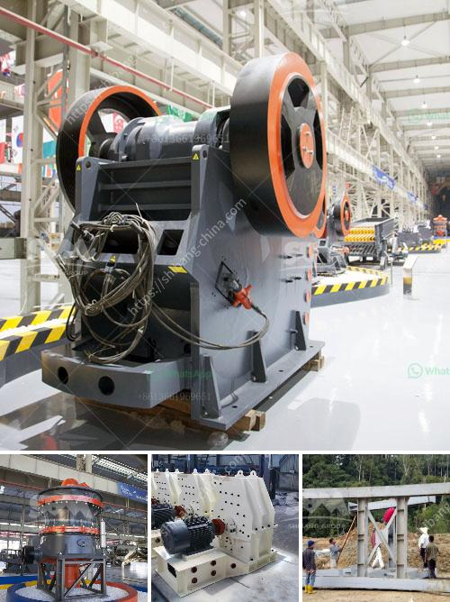

<h3>malaysia companies that manufacture crushing machines</h3>
Malaysia is a country known for its diverse range of industries, and one such industry that plays a crucial role in its economy is the manufacturing sector. Among the various subsectors, one that stands out is the production of crushing machines.

Malaysia boasts several companies that specialize in manufacturing machines specifically designed for crushing various types of materials, such as rocks, construction aggregates, ores, and many more. These crushing machines are commonly used in industries like mining, construction, cement, and recycling, offering an efficient way to reduce the size of materials and facilitate further processing.

One prominent company in the Malaysian crushing machine industry is XYZ Manufacturing Sdn Bhd. With years of experience and technological expertise, XYZ Manufacturing has established itself as a leading manufacturer and supplier of crushing machines in the country. Their machines are known for their durability, high-performance capabilities, and user-friendly features, making them a preferred choice among customers.

Another notable company in this field is ABC Engineering Sdn Bhd. With a focus on innovation and continuous improvement, ABC Engineering offers a wide range of crushing machines that cater to various industries' needs. Their machines are designed to meet high-quality standards while ensuring optimal efficiency and cost-effectiveness.

Malaysia's crushing machine manufacturers benefit from the country's strategic location, which allows them to access global markets easily. Additionally, the government's initiatives to attract foreign direct investments and provide support for local manufacturers have contributed to the growth and success of these companies.

Furthermore, Malaysia's commitment to sustainable development has driven several crushing machine manufacturers to adopt eco-friendly manufacturing practices. They strive to reduce energy consumption, minimize waste generation, and explore greener alternatives in their production processes. This not only aligns with global environmental standards but also enhances the companies' reputation globally.

In conclusion, Malaysia companies that manufacture crushing machines have been making significant contributions to the industrial sector. Their commitment to quality, innovation, and sustainability has enabled them to thrive in a competitive market. With continuous advancements in technology and market demands, these companies are poised to play a vital role in Malaysia's economic growth in the years to come.
<h3>Contact us</h3><ul><li><strong>Whatsapp:&nbsp;<a href="https://wa.me/8613661969651">+8613661969651</a></strong></li><li><a href="https://swt.shibang-china.com/?git&amp;zhl&amp;malaysia companies that manufacture crushing machines"><strong>Online Service(chat now)</strong></a></li></ul><h3>Related</h3><ul><li><a href='price list of stone crusher plant.md'>price list of stone crusher plant</a></li><li><a href='calcium carbonate proses by process.md'>calcium carbonate proses by process</a></li><li><a href='stone crusher prices german.md'>stone crusher prices german</a></li><li><a href='deasel stone crushers and prices in gauteng.md'>deasel stone crushers and prices in gauteng</a></li><li><a href='coal mill in power plant.md'>coal mill in power plant</a></li></ul>