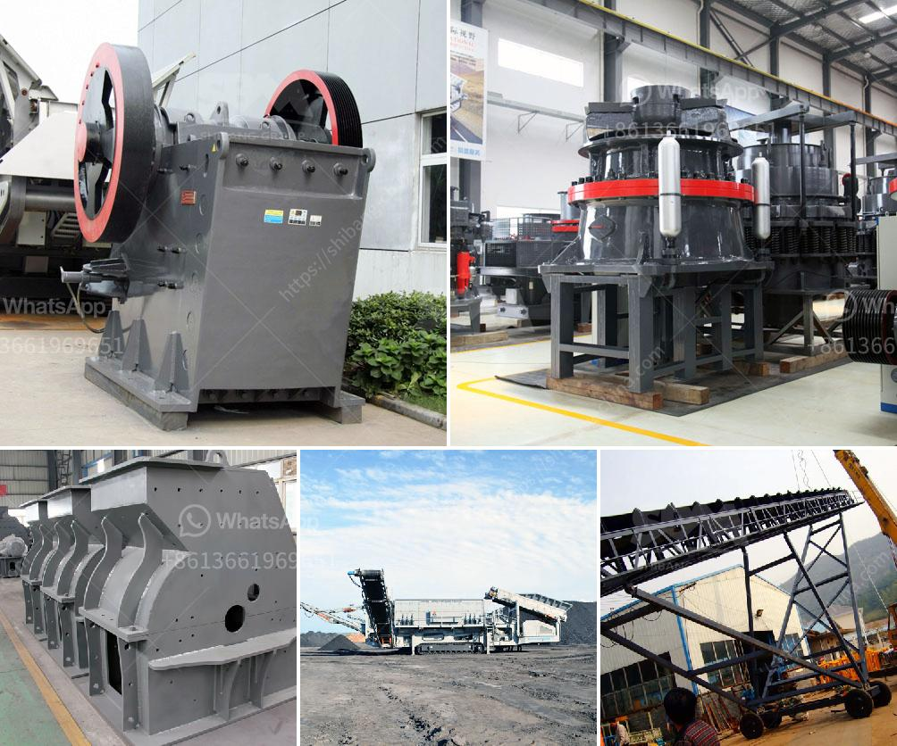

<h3>malaysia stone crusher price</h3>
Malaysia is a Southeast Asian country located on the Malay Peninsula and the island of Borneo. It is known for its diverse culture, vibrant economy, and stunning landscapes. When it comes to construction and infrastructure development, stone crusher machines are essential equipment. 

Stone crushers are machines designed to reduce large rocks into smaller stones, gravel, or rock dust. These machines are mainly used in mining, quarrying, and recycling industries. In Malaysia, stone crushers are widely used in granite, limestone, basalt, and other materials in the construction sector.

Malaysia stone crusher price is determined by the brand, capacity, input size, and output size. In general, the higher the capacity, the higher the price. Other factors, such as input size and output size, also affect the price. Different stone crushers have different prices. Some crushers even offer adjustable output size settings, making them more versatile and valuable.

Besides price, it is essential to consider the quality and after-sales service of the stone crusher. A reliable stone crusher should have a sturdy construction, reliable performance, and long service life. Before purchasing, it is advisable to visit the manufacturer's website, read customer reviews, and compare prices from different suppliers to ensure you are getting a competitive price for a high-quality machine.

In Malaysia, there are various options available for stone crushers, including jaw crushers, impact crushers, cone crushers, and hammer crushers. Each type has its own advantages and application areas. Jaw crushers are suitable for primary crushing, while impact crushers and cone crushers are ideal for secondary or tertiary crushing. Hammer crushers are mainly used for materials with lower hardness.

In conclusion, the price of Malaysia stone crusher depends on the capacity, input size, output size, and other factors. It is important to choose a reliable supplier and consider the quality and after-sales service. By doing so, you can find a stone crusher that meets your specific requirements and budget, helping you achieve efficient and cost-effective stone crushing operations for your construction projects in Malaysia.
<h3>Contact us</h3><ul><li><strong>Whatsapp:&nbsp;<a href="https://wa.me/8613661969651">+8613661969651</a></strong></li><li><a href="https://swt.shibang-china.com/?git&amp;zhl&amp;malaysia stone crusher price"><strong>Online Service(chat now)</strong></a></li></ul><h3>Related</h3><ul><li><a href='gold wash plant machine in ghana.md'>gold wash plant machine in ghana</a></li><li><a href='limestone crusher equipment.md'>limestone crusher equipment</a></li><li><a href='limestone belt conveyor.md'>limestone belt conveyor</a></li><li><a href='flsmidth cement plant in egypt.md'>flsmidth cement plant in egypt</a></li><li><a href='200tph mobile crusher prices used.md'>200tph mobile crusher prices used</a></li></ul>