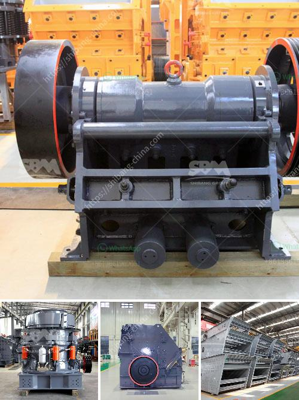

<h3>manganese mining techniques</h3>
Manganese mining techniques refer to the methods used for the extraction of manganese ore from the Earth. Manganese is a transition metal with important industrial uses, particularly in the steel-making process. Similar to other mining operations, manganese mining involves the extraction, crushing, grinding, beneficiation, and processing of the ore.

The first step in manganese mining is the removal of overburden. This involves stripping away the top layers of soil and vegetation to expose the ore body. This process can be done through open-pit mining, where large machinery is used to extract the ore from the ground. Alternatively, underground mining techniques may be employed when the ore body is located at a greater depth. Underground mining involves the creation of tunnels and shafts to access the ore.

Once the ore is extracted, it is transported to a processing plant for further treatment. The next step is crushing and grinding the ore into small particles. This prepares the ore for beneficiation, a process that involves separating the valuable minerals from the waste material. Beneficiation techniques for manganese ore include gravity separation, magnetic separation, and flotation.

Gravity separation utilizes the difference in density between the ore minerals and gangue minerals. By applying a force such as water or air, the heavier manganese ore particles can be separated from the lighter gangue minerals.

Magnetic separation utilizes the magnetic properties of manganese ore minerals. An electromagnetic separator is used to attract and separate the magnetic particles from non-magnetic ones.

Flotation is a technique used for the separation of minerals through the formation of a frothy layer on the surface of a slurry. By adding specific chemicals, the valuable manganese minerals can be separated from the gangue minerals.

After beneficiation, the concentrate is then further refined and processed into various manganese-based products. This includes the production of ferromanganese or silicomanganese, which are used as additives in the steel-making process.

In conclusion, manganese mining techniques involve several processes, including extraction, crushing, grinding, beneficiation, and processing. These methods are necessary to obtain high-quality manganese ore for industrial applications. As the demand for manganese continues to grow, it is important to implement sustainable mining practices that minimize environmental impact and ensure the responsible extraction of this valuable resource.
<h3>Contact us</h3><ul><li><strong>Whatsapp:&nbsp;<a href="https://wa.me/8613661969651">+8613661969651</a></strong></li><li><a href="https://swt.shibang-china.com/?git&amp;zhl&amp;manganese mining techniques"><strong>Online Service(chat now)</strong></a></li></ul><h3>Related</h3><ul><li><a href='used granite crusher machinery.md'>used granite crusher machinery</a></li><li><a href='semi industrial stone crusher.md'>semi industrial stone crusher</a></li><li><a href='mobile crushers for hire in product.md'>mobile crushers for hire in product</a></li><li><a href='chromite beneficiation plants malaysia.md'>chromite beneficiation plants malaysia</a></li><li><a href='mining crusher machine.md'>mining crusher machine</a></li></ul>