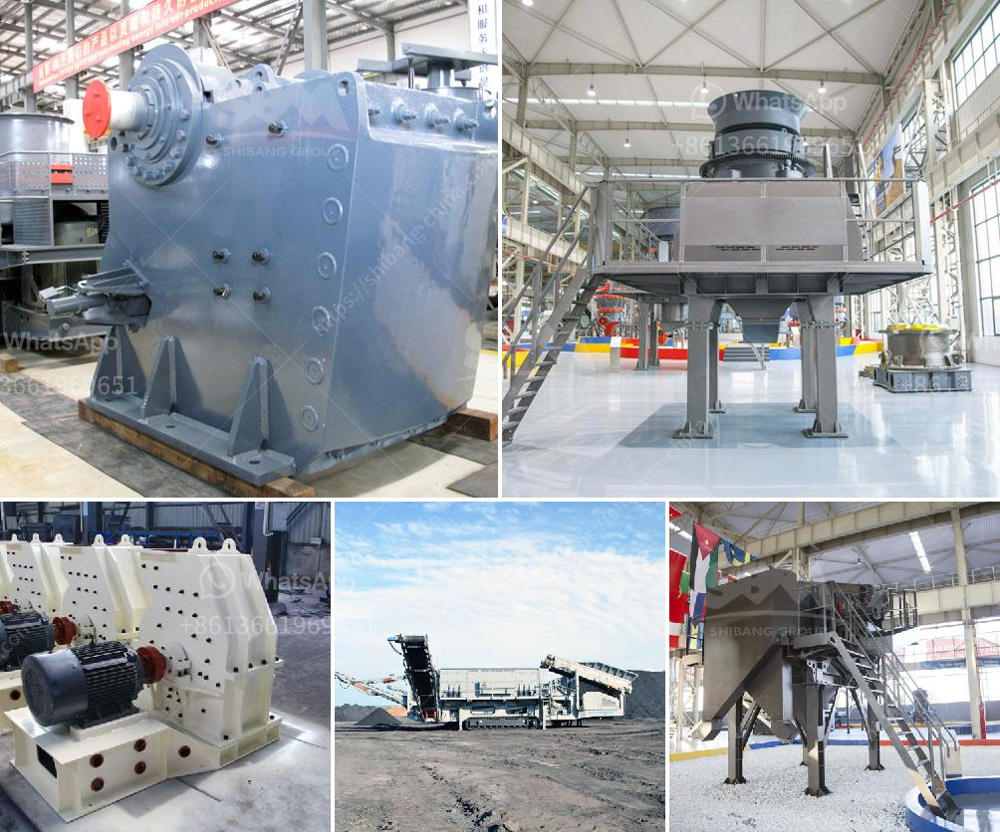

<h3>manganese ore processing machine price</h3>
Manganese is widely distributed in nature, and most of the ore is oxidized manganese ore, which is difficult to enrich. In recent years, researchers have made significant progress in the exploration and utilization of manganese ore, especially in the processing of oxidized manganese ore. The manganese ore processing machine price is related to the beneficiation technology adopted. Commonly used manganese ore processing methods include physical beneficiation (washing and screening), gravity beneficiation, strong magnetic separation, flotation method, and fire enrichment, etc.

The traditional manganese ore beneficiation process is generally carried out by washing with water or a mechanical scrubbing machine to separate the ore from the mud. The commonly used washing equipment includes a cylindrical washing machine, a trough washing machine, a vibrating screen, and a log washer. These machines can remove impurities such as clay, organic matter, and aluminosilicate minerals from the ore, increasing the grade of manganese ore.

Gravity beneficiation is based on the difference in density and particle size of manganese ore and gangue minerals. The commonly used gravity separation equipment includes jigging machine, shaking table, and spiral chute. Jigging machine separates manganese ore from the mine by pulsating water flow, while shaking table and spiral chute separate ore and gangue minerals by the difference in specific gravity.

Strong magnetic separation is mainly used to separate magnetic minerals from manganese ore. The commonly used magnetic separators are dry magnetic separator and wet magnetic separator. Dry magnetic separator is suitable for dry separation of magnetite, pyrrhotite, roasting ore, ilmenite, and other materials with a particle size of 3mm or less. Wet magnetic separator is commonly used for separating fine-grained magnetic minerals such as hematite, limonite, siderite, manganese ore, etc.

Flotation method is widely used in the processing of oxidized manganese ore. The principle of flotation is to use a chemical agent to selectively adsorb on the surface of mineral particles and then make the mineral particles hydrophobic. The commonly used flotation agents for manganese ore include fatty acids, alkyl sulfates, alkyl sulfonates, and petroleum sulfonates. By adjusting the pH of the slurry, the flotation of manganese ore can be effectively controlled.

Fire enrichment is a method of beneficiation in which the ore is heated to a certain temperature in an oxidizing atmosphere to selectively separate manganese, phosphorus, and iron. This method is mostly used for low-grade manganese ore with high iron content. The process is relatively simple, but it requires certain equipment and energy consumption.

In conclusion, the manganese ore processing machine price is determined by the beneficiation technology, equipment quality, and process complexity. Generally, the price of manganese ore processing machine is relatively lower than other mineral processing equipment. However, customers should also consider factors such as after-sales service and reputation of the manufacturer when purchasing manganese ore processing equipment, in order to achieve the best beneficiation results.
<h3>Contact us</h3><ul><li><strong>Whatsapp:&nbsp;<a href="https://wa.me/8613661969651">+8613661969651</a></strong></li><li><a href="https://swt.shibang-china.com/?git&amp;zhl&amp;manganese ore processing machine price"><strong>Online Service(chat now)</strong></a></li></ul><h3>Related</h3><ul><li><a href='gold refining equipment for sale.md'>gold refining equipment for sale</a></li><li><a href='stone principle crusher project.md'>stone principle crusher project</a></li><li><a href='diesel stone crushers from germany.md'>diesel stone crushers from germany</a></li><li><a href='stones grinding plant thailand.md'>stones grinding plant thailand</a></li><li><a href='bentonite manufacturing process image.md'>bentonite manufacturing process image</a></li></ul>