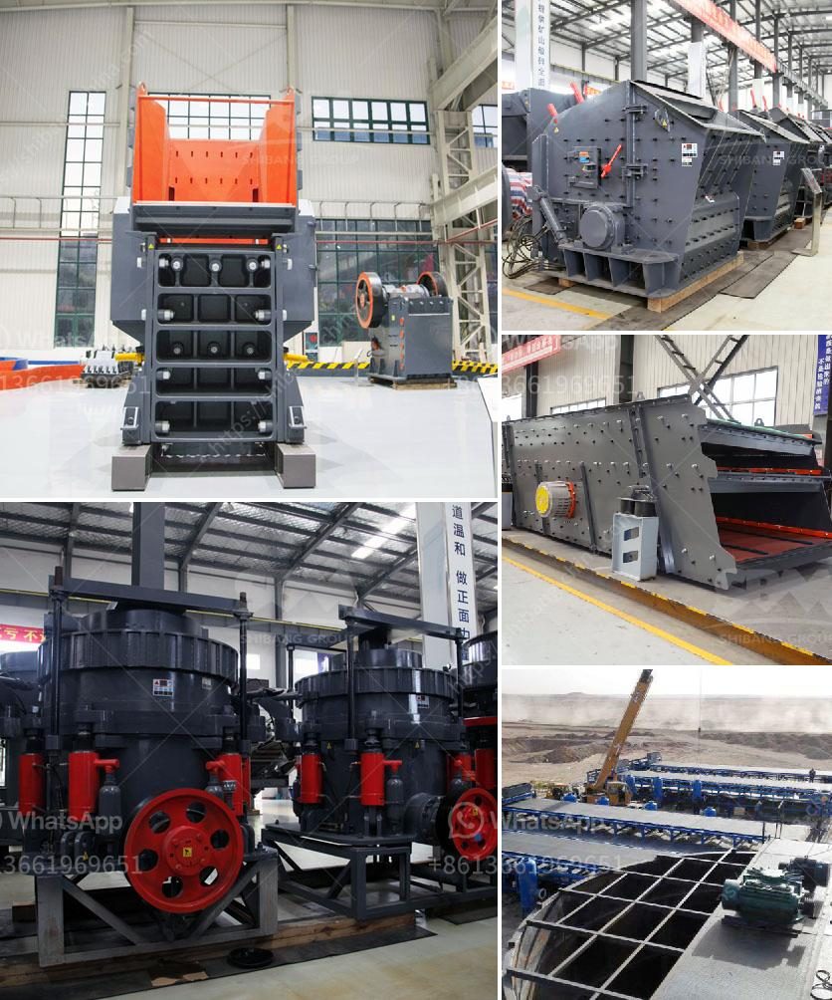

<h3>manganese ore wash plant</h3>
Manganese is one of the most essential metals used in various industries. Its diverse applications include steel manufacturing, batteries, fertilizers, and many more. As the demand for manganese continues to rise, efficient mining and processing methods become crucial to ensure a reliable supply of this valuable resource. One such method gaining popularity in the mining industry is the manganese ore wash plant.

A manganese ore wash plant consists of several components, including a feeding system, the scrubbing process, the dewatering unit, and the fines recovery system. Each of these components plays a vital role in removing impurities and increasing the overall manganese ore grade.

The feeding system of a wash plant is responsible for providing a consistent and controlled flow of raw material. Often, a vibrating feeder or conveyor belt is used to deliver the ore to the scrubbing process. This ensures that the plant operates at optimal efficiency with a steady supply of manganese ore.

The scrubbing process is the heart of the manganese ore wash plant. It involves the physical and chemical removal of impurities from the ore through attrition and agitation. The ore and water are mixed with specific chemicals, creating a slurry. This mixture is then scrubbed under high-pressure conditions to break down any clumps and remove contaminants like clay, silica, and iron oxides.

Once the scrubbing process is complete, the slurry is directed to the dewatering unit. Here, the excess water is removed, allowing for a more concentrated manganese ore product. Different techniques like thickening, filtering, or centrifuging may be employed depending on the desired level of dewatering and the properties of the manganese ore.

The final stage of the manganese ore wash plant is the fines recovery system. During the dewatering process, a portion of valuable fines can be lost. The fines recovery system ensures the recovery of these valuable particles and further increases the overall manganese ore grade. Techniques such as flocculation, filtration, and flotation can be utilized to achieve this.

The introduction of a manganese ore wash plant offers numerous advantages to mining operations. Firstly, it significantly improves the manganese ore grade, leading to higher-quality end products. This enables manufacturers to produce stronger and lighter steel, more efficient batteries, and successful fertilizer formulations.

Secondly, the manganese ore wash plant enhances the overall operational efficiency of mining operations. By removing impurities at an early stage, it reduces the time, energy, and costs associated with downstream processing. This leads to higher production yields, shorter processing times, and increased profitability.

Moreover, the wash plant minimizes the environmental impact of mining activities. By efficiently removing contaminants, it helps reduce the discharge of harmful substances into water bodies. Additionally, the plant's water recycling capabilities can help conserve precious water resources, making manganese mining more sustainable and eco-friendly.

In conclusion, the manganese ore wash plant is revolutionizing the mining industry by improving the efficiency and sustainability of manganese extraction. With its ability to remove impurities and increase the ore grade, this innovative technology ensures a reliable supply of high-quality manganese for various industries. As the demand for manganese continues to grow, the wash plant proves to be an indispensable asset to the mining sector.
<h3>Contact us</h3><ul><li><strong>Whatsapp:&nbsp;<a href="https://wa.me/8613661969651">+8613661969651</a></strong></li><li><a href="https://swt.shibang-china.com/?git&amp;zhl&amp;manganese ore wash plant"><strong>Online Service(chat now)</strong></a></li></ul><h3>Related</h3><ul><li><a href='cement making process.md'>cement making process</a></li><li><a href='grinding zeolite ball mill machine.md'>grinding zeolite ball mill machine</a></li><li><a href='conveyor belt manufacturers in bangladesh.md'>conveyor belt manufacturers in bangladesh</a></li><li><a href='vertical mill calcium.md'>vertical mill calcium</a></li><li><a href='for sale mobile crusher.md'>for sale mobile crusher</a></li></ul>