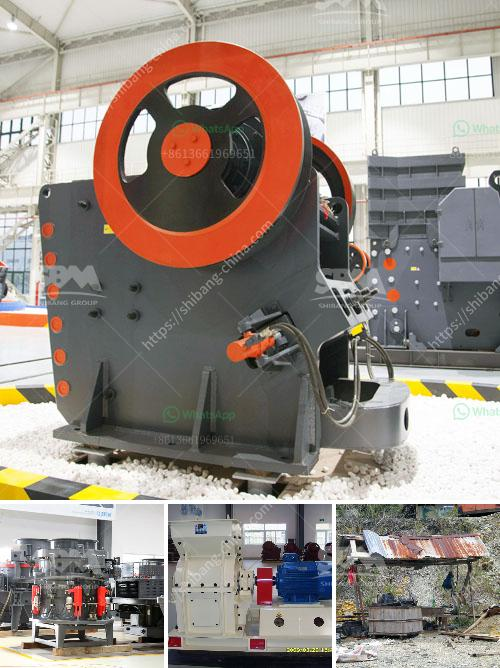

<h3>manganese processing plant in india</h3>
India is a major player in the global manganese market, boasting a vast reserve of manganese ore, which is essential for various industries. In order to leverage this valuable resource, the country has invested in setting up several manganese processing plants in various states. These plants not only meet domestic demand but also contribute significantly to the global supply chain.

One of the prominent manganese processing plants in India is located in the state of Odisha. This plant has been operational for over a decade and has played a crucial role in meeting the increasing demand for manganese and its by-products. The plant is strategically located near manganese ore mines, which ensures a steady supply of raw material.

The process of manganese ore processing starts with the extraction of manganese ore from mines. The ore is then crushed and screened to remove impurities. After that, it undergoes various beneficiation processes such as gravity separation, magnetic separation, and flotation to enhance its quality and purity. The processed ore is then sent to the smelter for further refining.

The manganese processing plant in India utilizes modern and advanced technology to produce high-quality manganese products, such as ferroalloys, silico-manganese, and electrolytic manganese dioxide. These products find application in various industries, including steel production, batteries, ceramics, and chemicals.

The plant employs a skilled workforce that is adept at handling sophisticated machinery and ensuring the smooth functioning of the production process. Stringent quality control measures are implemented at every stage of production to ensure that the products meet the required standards. Regular monitoring and testing of the finished products are carried out in well-equipped laboratories.

Apart from its economic significance, the manganese processing plant also contributes to sustainable development. Efforts are made to minimize the environmental impact of the plant by adopting eco-friendly practices. Measures are taken to reduce energy consumption, optimize water usage, and manage waste effectively. The plant also emphasizes on employee safety and welfare, providing a safe and healthy work environment.

India's manganese processing plants have not only strengthened the country's industrial base but have also created employment opportunities and contributed to the overall development of the region. These plants have generated direct and indirect employment for thousands of people, benefiting the local economy. They have also stimulated ancillary industries, such as logistics, engineering services, and maintenance, further boosting economic growth.

In conclusion, India's manganese processing plants play a critical role in meeting the global demand for manganese and its by-products. These plants leverage the country's vast manganese ore reserves, employing advanced technology and skilled workforce to produce high-quality manganese products. Apart from economic benefits, these plants contribute to sustainable development by embracing eco-friendly practices and ensuring employee welfare. With their strategic location and efficient operations, these plants are poised to play a vital role in the manganese market for years to come.
<h3>Contact us</h3><ul><li><strong>Whatsapp:&nbsp;<a href="https://wa.me/8613661969651">+8613661969651</a></strong></li><li><a href="https://swt.shibang-china.com/?git&amp;zhl&amp;manganese processing plant in india"><strong>Online Service(chat now)</strong></a></li></ul><h3>Related</h3><ul><li><a href='jaw crusher price in kenya.md'>jaw crusher price in kenya</a></li><li><a href='sand washing plants.md'>sand washing plants</a></li><li><a href='powder making machines.md'>powder making machines</a></li><li><a href='cost of ball mill in india.md'>cost of ball mill in india</a></li><li><a href='manufacturer of quartz powder mill.md'>manufacturer of quartz powder mill</a></li></ul>