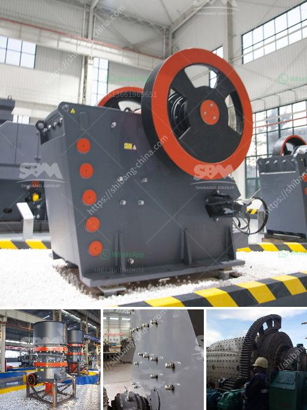

<h3>manufacture of a cone crusher</h3>
The cone crusher is one of the most popular crushing machines designed for mining and ore processing industries. It is widely used in the production of materials such as minerals, metallurgy, building materials, chemicals, and other industries.

When it comes to the manufacture of a cone crusher, several key components are essential for its successful production. First and foremost, the frame of the cone crusher needs to be sturdy and durable. It is typically made of cast steel or iron, ensuring the crusher can withstand heavy loads and severe working conditions.

The cone crusher also requires high-quality crushing cones, which are usually made of high-manganese steel. These cones are resistant to wear and tear, ensuring a longer lifespan for the crusher and reducing production downtime.

Another crucial component is the eccentric shaft, which is responsible for the vertical movement of the mantle during operation. The eccentric shaft is typically made of forged steel or alloy steel, providing the necessary strength and durability required for crushing various materials efficiently.

Additionally, the cone crusher needs to have a reliable lubrication system to prevent excessive friction and heat generation during operation. This system typically consists of an oil pump, oil filter, and oil cooler, ensuring proper lubrication and cooling for the crusher's components.

Lastly, the electrical control system plays a vital role in the efficient production of the cone crusher. It allows operators to monitor and control the crusher's operation, adjusting settings and monitoring performance to ensure optimal productivity and safety.

In conclusion, the manufacture of a cone crusher involves several key components that are essential for its successful operation. From a sturdy frame to high-quality crushing cones, an efficient lubrication system, and a reliable electrical control system, each component is crucial in ensuring the cone crusher operates smoothly and efficiently. Ultimately, these efforts result in a high-performing crusher that is capable of effectively crushing various materials in the mining and ore processing industries.
<h3>Contact us</h3><ul><li><strong>Whatsapp:&nbsp;<a href="https://wa.me/8613661969651">+8613661969651</a></strong></li><li><a href="https://swt.shibang-china.com/?git&amp;zhl&amp;manufacture of a cone crusher"><strong>Online Service(chat now)</strong></a></li></ul><h3>Related</h3><ul><li><a href='8 kw hammer mill.md'>8 kw hammer mill</a></li><li><a href='rock crushers ball mill.md'>rock crushers ball mill</a></li><li><a href='grinding machine manufacturers from europe.md'>grinding machine manufacturers from europe</a></li><li><a href='charcoal pulverizer machine philippines.md'>charcoal pulverizer machine philippines</a></li><li><a href='gold mining equipment manufacturers in europe.md'>gold mining equipment manufacturers in europe</a></li></ul>