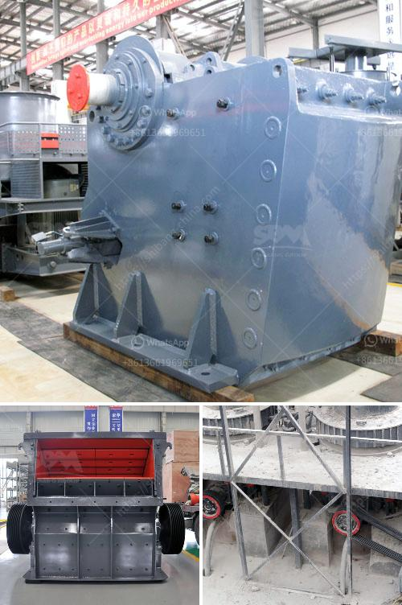

<h3>manufacture of a conveyor belt</h3>
The manufacturing process of a conveyor belt is quite complex. Thanks to modern technology, conveyor belts can now be made from various materials such as rubber, polyester, nylon, neoprene, and even metal. These materials are carefully selected based on the specific needs of the application, ensuring durability, flexibility, and resistance to wear and tear.

The process begins with the preparation of the material. For instance, if the conveyor belt is made of rubber, natural or synthetic rubber compounds are mixed with additives to achieve the desired properties. The mixture is then rolled into sheets and cured in an oven to solidify the rubber. Some belts may require additional reinforcement, so different layers of fabric or metal wires are added during this stage.

Once the primary material is ready, it undergoes a cutting process where the sheets are sliced into thin strips, commonly referred to as plies. These plies will eventually form the foundation of the conveyor belt and determine its strength and flexibility. The number of plies used depends on the application and desired strength of the belt.

After cutting, the plies are coated with adhesive to bind them together. This step is crucial to create a strong and durable belt. Belt edges are carefully trimmed to ensure a seamless connection when the plies are joined.

The plies are then placed on a conveyor system that gradually moves them through various stages, such as pressing and rolling. This helps to consolidate the layers, remove any air bubbles, and ensure uniform thickness throughout the belt. The belt may also undergo heat treatment to enhance its stability, durability, and resistance to external elements.

Once the belt is fully formed, it is coated with a protective layer, often using compounds such as neoprene or polyurethane. This layer acts as a shield against abrasion, chemicals, and other environmental factors that the belt may encounter during its operation. The final step involves cutting the belt to the desired length, attaching fasteners or splicing it into an endless loop, and performing a series of quality checks to ensure its integrity.

In conclusion, the manufacturing of a conveyor belt is a complex and meticulous process. It involves selecting the right materials, preparing, cutting, joining, and applying protective layers to create a durable, efficient, and reliable product. With advancements in technology, conveyor belts continue to play a crucial role in various industries, facilitating the movement of goods and materials efficiently and safely.
<h3>Contact us</h3><ul><li><strong>Whatsapp:&nbsp;<a href="https://wa.me/8613661969651">+8613661969651</a></strong></li><li><a href="https://swt.shibang-china.com/?git&amp;zhl&amp;manufacture of a conveyor belt"><strong>Online Service(chat now)</strong></a></li></ul><h3>Related</h3><ul><li><a href='cocount crushing manchine.md'>cocount crushing manchine</a></li><li><a href='company in japan dealing in portable crusher machine.md'>company in japan dealing in portable crusher machine</a></li><li><a href='crushing and grinding.md'>crushing and grinding</a></li><li><a href='pioneer 3042 jaw crusher part.md'>pioneer 3042 jaw crusher part</a></li><li><a href='small scale mining partnership crusher.md'>small scale mining partnership crusher</a></li></ul>