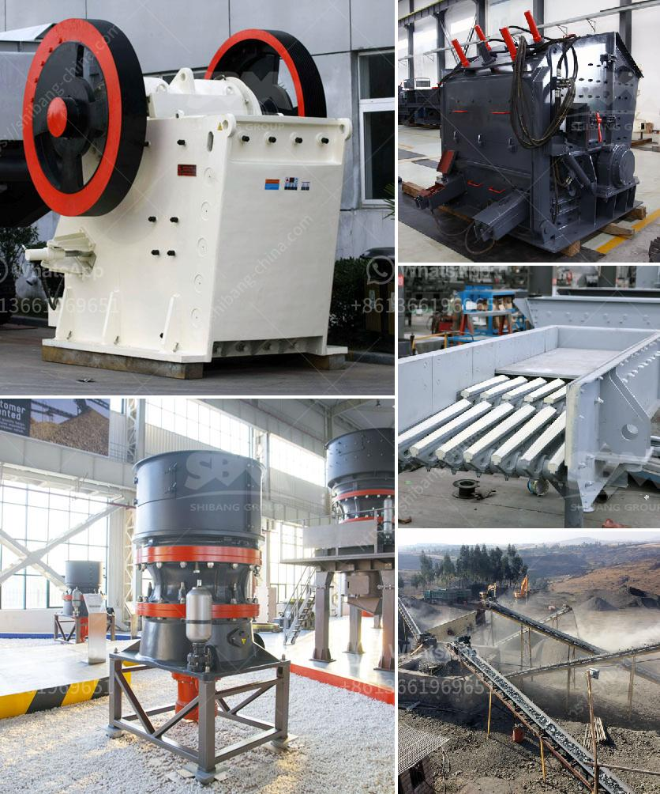

<h3>manufacturer crusher machines contacts</h3>
Crusher machines have become an integral part of the mining and construction industry. They offer immense benefits to various sectors, enabling the efficient and quick crushing of different materials. With the advancement in technology, manufacturers are producing high-quality and durable crusher machines. These machines have made the crushing process more cost-effective, reliable, and time-saving.

One crucial aspect of crusher machines is the manufacturer's role in producing these efficient devices. Manufacturers play a pivotal role in the production and streamlined functioning of these machines. They are responsible for designing, manufacturing, and distributing crusher machines to different industries across the globe. The contacts of these manufacturers have become crucial for companies looking to purchase crusher machines.

When it comes to choosing a crusher machine manufacturer, it is essential to consider several factors. First and foremost, the manufacturer should have a solid reputation in the industry. This can be determined by assessing their experience, track record, and customer reviews. A reputable manufacturer would have been in the industry for several years, showcasing their expertise and commitment to producing high-quality machines.

Apart from reputation, the manufacturer should possess advanced technology and equipment. Innovations in crusher machine technology have significantly improved crushing efficiency and reduced downtime. Therefore, it's essential to select a manufacturer that incorporates the latest advancements in their machines, ensuring optimal performance and productivity.

Another critical factor to consider is the manufacturer's after-sales support. It is crucial to choose a manufacturer that provides comprehensive after-sales assistance, such as spare parts availability and technical support. In case of any issues or breakdowns, prompt support from the manufacturer can minimize downtime, ultimately adding value to the crusher machine investment.

Furthermore, the manufacturer's contacts are crucial for customers seeking specific requirements or customization options for their crusher machines. By having direct contacts with the manufacturer, companies can convey their specifications and expectations, resulting in tailor-made machines that fulfill their specific needs. This customization facility allows industries to achieve better productivity and efficiency in their crushing processes.

The contacts with crusher machine manufacturers can be established through various means. Firstly, most manufacturers have websites where potential customers can find their contact details. These details usually include email addresses, phone numbers, and physical addresses, enabling customers to connect with them directly. Additionally, trade shows and exhibitions related to the mining and construction industry serve as excellent platforms to establish contacts with manufacturers. These events provide an opportunity to meet manufacturers face-to-face, discuss requirements, and form long-term relationships.

In conclusion, manufacturer crusher machines play a significant role in streamlining the crushing process in various industries. Choosing a reputable manufacturer with advanced technology, after-sales support, and customization options can lead to enhanced operational efficiency and cost savings. Contacts with manufacturers are crucial, ensuring open communication, personalized services, and prompt support. As the demand for crusher machines increases, it is essential to establish strong connections with reliable manufacturers to meet the growing needs of the industry.
<h3>Contact us</h3><ul><li><strong>Whatsapp:&nbsp;<a href="https://wa.me/8613661969651">+8613661969651</a></strong></li><li><a href="https://swt.shibang-china.com/?git&amp;zhl&amp;manufacturer crusher machines contacts"><strong>Online Service(chat now)</strong></a></li></ul><h3>Related</h3><ul><li><a href='canada gold mining equipment manufacturers.md'>canada gold mining equipment manufacturers</a></li><li><a href='pharma grade kaolin process.md'>pharma grade kaolin process</a></li><li><a href='mineral crushing plant.md'>mineral crushing plant</a></li><li><a href='used granite crusher machinery.md'>used granite crusher machinery</a></li><li><a href='price of grinder machine in malaysia.md'>price of grinder machine in malaysia</a></li></ul>