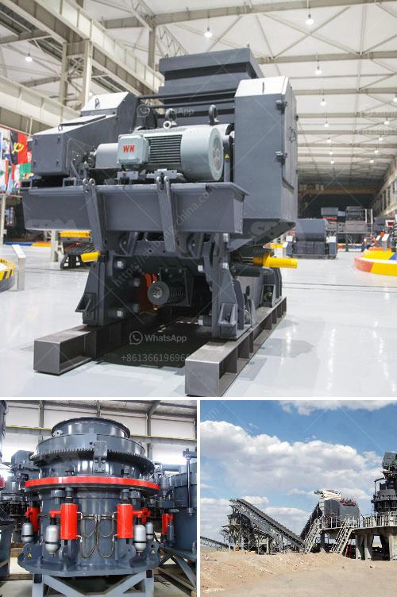

<h3>manufacturer of cement packing plant machinery</h3>
The Cement industry plays a crucial role in the infrastructure development of any country. The manufacturing process of cement involves several stages, from mining the raw materials to packaging the final product. In this article, we will focus on the manufacturer of cement packing plant machinery, which is an essential component of the cement production process.

A cement packing plant is responsible for the final packing of cement bags before they are transported to distributors and retailers. The machinery used in these plants must be robust, efficient, and highly reliable to ensure the seamless and accurate packaging of cement bags.

One of the leading manufacturers of cement packing plant machinery is XYZ Machinery. With several years of experience in the industry, XYZ Machinery has earned a reputation for delivering high-quality and durable machinery for cement packing plants.

XYZ Machinery offers a comprehensive range of cement packing plant machinery, including Cement Bag Packing Machine, Bulk Loading Machine, and Cement Truck Loading Machine. These machines are designed to handle different capacities of cement bags, ranging from 25 kg to 50 kg, with precision and efficiency.

The Cement Bag Packing Machine offered by XYZ Machinery is equipped with advanced features such as automatic bag filling, weighing, and sealing. It ensures accurate filling of cement bags at a high rate, minimizing human error and improving productivity. The machine also has a user-friendly interface, allowing operators to monitor and control the packaging process easily.

The Bulk Loading Machine manufactured by XYZ Machinery is designed for efficient loading of cement into bulk trucks or containers. It ensures quick and reliable loading, minimizing spillage and wastage. With its robust construction and advanced technology, the Bulk Loading Machine offered by XYZ Machinery is a reliable solution for cement manufacturers.

Another notable product from XYZ Machinery is the Cement Truck Loading Machine. This machine is specifically designed for loading cement bags into trucks with ease. It eliminates the need for manual labor in the loading process, reducing the risk of injuries and ensuring the safety of workers. The Cement Truck Loading Machine can handle different truck sizes and is capable of loading multiple bags simultaneously, optimizing efficiency.

One of the key advantages of XYZ Machinery's cement packing plant machinery is its focus on sustainability. The machines are designed to minimize energy consumption and reduce waste generation. The company also prioritizes the use of eco-friendly materials in the manufacturing process, promoting a greener approach to cement production.

In conclusion, the manufacturer of cement packing plant machinery plays a crucial role in the cement production process. XYZ Machinery is one such manufacturer that offers a range of high-quality and reliable machinery for cement packing plants. With its focus on efficiency, accuracy, and sustainability, XYZ Machinery is a trusted partner for cement manufacturers, helping them enhance their packaging capabilities and streamline their operations.
<h3>Contact us</h3><ul><li><strong>Whatsapp:&nbsp;<a href="https://wa.me/8613661969651">+8613661969651</a></strong></li><li><a href="https://swt.shibang-china.com/?git&amp;zhl&amp;manufacturer of cement packing plant machinery"><strong>Online Service(chat now)</strong></a></li></ul><h3>Related</h3><ul><li><a href='pioneer 3042 jaw crusher part.md'>pioneer 3042 jaw crusher part</a></li><li><a href='barite jaw crusher manufacturing companies.md'>barite jaw crusher manufacturing companies</a></li><li><a href='vibrating screen in south africa.md'>vibrating screen in south africa</a></li><li><a href='granite quarry crusher in nigeria.md'>granite quarry crusher in nigeria</a></li><li><a href='project report clinker grinding.md'>project report clinker grinding</a></li></ul>