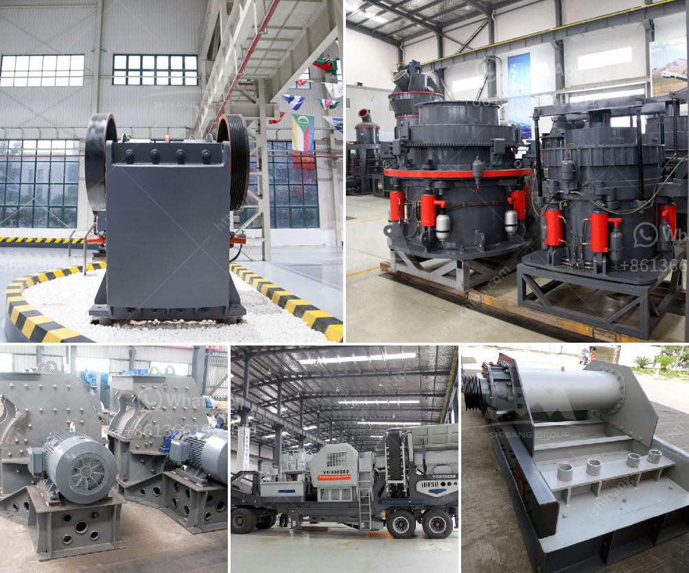

<h3>manufacturer of quartz powder mill</h3>
Quartz powder is a widely used mineral in various industries like glass, ceramics, paint, and rubber. To cater to the growing demand, majority of manufacturers are increasingly focusing on developing advanced machinery to improve the efficiency and productivity of their plants. One such crucial equipment is the quartz powder mill. Here, we will discuss the leading manufacturer of quartz powder mills, which are known for their reliability, durability, and high-performance.

A reputable manufacturer, with years of experience in the industry, understands the importance of efficient grinding of quartz. Therefore, they design and produce mills that are specifically tailored to meet the unique requirements of quartz powder production. These mills are equipped with advanced technology and high-quality components to ensure consistent and precise grinding of quartz.

The manufacturer's quartz powder mills are highly efficient and have a large capacity, allowing for faster grinding and production. They are equipped with state-of-the-art control systems that enable operators to monitor and adjust various parameters to achieve the desired fineness of the powder. The mills also have a low maintenance requirement, reducing downtime and ensuring uninterrupted production.

One of the key features of the manufacturer's quartz powder mills is their energy-saving capabilities. They are designed to minimize energy consumption while maintaining high grinding efficiency. This not only helps in reducing operational costs but also contributes to environmental sustainability.

The quartz powder mills manufactured by this leading manufacturer are made from high-quality materials, ensuring their durability and longevity. The mills undergo rigorous quality checks at every stage of production to ensure that they meet international standards. This guarantees that customers receive a reliable and durable product that will serve them for years to come.

The manufacturer also provides excellent after-sales support, including installation, commissioning, and maintenance services. Their team of experienced technicians is readily available to assist customers with any queries or issues they may encounter. The manufacturer's commitment to customer satisfaction is evident in their prompt and efficient service.

In conclusion, the manufacturer of quartz powder mills is dedicated to providing high-quality, efficient, and durable equipment to meet the growing demand for quartz powder. Their mills are designed with advanced technology, energy-saving capabilities, and reliable performance in mind. With years of experience in the industry, they have gained a reputation for delivering top-notch products and outstanding customer support. Whether it's for glass, ceramics, paint, or rubber industries, the manufacturer's quartz powder mills are a reliable choice for efficient and precise grinding of quartz.
<h3>Contact us</h3><ul><li><strong>Whatsapp:&nbsp;<a href="https://wa.me/8613661969651">+8613661969651</a></strong></li><li><a href="https://swt.shibang-china.com/?git&amp;zhl&amp;manufacturer of quartz powder mill"><strong>Online Service(chat now)</strong></a></li></ul><h3>Related</h3><ul><li><a href='gypsum recycling plant cost.md'>gypsum recycling plant cost</a></li><li><a href='categories of conveyor belts.md'>categories of conveyor belts</a></li><li><a href='rumus menghitung berat besi stanliss.md'>rumus menghitung berat besi stanliss</a></li><li><a href='gold milling plant cost.md'>gold milling plant cost</a></li><li><a href='how much does a quarry machine cost.md'>how much does a quarry machine cost</a></li></ul>