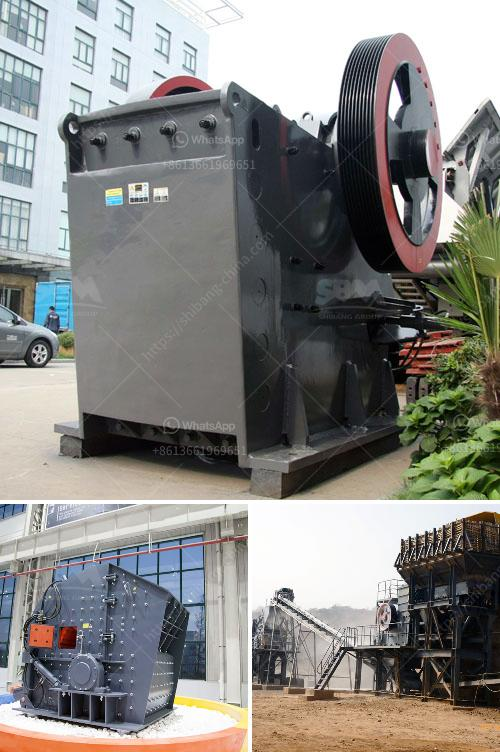

<h3>manufacturer of vertical coal pulverizer mill</h3>
The vertical coal pulverizer mill is an efficient and versatile grinding equipment designed to crush and grind hard and abrasive materials. It adopts a high-speed impact and grinding principle to squeeze and grind raw materials. The vertical coal pulverizer mill is composed of a separator, a grinding roller, a grinding disc, a pressurizing device, a speed reducer, a motor, a casing, and the like. The separator is an important component that determines the thickness of the finished product.

The manufacturer of the vertical coal pulverizer mill uses air to transport the material, and the wind swept grinding mill has the advantages of low investment cost and less consumption of auxiliary materials. It integrates drying, grinding, grading, and conveying into one, with high grinding efficiency and low energy consumption. It combines the advantages of Raymond mill, vertical roller mill, and ultra-fine grinding mill.

The manufacturer of the vertical coal pulverizer mill is based on the market demand and the market-oriented development concept, adhering to the "integrity management, quality-oriented" principle, in a continuous learning, innovation, strive to make customers satisfied products. The manufacturer integrates its own resources and advantages, continuously expands production scale, improves product quality and technical level, and establishes a complete pre-sales, sales, and after-sales service system.

The manufacturer of the vertical coal pulverizer mill has rich experience in manufacturing, providing customized solutions to customers, and ensuring the smooth operation of customer equipment. With advanced technology and excellent quality, it has won the trust and recognition of customers. In addition, the manufacturer also provides customers with comprehensive technical support, including site planning, equipment installation, training guidance, and other services.

In summary, the manufacturer of the vertical coal pulverizer mill is committed to providing customers with efficient, reliable, and durable grinding equipment. It continuously improves product quality, optimizes process technology, and provides comprehensive after-sales service, creating value for customers and contributing to the development of the coal industry.
<h3>Contact us</h3><ul><li><strong>Whatsapp:&nbsp;<a href="https://wa.me/8613661969651">+8613661969651</a></strong></li><li><a href="https://swt.shibang-china.com/?git&amp;zhl&amp;manufacturer of vertical coal pulverizer mill"><strong>Online Service(chat now)</strong></a></li></ul><h3>Related</h3><ul><li><a href='feldspar beneficiation plant.md'>feldspar beneficiation plant</a></li><li><a href='vibrating screen in cement plant.md'>vibrating screen in cement plant</a></li><li><a href='used crushers prices in nigeria.md'>used crushers prices in nigeria</a></li><li><a href='marble crushing plants.md'>marble crushing plants</a></li><li><a href='slag drying and grinding technique india crusher.md'>slag drying and grinding technique india crusher</a></li></ul>