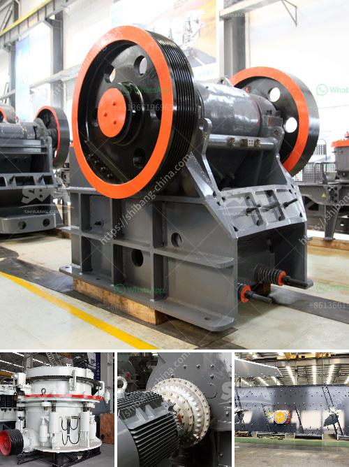

<h3>manufacturers of 3 tph vertical roller mill in china</h3>
Vertical roller mills have been the go-to choice for grinding raw materials in the cement industry for many years. These mills offer several benefits, including low energy consumption, compact design for space-saving, and a robust and reliable grinding process. In recent years, China has emerged as a leading manufacturer of vertical roller mills, offering state-of-the-art products that cater to the growing demand from various industries.

One such manufacturer that has gained prominence in the market is China's very own. With a proven track record of delivering high-quality machinery, they have become a trusted name in the industry. Their 3 TPH vertical roller mill is specially designed to meet the grinding needs of small and medium-sized cement plants.

The key feature of this mill is its compact size, making it ideal for sites with space constraints. Despite its small footprint, it delivers impressive performance in terms of grinding capacity and energy efficiency. This mill can handle a variety of raw materials, ranging from limestone and clay to cement clinker and slag.

The manufacturers have also focused on ensuring maximum reliability of their vertical roller mills. They employ advanced manufacturing processes and use high-quality materials to construct their machinery. Additionally, rigorous quality control measures are implemented throughout the production process to ensure that every mill meets the highest standards of functionality and durability.

The success of these manufacturers can largely be attributed to their dedication to research and development. They constantly invest in improving their products, incorporating the latest technological advancements to enhance performance and increase overall productivity. This commitment to innovation has helped them gain a competitive edge in the market, both domestically and globally.

In conclusion, the manufacturers of 3 TPH vertical roller mills in China are setting new standards in efficiency and reliability. With their small yet powerful mills, they are catering to the grinding needs of small and medium-sized cement plants, offering superior performance and energy efficiency. As the demand for vertical roller mills continues to grow, these manufacturers are poised to lead the way with their state-of-the-art products.
<h3>Contact us</h3><ul><li><strong>Whatsapp:&nbsp;<a href="https://wa.me/8613661969651">+8613661969651</a></strong></li><li><a href="https://swt.shibang-china.com/?git&amp;zhl&amp;manufacturers of 3 tph vertical roller mill in china"><strong>Online Service(chat now)</strong></a></li></ul><h3>Related</h3><ul><li><a href='pulverizer crusher manufacturer in pune.md'>pulverizer crusher manufacturer in pune</a></li><li><a href='crusher plant price komatsu.md'>crusher plant price komatsu</a></li><li><a href='yd mobile crushing plant.md'>yd mobile crushing plant</a></li><li><a href='portable mobile stone crushing plants.md'>portable mobile stone crushing plants</a></li><li><a href='primary jaw crusher saudi.md'>primary jaw crusher saudi</a></li></ul>