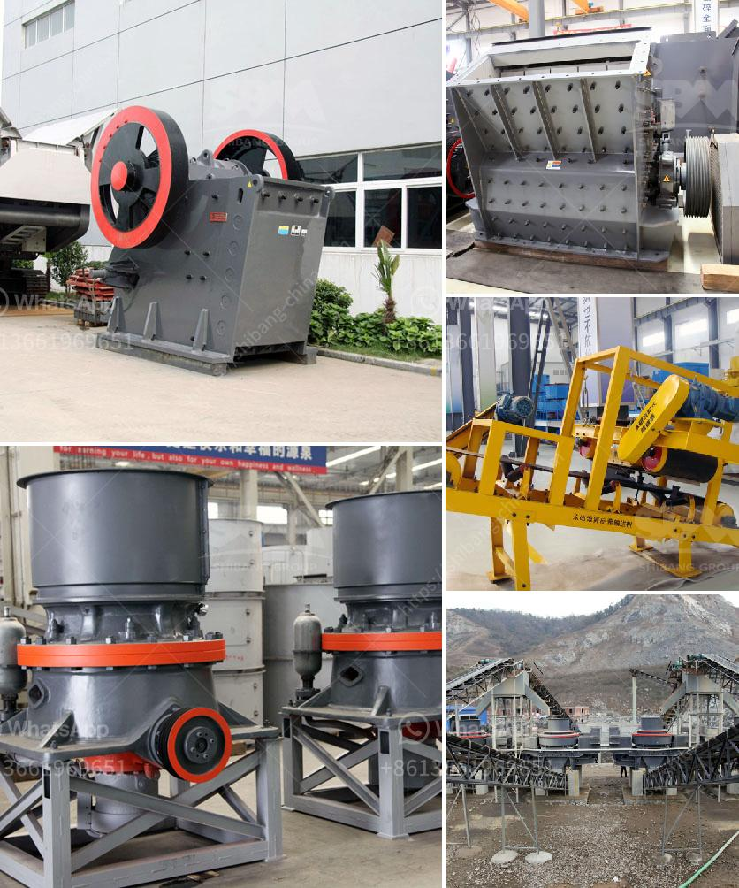

<h3>manufacturers of coal mill in india</h3>
India’s coal production has been on a steady rise over the past few years and is expected to reach a record high of 1.05 billion tonnes in 2021. The vast abundance of coal reserves and the significant role it plays in the country’s energy mix make India one of the largest producers and consumers of coal in the world.

One crucial aspect of coal utilization is its efficient conversion into electricity through coal mills. These mills are used to pulverize coal into fine powder, which is then used as fuel in power plants to generate electricity. To meet the increasing demand for coal, the need for high-quality and reliable coal mills is paramount for the Indian power industry.

Several manufacturers in India specialize in the production of coal mills that cater to the specific needs of the power industry. These manufacturers understand the unique requirements and challenges faced by power plants in India and design their mills accordingly.

One such trusted manufacturer is Bharat Heavy Electricals Limited (BHEL), a leading engineering and manufacturing company in India. BHEL has been supplying coal mills to power plants across the country for several decades. Its state-of-the-art manufacturing facilities and skilled workforce ensure the production of top-quality coal mills that meet global standards. BHEL’s mills are known for their robust construction, long service life, and efficient performance, making them a popular choice for power plant operators.

Another prominent manufacturer in India is Coal India Limited (CIL), the largest coal-producing company in the world. CIL not only supplies coal to various industries but also manufactures coal mills through its subsidiary, CMPDI (Central Mine Planning and Design Institute). CMPDI has a dedicated research and development wing that works towards enhancing the efficiency and reliability of coal mills.

Apart from BHEL and CIL, several other manufacturers, both domestic and international, cater to the Indian market for coal mills. These manufacturers leverage advanced technologies and innovative designs to produce mills that can handle high coal consumption rates and maintain optimal fuel efficiency. Some prominent international manufacturers include Mitsubishi Power, Alstom Power, and Babcock & Wilcox.

In recent years, there has been a growing emphasis on cleaner and more sustainable energy sources globally. However, coal remains a significant part of India's energy mix due to its abundance and affordability. In this context, manufacturers of coal mills in India are not only focused on improving the performance and efficiency of their mills but also exploring ways to reduce emissions and comply with environmental regulations.

Given the increasing demand for coal in India, manufacturers of coal mills play a crucial role in ensuring a steady supply of high-quality coal powder for power generation. With their expertise and relentless pursuit of innovation, these manufacturers contribute to India's energy security and the overall development of the power industry.

In conclusion, the manufacturers of coal mills in India are vital players in the country's power industry. Their commitment to producing high-quality mills that meet the specific needs of power plants ensures efficient and reliable coal utilization. As India continues to rely on coal for its energy needs, these manufacturers will play an essential role in catering to the growing demand and contributing to the country's energy security.
<h3>Contact us</h3><ul><li><strong>Whatsapp:&nbsp;<a href="https://wa.me/8613661969651">+8613661969651</a></strong></li><li><a href="https://swt.shibang-china.com/?git&amp;zhl&amp;manufacturers of coal mill in india"><strong>Online Service(chat now)</strong></a></li></ul><h3>Related</h3><ul><li><a href='sand crushing equipment sale in tanzania.md'>sand crushing equipment sale in tanzania</a></li><li><a href='kenya quartz crushing.md'>kenya quartz crushing</a></li><li><a href='dolomite production process.md'>dolomite production process</a></li><li><a href='cost of tonne per day cement plant.md'>cost of tonne per day cement plant</a></li><li><a href='stone crushers in kenya.md'>stone crushers in kenya</a></li></ul>