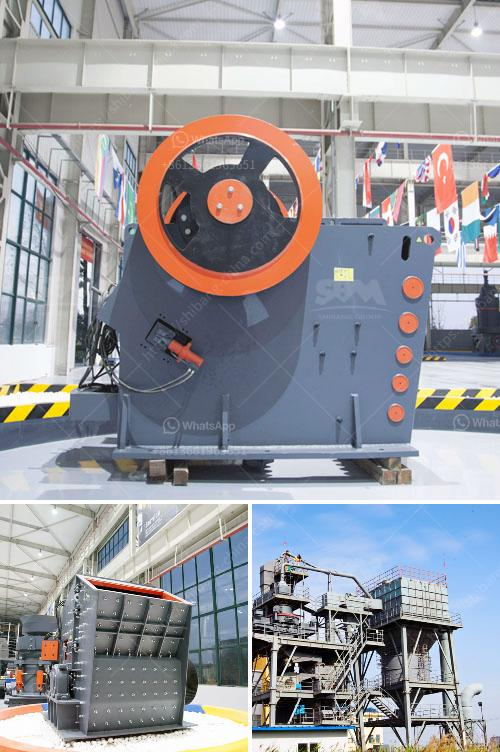

<h3>manufacturing from quatrz powder</h3>
When we think of manufacturing, various metals, plastics, and composite materials often come to mind. However, one lesser-known but incredibly versatile mineral that plays a crucial role in manufacturing is quartz powder. Derived from the abundant mineral quartz, this fine powdered form has found widespread use in a plethora of industries thanks to its exceptional properties.

Quartz powder is derived from silica, a natural mineral found in abundance in the Earth's crust. It is then processed through a series of crushing, grinding, and grading steps to create a fine, white powder with a range of particle sizes. Known for its hardness and resistance to high temperatures and chemical corrosion, quartz powder is gaining popularity for its numerous applications in the manufacturing realm.

One of the primary uses of quartz powder is in the production of glass. Its high silica content makes it an ideal material for manufacturing various types of glass, including flat glass used in windows and mirrors, scientific glassware, laboratory equipment, and specialized glass fibers for insulation and reinforcement. The uniform particle size of quartz powder ensures consistent quality and strength in the final glass products, making it an essential component in the glass industry.

Quartz powder is also widely utilized in ceramic manufacturing. Its low coefficient of thermal expansion, excellent mechanical strength, and resistance to chemical reactions at high temperatures make it an ideal additive in ceramic formulations. It improves the strength, hardness, and durability of ceramics, making them suitable for a wide range of applications, such as tiles, sanitary ware, electrical insulators, and refractory materials.

Furthermore, quartz powder finds extensive use in the production of paints and coatings. The fine particles of quartz powder act as fillers, enhancing the mechanical properties and providing improved adhesion and reinforcement to the paint film. Additionally, the chemical stability of quartz powder reduces the vulnerability of the paint to degradation caused by UV radiation and chemical exposure, increasing its lifespan and ensuring long-lasting protection for various surfaces.

In the field of construction, quartz powder is a key ingredient in the manufacturing of concrete and cement-based products. It acts as a pozzolan – a material that reacts chemically with water and cement to form additional binding agents. This results in increased strength, reduced permeability, and enhanced durability of the concrete. Quartz powder also contributes to its smooth texture and resistance against harsh environmental conditions.

Beyond these major industries, quartz powder finds application in diverse areas like friction materials, foundry castings, cosmetics, abrasives, and even as a filler in plastic and rubber products. Its remarkable thermal, electrical, and chemical properties make it an indispensable material for countless manufacturing processes.

In conclusion, quartz powder, derived from quartz mineral, is a versatile material playing a significant role in manufacturing. From glass production to ceramics, paints, construction, and various other industries, its unique characteristics and exceptional performance make it an invaluable component. As the manufacturing sector continues to evolve and strive for superior quality and innovation, the utilization of quartz powder is set to grow, opening up novel methods of production and enhancing the quality of countless products.
<h3>Contact us</h3><ul><li><strong>Whatsapp:&nbsp;<a href="https://wa.me/8613661969651">+8613661969651</a></strong></li><li><a href="https://swt.shibang-china.com/?git&amp;zhl&amp;manufacturing from quatrz powder"><strong>Online Service(chat now)</strong></a></li></ul><h3>Related</h3><ul><li><a href='impact crusher company.md'>impact crusher company</a></li><li><a href='copper processing plants in usa for sale.md'>copper processing plants in usa for sale</a></li><li><a href='mining and machine in turkey.md'>mining and machine in turkey</a></li><li><a href='modular conveyor belt supplier china.md'>modular conveyor belt supplier china</a></li><li><a href='vertical mill operating principle.md'>vertical mill operating principle</a></li></ul>