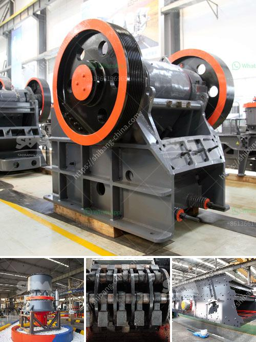

<h3>manufacturing of gypsum board production lines</h3>
Gypsum board, also known as drywall, is a popular construction material used for its versatility, durability, and fire-resistant properties. The manufacturing of gypsum board production lines plays a crucial role in meeting the increasing demand for this essential building material.

Gypsum board production lines are complex systems that involve various stages to transform gypsum into finished boards suitable for installation. The process begins with the raw gypsum being crushed into small pieces and then heated to remove excess moisture. The dried gypsum is then ground into a fine powder before being mixed with additives like starch, paper pulp, and fibreglass strands to strengthen the boards.

Manufacturing gypsum board production lines require an extensive array of machinery and equipment, including crushers, dryers, grinding mills, calciners, mixing machines, and board forming machines. These machines work in harmony to ensure precise gypsum board dimensions and consistent quality throughout the production process.

Advanced gypsum board production lines utilize cutting-edge technology to enhance efficiency and productivity while reducing energy consumption and environmental impacts. Automated systems control the various stages of production, ensuring high precision and minimizing human error. Modern production lines also incorporate quality control systems that monitor and regulate the boards' dimensions, strength, and other specifications.

To meet diverse market needs, gypsum board production lines can be customized in terms of capacity, dimensions, and automation level. Small-scale production lines cater to smaller construction projects, while larger lines with higher production capacities satisfy the demands of major construction companies and industries.

In conclusion, the manufacturing of gypsum board production lines represents a critical facet of the construction industry, enabling the efficient production of gypsum boards for a wide range of applications. As demand for gypsum board continues to grow, the development of advanced production lines will play a crucial role in meeting this increasing need while maintaining high quality and sustainability standards.
<h3>Contact us</h3><ul><li><strong>Whatsapp:&nbsp;<a href="https://wa.me/8613661969651">+8613661969651</a></strong></li><li><a href="https://swt.shibang-china.com/?git&amp;zhl&amp;manufacturing of gypsum board production lines"><strong>Online Service(chat now)</strong></a></li></ul><h3>Related</h3><ul><li><a href='silica sand price per tonne.md'>silica sand price per tonne</a></li><li><a href='how to maintain stone crusher daily accounts in tally.md'>how to maintain stone crusher daily accounts in tally</a></li><li><a href='crushing plant working.md'>crushing plant working</a></li><li><a href='portable gold mining hammer mills.md'>portable gold mining hammer mills</a></li><li><a href='gypsum washing plant.md'>gypsum washing plant</a></li></ul>