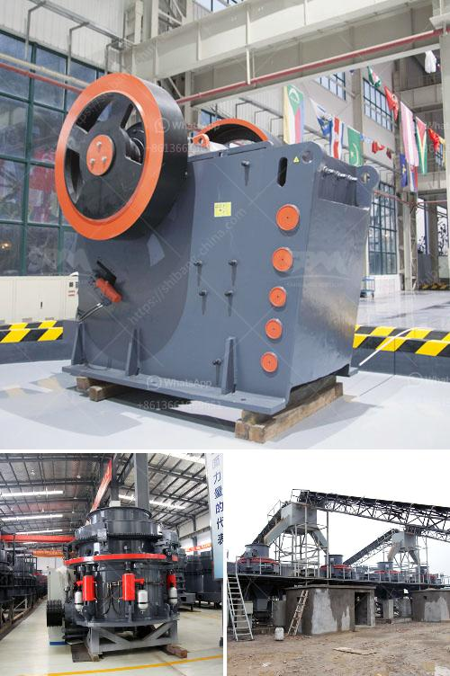

<h3>manufacturing process of mica crusher</h3>
The mica stone crushing and mining industry is a highly booming sector in the present day. With the continuous advancement of technological development, the mills within the manufacturing process of mica have also been improved.

In the Mica Crusher Manufacturing Process, the main raw material is broken first by a Jaw Crusher, and then it is transported from the bin to the mill evenly for a purposeful grinding. Mica is crushed and grinded predominantly by the grinding roll and ring impacts. After being crushed by the Mica Crusher, the mica is sent to the silo by the hoist, and then evenly fed into the main Raymond mill chamber for grinding. The rollers oscillate outward to press the ring because of the centrifugal force and the shovel scoops up the materials, which sends it between the grinding roll and the grinding ring. Finally, the Mica Powder is sorted by the separator and sent to the finished product storage bin through the discharge pipe.

The Mica Crusher manufacturing process has several requirements, such as the size of the feedstock, finished product granularity, and the output. These are all determined by the model of the equipment and the selection of the components. The model of the Jaw Crusher is chosen according to the hardness, moisture, and particle size of the raw materials, while the model of the Raymond mill is selected according to the fineness and output requirements of the product.

The crushing and grinding processes of Mica Crusher have undergone tremendous changes over the years. With the advancement of technology and the improvement of equipment performance, the equipment has become more and more efficient, providing a higher output and better processing efficiency. In addition, the equipment used in the production process has also become more diverse, providing users with different options to meet their specific needs.

The manufacturing process of Mica Crusher also includes several supporting equipment, such as feeding equipment, grinding equipment, and screening equipment. The feeding equipment ensures that the raw materials are evenly and uniformly fed into the crusher, avoiding the occurrence of blockages or uneven feeding, which may affect the grinding effect. The grinding equipment is responsible for the grinding and crushing of the raw materials, ensuring that the finished product has the required particle size and fineness. The screening equipment is used to separate the impurities from the crushed Mica Powder, ensuring the purity and quality of the final product.

In conclusion, the manufacturing process of Mica Crusher involves various stages, starting from the crushing of raw materials to the grinding and screening of the final product. The process has undergone significant improvements over the years, with advancements in technology and equipment. The Mica Crusher manufacturing process plays a vital role in the thriving mica stone crushing and mining industry, contributing to the growth and development of the sector. With continuous improvements, the industry is expected to witness further advancements in the manufacturing process, resulting in enhanced productivity and efficiency.
<h3>Contact us</h3><ul><li><strong>Whatsapp:&nbsp;<a href="https://wa.me/8613661969651">+8613661969651</a></strong></li><li><a href="https://swt.shibang-china.com/?git&amp;zhl&amp;manufacturing process of mica crusher"><strong>Online Service(chat now)</strong></a></li></ul><h3>Related</h3><ul><li><a href='diamond stone crusher.md'>diamond stone crusher</a></li><li><a href='used sand dryer for sale australia.md'>used sand dryer for sale australia</a></li><li><a href='grinding rock into powder.md'>grinding rock into powder</a></li><li><a href='cement grinding mill in bangladesh.md'>cement grinding mill in bangladesh</a></li><li><a href='start a quarry plant.md'>start a quarry plant</a></li></ul>