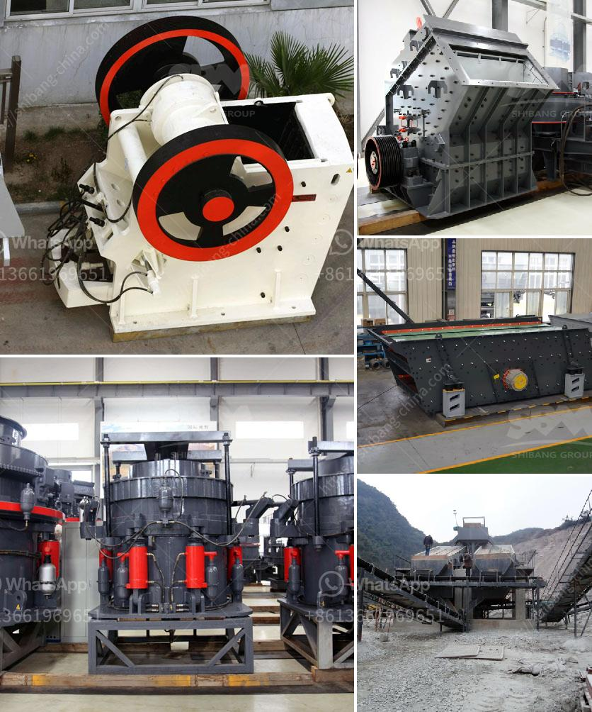

<h3>manufacturing process of portland slag cement</h3>
Portland slag cement, also referred to as PSC or simply slag cement, is a type of cement that incorporates blast furnace slag into its manufacturing process. This cement is highly durable, sustainable, and offers several advantages over traditional ordinary portland cement (OPC). In this article, we will explore the manufacturing process of portland slag cement and the benefits it brings.

The manufacturing process of portland slag cement involves the utilization of blast furnace slag, a byproduct of iron and steel production. This slag is obtained from the blast furnace, where it is produced during the smelting process by eliminating impurities and forming molten iron. Once the molten iron is extracted, the remaining slag is rapidly quenched with water, creating a granulated glassy material.

The granulated slag is then dried and grounded to obtain a fine powder, which is further blended with a predetermined amount of high-quality clinker (a key component of cement production) and gypsum. The clinker is obtained by heating limestone, clay, and shale in a kiln at high temperatures. The blend undergoes a grinding process to achieve the desired particle size distribution, resulting in the formation of portland slag cement.

One of the notable advantages of portland slag cement is its lower carbon footprint compared to OPC. By utilizing the slag waste material, the manufacturing process reduces the need for extracting and processing raw materials, which significantly minimizes energy consumption and greenhouse gas emissions. Additionally, the inclusion of slag enhances the cement's workability, strength, and durability. The porous structure of the slag particles contributes to internal curing, improving resistance against cracking and enhancing long-term performance.

Moreover, portland slag cement is highly resistant to chemical attacks, particularly from sulfate compounds found in groundwater or industrial effluents. This makes it an ideal choice for applications in marine structures, wastewater treatment plants, and industrial facilities.

In conclusion, the manufacturing process of portland slag cement involves utilizing blast furnace slag, obtained as a byproduct of iron and steel production. This sustainable cement offers numerous advantages, including lower energy consumption, reduced carbon emissions, improved workability, and higher resistance to chemical attacks. As the construction industry moves towards more sustainable and environmentally friendly practices, the use of portland slag cement is expected to grow and contribute to a greener future.
<h3>Contact us</h3><ul><li><strong>Whatsapp:&nbsp;<a href="https://wa.me/8613661969651">+8613661969651</a></strong></li><li><a href="https://swt.shibang-china.com/?git&amp;zhl&amp;manufacturing process of portland slag cement"><strong>Online Service(chat now)</strong></a></li></ul><h3>Related</h3><ul><li><a href='difference between raymond mill and ball mill.md'>difference between raymond mill and ball mill</a></li><li><a href='complete plant copper extraction processing for sale.md'>complete plant copper extraction processing for sale</a></li><li><a href='equipment costs for cement plant.md'>equipment costs for cement plant</a></li><li><a href='vertical roller mill coal.md'>vertical roller mill coal</a></li><li><a href='gold wash plant machine in ghana.md'>gold wash plant machine in ghana</a></li></ul>