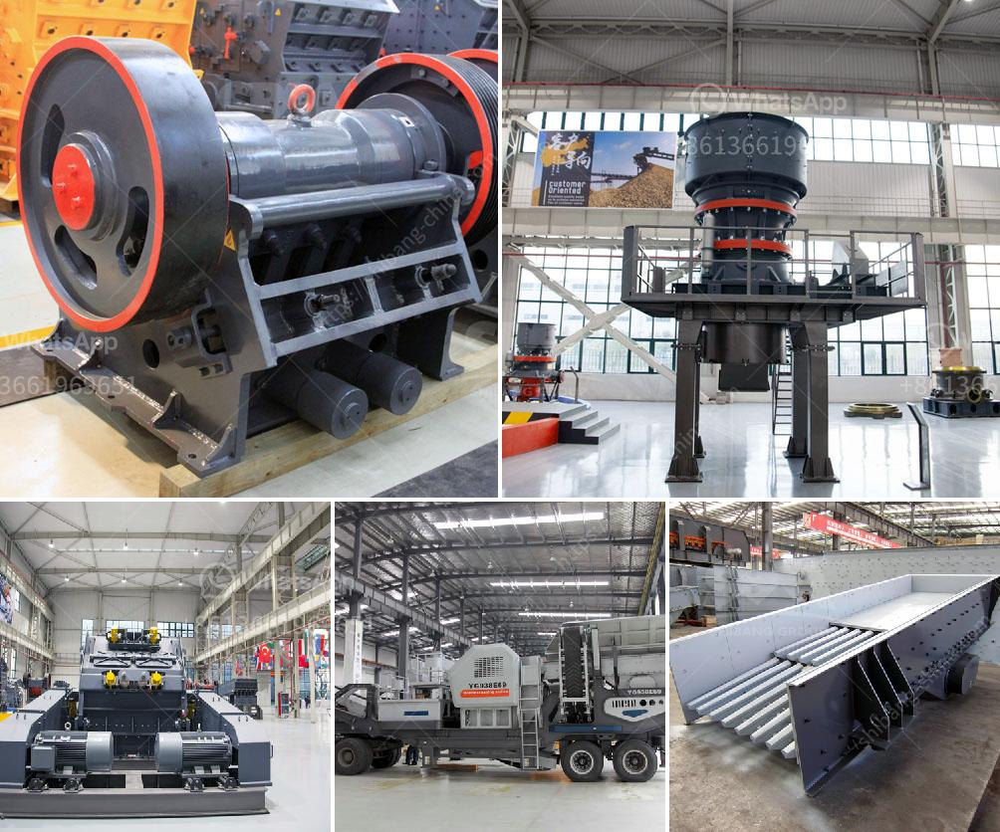

<h3>manufacturing process of talcum powder</h3>
Talcum powder, also known as talc powder, is a versatile white mineral powder made from talc, a naturally occurring mineral. Talcum powder is primarily used in the manufacturing of cosmetics, baby powders, and personal care products due to its ability to absorb moisture and provide a smooth and slippery texture.

The process of manufacturing talcum powder primarily involves drying, grinding, sieving, and blending of various raw materials. First, the raw materials like purified talc and other minerals are acquired from reputable suppliers. These raw materials are then pulverized into a fine powder through a process called milling.

The milling process involves machines called pulverizers or grinders that crush the raw material into fine particles. These machines have sharp blades that rotate at high speeds, reducing the raw material into a fine powder. After the milling process, the talc powder undergoes a sieving process to remove any impurities or larger particles.

The sieved talc powder is then transferred to a mixing machine, where it is blended with other ingredients according to the specific requirements of the product being manufactured. These additional ingredients might include fragrances, oils, or other additives that enhance the product's texture, scent, or color.

After the blending process, the talcum powder is transferred to packaging lines, where it is carefully filled into containers. These containers may vary depending on the product, ranging from small bottles or cans to larger containers. The packaging is designed to ensure the powder remains dry and free-flowing, preserving its quality and usability.

During the entire manufacturing process, strict quality control measures are implemented to ensure that the talcum powder meets the required standards. This includes regular sampling and testing of the raw materials and the final product to check for purity, consistency, and safety.

In recent years, there have been concerns regarding the safety of talcum powder due to the presence of trace amounts of asbestos, a known carcinogen, in some talc mines. However, reputable manufacturers utilize stringent testing methods to ensure that their talcum powder is asbestos-free. Additionally, regulatory bodies closely monitor and regulate the production and sale of talcum powder products to ensure consumer safety.

It is important to note that talcum powder is intended for external use only and should be used as directed. Inhalation of talc particles can lead to health issues, and it should be kept away from the eyes to avoid irritation.

In conclusion, the manufacturing process of talcum powder involves various steps, including drying, grinding, sieving, and blending of raw materials. Stringent quality control measures are implemented to ensure the purity and safety of the final product. As with any product, it is essential to use talcum powder responsibly and as directed to promote its safe use.
<h3>Contact us</h3><ul><li><strong>Whatsapp:&nbsp;<a href="https://wa.me/8613661969651">+8613661969651</a></strong></li><li><a href="https://swt.shibang-china.com/?git&amp;zhl&amp;manufacturing process of talcum powder"><strong>Online Service(chat now)</strong></a></li></ul><h3>Related</h3><ul><li><a href='best grinding pads for marble in pakistan.md'>best grinding pads for marble in pakistan</a></li><li><a href='fly ash processing plant for sale.md'>fly ash processing plant for sale</a></li><li><a href='stone crusher suppliers in indore.md'>stone crusher suppliers in indore</a></li><li><a href='process of coal crushing plant.md'>process of coal crushing plant</a></li><li><a href='crushing and serreing machinery.md'>crushing and serreing machinery</a></li></ul>