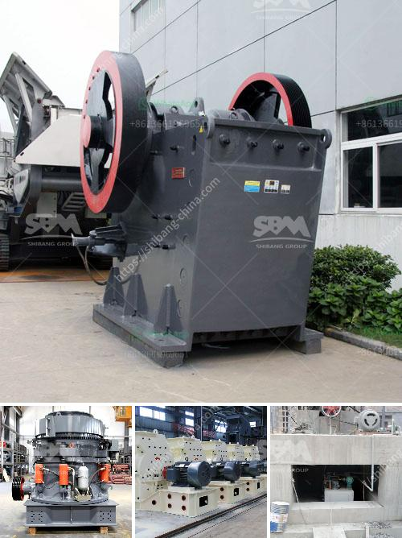

<h3>manufacturing processes of clay products</h3>
The manufacturing processes of clay products involve a series of steps to transform raw clay into finished ceramic items. Clay products have been utilized by humans for thousands of years and are still widely used today in various industries. This article explores the different stages that clay goes through to become a final product.

The first step in the manufacturing process is mining or extracting the clay. Clay is usually found in underground deposits and is obtained through surface mining or deep drilling. Once the clay is extracted, it is brought to the manufacturing facility.

The second stage is preparation, where the clay is cleaned and refined to remove impurities such as rocks, stones, and other foreign materials. This is done to ensure the quality and consistency of the clay. The clay is then crushed into smaller particles and mixed with water to create a workable consistency.

Next comes the shaping process. There are several methods of shaping clay products, including hand molding, wheel throwing, and extrusion. Hand molding involves manually shaping the clay into the desired form. This method allows for greater artistic expression and is typically used for one-of-a-kind pieces. Wheel throwing, on the other hand, utilizes a pottery wheel that spins the clay while it is being shaped by the potter's hands. This method is commonly employed for creating symmetrical and uniform pottery items. Extrusion, the third method, involves forcing the clay through a shaped die to create long and uniform shapes, such as bricks and tiles.

Once the clay has been shaped, it is left to dry partially. This drying process, also known as the leather-hard stage, allows the clay to harden enough to handle without losing its plasticity. At this stage, the partially dried clay can be trimmed, carved, or have attachments added.

The next stage is firing or baking the clay in a kiln. Firing is carried out at high temperatures to remove any remaining moisture and to chemically transform the clay into a ceramic material. The temperature and duration of firing depend on the type of clay and the desired final product. There are two main types of firing: bisque firing and glaze firing. Bisque firing, also known as the first firing, is done at a lower temperature and prepares the clay for glazing. Glaze firing, the final firing, is carried out at a higher temperature to fuse the glaze onto the clay surface, resulting in a glossy and durable finish.

After firing, additional finishing touches may be applied to the clay products. This can include glazing, painting, or adding decorative elements. Glazing involves applying a thin layer of glassy material to the surface of the ceramic item, giving it a smooth and colorful finish. Painting and decorative elements can add further aesthetic value to the product.

Finally, the clay products undergo a final firing to ensure that the glaze and additional decorative elements are properly fused to the ceramic surface. Once the firing process is complete, the clay products are ready to be packaged, stored, and distributed to various markets.

In conclusion, the manufacturing processes of clay products involve several stages, from mining and preparation to shaping, drying, firing, and finishing. Each step contributes to the creation of unique and functional ceramic items that have been an integral part of human civilization for centuries. The versatility and durability of clay products make them valuable in numerous industries and a timeless form of art and craftsmanship.
<h3>Contact us</h3><ul><li><strong>Whatsapp:&nbsp;<a href="https://wa.me/8613661969651">+8613661969651</a></strong></li><li><a href="https://swt.shibang-china.com/?git&amp;zhl&amp;manufacturing processes of clay products"><strong>Online Service(chat now)</strong></a></li></ul><h3>Related</h3><ul><li><a href='categories of conveyor belts.md'>categories of conveyor belts</a></li><li><a href='cost of cement manufacturing plant.md'>cost of cement manufacturing plant</a></li><li><a href='slag crusher machine india.md'>slag crusher machine india</a></li><li><a href='kaolin clay processing flow chart.md'>kaolin clay processing flow chart</a></li><li><a href='build a rock crusher.md'>build a rock crusher</a></li></ul>