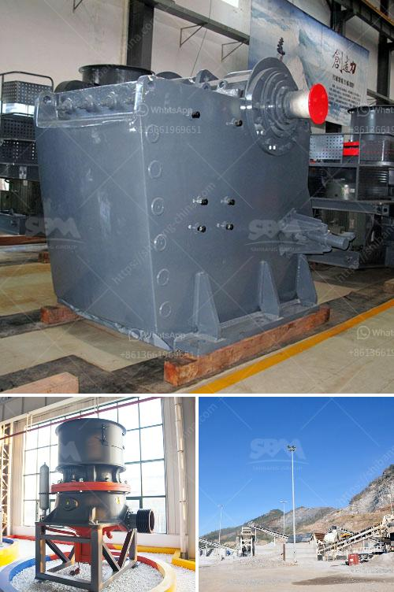

<h3>marble crusher cost</h3>
Marble is a popular material used for sculptures, construction, and decorative purposes due to its elegance and durability. However, extracting and crafting marble can be a labor-intensive process that requires appropriate equipment such as a marble crusher. In this article, we will focus on the cost associated with acquiring and using a marble crusher and how it contributes to increasing efficiency and value.

The cost of a marble crusher primarily depends on the specific model and the materials it is made of. Typically, the prices range from a few thousand dollars to tens of thousands of dollars. The cost can be divided into two main components: the initial purchase price and the operational expenses.

When considering the initial purchase price, it is essential to evaluate the crusher's capabilities and features. A high-quality marble crusher should possess sufficient crushing capacity, adjustable output size, and reliable performance. This ensures that it can effectively process various sizes of marble without any bottlenecks or breakdowns. Additionally, modern crushers often come with advanced technology that allows for automated control systems, ensuring a consistent and efficient crushing process.

Apart from the purchase price, the operational expenses associated with a marble crusher include electricity, maintenance, and wear parts. The power consumption largely depends on the crusher's efficiency and the hardness of the marble being processed. It is crucial to choose a crusher that optimizes energy utilization to minimize electricity costs. Regular maintenance, including lubrication and inspection, is essential to ensure the crusher's longevity and prevent unexpected downtime or costly repairs. Similarly, replacing worn-out parts in a timely manner can prevent further damage and improve the crusher's overall performance.

Although the initial cost of a marble crusher might seem high, it is important to consider the long-term benefits it brings. Investing in a high-quality crusher can significantly enhance the efficiency of marble processing, thereby increasing productivity and reducing labor costs. With a reliable crusher, marble can be processed in large quantities, saving time and human resources.

Furthermore, a marble crusher also adds value to the processed marble. By crushing marble into smaller particles, it becomes easier to transport and handle, making it more accessible for various applications. Crushed marble can be used as a base material for construction projects, as an ingredient in concrete, or as a decorative element in landscaping. These applications increase the market value of marble, further justifying the cost of a crusher.

In conclusion, a marble crusher comes with both an initial purchase cost and ongoing operational expenses. However, the efficiency and value it brings to marble processing make it a worthwhile investment. By choosing a suitable crusher and optimizing its use, businesses can increase productivity, reduce labor costs, and add value to their marble products. Therefore, carefully considering the cost of a marble crusher can lead to long-term benefits and a competitive edge in the market.
<h3>Contact us</h3><ul><li><strong>Whatsapp:&nbsp;<a href="https://wa.me/8613661969651">+8613661969651</a></strong></li><li><a href="https://swt.shibang-china.com/?git&amp;zhl&amp;marble crusher cost"><strong>Online Service(chat now)</strong></a></li></ul><h3>Related</h3><ul><li><a href='stone crusher business plan.md'>stone crusher business plan</a></li><li><a href='hammer mill pc800 x 600.md'>hammer mill pc800 x 600</a></li><li><a href='calcium carbonate proses by process.md'>calcium carbonate proses by process</a></li><li><a href='hammer crusher pc400.md'>hammer crusher pc400</a></li><li><a href='milling equipment for talcum powder.md'>milling equipment for talcum powder</a></li></ul>