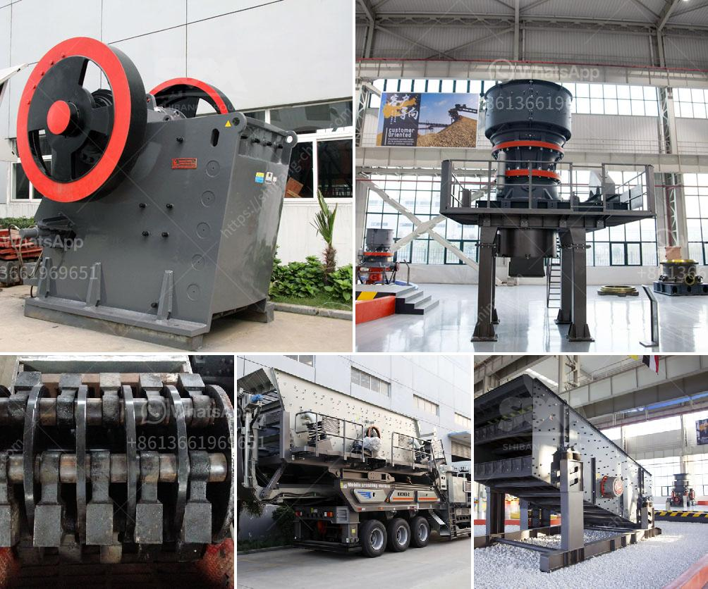

<h3>marble crushing plants</h3>
Marble has been regarded as a luxurious natural stone since ancient times. Its stunning appearance and unique veining patterns have made it a popular choice for various applications, including countertops, flooring, and decorative elements. However, the process of obtaining marble involves several steps, starting with the extraction of the stone from quarries, followed by cutting, polishing, and shaping. One crucial aspect of this process is marble crushing, which ensures that the material is suitable for further use.

Marble crushing plants play a vital role in bringing marble fragments with various sizes to the desired particle size. Traditionally, these plants are equipped with jaw crushers, impact crushers, and vibrating screens to ensure optimum product quality and efficiency. Jaw crushers are renowned for their ability to break down large rocks into smaller, more manageable sizes, making them perfect for primary crushing.

Impact crushers, on the other hand, are ideal for secondary crushing. They can break down marble fragments even further, resulting in even smaller particle sizes. These crushers utilize impact forces to shatter the marble, reducing it to a precise and uniform size. Vibrating screens, on the other hand, ensure the separation of different-sized marble particles, allowing for the production of marble with specific size requirements.

Marble crushing plants are often equipped with advanced technology and machinery, resulting in efficient and high-quality production. These plants use hydraulic systems to adjust the crusher settings, leading to improved safety and increased productivity. Additionally, automation features enable operators to monitor and control the crushing process remotely, minimizing human error and maximizing efficiency.

In addition to providing the necessary equipment for marble crushing, these plants also adhere to sustainability practices. They utilize energy-efficient systems and implement recycling strategies to minimize waste and reduce environmental impact. This commitment to sustainability ensures that natural resources are used responsibly and that the marble industry can flourish without compromising the planet's well-being.

The crushed marble produced by these plants serves as a crucial raw material in the manufacturing of various products. From construction materials like aggregate and concrete to decorative elements and ornamental sculptures, crushed marble finds applications in numerous industries. Its durability, aesthetic appeal, and versatility make it a favored choice for architects, interior designers, and homeowners alike.

Moreover, marble crushing plants contribute to job creation and economic growth. The extraction and processing of marble require skilled labor, providing employment opportunities for local communities. Additionally, the marble industry fosters a boost in tourism as marble mines and processing plants often attract visitors interested in observing the stone's journey from quarry to final product.

In conclusion, marble crushing plants are essential in ensuring the availability of high-quality marble products. These plants utilize advanced technology and machinery to transform large marble fragments into the desired size, resulting in various applications ranging from construction materials to decorative elements. Furthermore, these plants prioritize sustainability and contribute to job creation and economic growth. With the increasing global demand for marble, it is crucial to have efficient and environmentally responsible crushing plants to support this flourishing industry.
<h3>Contact us</h3><ul><li><strong>Whatsapp:&nbsp;<a href="https://wa.me/8613661969651">+8613661969651</a></strong></li><li><a href="https://swt.shibang-china.com/?git&amp;zhl&amp;marble crushing plants"><strong>Online Service(chat now)</strong></a></li></ul><h3>Related</h3><ul><li><a href='i want a powder grinding mill for sale.md'>i want a powder grinding mill for sale</a></li><li><a href='limestone crusher equipment.md'>limestone crusher equipment</a></li><li><a href='mobile crusher south africa.md'>mobile crusher south africa</a></li><li><a href='gold plant for sale in africa.md'>gold plant for sale in africa</a></li><li><a href='dolomite crusher turkey 200 ton price.md'>dolomite crusher turkey 200 ton price</a></li></ul>