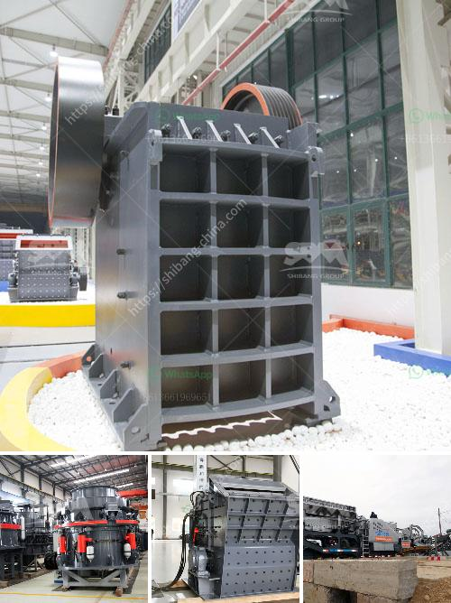

<h3>marble quarry crusher equipments</h3>
Marble is a natural stone that has been used for centuries in various applications such as architecture, sculpture, and home décor. It is a versatile material known for its beauty, durability, and unique patterns. One of the key steps in extracting marble from quarries is the use of marble quarry crusher equipment. In this article, we will discuss the different types of marble quarry crusher equipment and their function.

Marble quarrying is a highly energy-intensive process that involves cutting and drilling through large sections of rock, which creates dust, noise, and vibrations. The use of heavy-duty equipment during extraction helps to minimize these effects and ensure the safety and efficiency of the operation.

The primary crusher plays a crucial role in the quarrying process as it is responsible for breaking down the large rocks into smaller, more manageable sizes for further processing. Various types of crushers are used for this purpose, including jaw crushers, gyratory crushers, cone crushers, and impact crushers. Each of these types has its own unique characteristics and advantages.

Jaw crushers are commonly used in marble quarries because of their versatility and ability to handle larger feed sizes. They have a fixed jaw plate and a moving jaw plate, which together create a squeezing motion to break down the rocks. Jaw crushers are ideal for primary crushing of marble, as they are designed to handle large amounts of material efficiently.

Gyratory crushers are another popular choice for marble quarries. These crushers have a conical head and a concave surface, which enables them to crush the marble between the head and the concave. Gyratory crushers are known for their high capacity and ability to produce a uniform product size. They are suitable for both primary and secondary crushing.

Cone crushers are often used in the secondary and tertiary stages of crushing marble. They have a cone-shaped crushing chamber and an eccentrically rotating mantle that gyrates within the chamber. Cone crushers are efficient in producing cubic-shaped particles and are often used to produce high-quality aggregates.

Impact crushers are commonly used in marble quarries for secondary crushing. They have a high rotational speed rotor that strikes the marble and throws it against the crushing chamber walls. This action breaks the marble into smaller pieces and creates a cuboidal-shaped product. Impact crushers are known for their high reduction ratios and excellent particle shape.

In addition to crushers, other equipment used in the marble quarrying process includes screens, conveyors, and storage bins. Screens are used to separate the different sizes of crushed marble and ensure uniformity in the final product. Conveyors transport the crushed marble from the primary crusher to the next stage of processing. Storage bins are used to store the crushed marble before it is transported for further processing or sale.

In conclusion, marble quarry crusher equipment is essential in the marble quarrying process. Crushers are the primary crushing equipment that break down large rocks into smaller, more manageable sizes. Different types of crushers are used for different purposes, including jaw crushers, gyratory crushers, cone crushers, and impact crushers. These crushers, along with screens, conveyors, and storage bins, play a crucial role in ensuring the efficiency and safety of marble quarrying operations.
<h3>Contact us</h3><ul><li><strong>Whatsapp:&nbsp;<a href="https://wa.me/8613661969651">+8613661969651</a></strong></li><li><a href="https://swt.shibang-china.com/?git&amp;zhl&amp;marble quarry crusher equipments"><strong>Online Service(chat now)</strong></a></li></ul><h3>Related</h3><ul><li><a href='picture of concrete crusher machine.md'>picture of concrete crusher machine</a></li><li><a href='super fine roller mill.md'>super fine roller mill</a></li><li><a href='philippines cone crusher.md'>philippines cone crusher</a></li><li><a href='deasel stone crushers and prices in gauteng.md'>deasel stone crushers and prices in gauteng</a></li><li><a href='cement clinker grinding manufacturer.md'>cement clinker grinding manufacturer</a></li></ul>