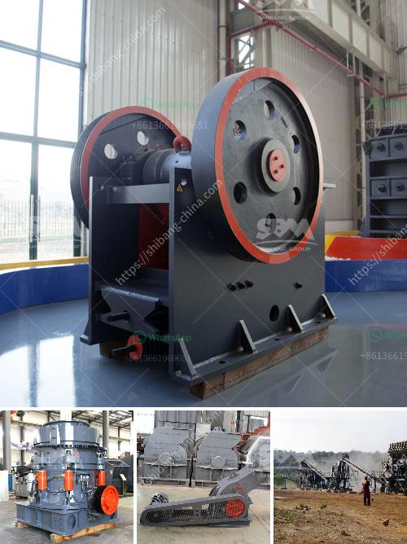

<h3>material ball mills</h3>
Ball mills have been used for decades to grind and mix materials used in the ceramic industry. SHIMPO's heavy-duty ball milling machines enable very precise milling, in porcelain jars, even for relatively tough materials, wet or dry. 

Our Shimpo ball mills for sale have a compact design that is ideal for small-scale production and is constructed using powder-coated steel for long-lasting durability. The PTA-01 accommodates one jar, the PTA-02 can handle two jars. Easy adjustments can be made to the sturdy roller bars to accommodate jars from 1-liter to 10-liters. Each milling machine comes with an operator-friendly control panel that allows users to easily set parameters such as milling time and speed.

Ball milling is a size reduction technique that uses media in a rotating cylindrical chamber to mill materials to a fine powder. As the chamber rotates, the media is lifted up on the rising side and then cascades down from near the top of the chamber, which provides global motion impact forces. These impact forces can be quite strong, and their effect can be enhanced by the addition of milling media such as steel balls, porcelain balls, or flint pebbles. Ceramic balls are often added to aid with the reduction processes, as they can withstand high temperatures and lower the risk of contamination. 

Materials such as clay and glaze components can be broken down in a ball mill by getting placed into rotating or rolling jars with porcelain balls inside them. During milling, the porcelain balls pulverize the materials due to their high impact energy. The resulting materials can be further reduced in particle size in a second milling process. 

In addition to using ball mills to grind materials down to a fine powder, SHIMPO ball mills can be used for other materials such as turning clay into fine particles for pottery applications. By changing the energy distribution of the grinding media, it is possible to obtain high-quality products with narrower particle size distributions (PSDs). The selection of appropriate grinding media is crucial, as it affects both the grinding efficiency and the final particle size distribution of the product. 

It is important to note that different materials require different milling conditions. For example, brittle and hard materials require milling with dry or wet processes, while ductile materials require only dry milling. Moreover, the process of adding liquid to materials can cause contamination if the grinding media are not ideally suited for the material being processed. Therefore, users must take into consideration the characteristics of the material being processed and choose the appropriate milling conditions and media accordingly.

Overall, material ball mills are versatile and efficient tools that allow for easy and precise milling of a wide range of materials. By choosing the right equipment and milling conditions, manufacturers and researchers can achieve the desired particle size distributions and product quality.
<h3>Contact us</h3><ul><li><strong>Whatsapp:&nbsp;<a href="https://wa.me/8613661969651">+8613661969651</a></strong></li><li><a href="https://swt.shibang-china.com/?git&amp;zhl&amp;material ball mills"><strong>Online Service(chat now)</strong></a></li></ul><h3>Related</h3><ul><li><a href='usina de minerio de ferro para venda no mexico.md'>usina de minerio de ferro para venda no mexico</a></li><li><a href='mobile crusher in saudi.md'>mobile crusher in saudi</a></li><li><a href='crusher agreegade suppliers durban.md'>crusher agreegade suppliers durban</a></li><li><a href='gypsum ball mill manufacturing machine.md'>gypsum ball mill manufacturing machine</a></li><li><a href='cost of setting up a kaolin production plant.md'>cost of setting up a kaolin production plant</a></li></ul>