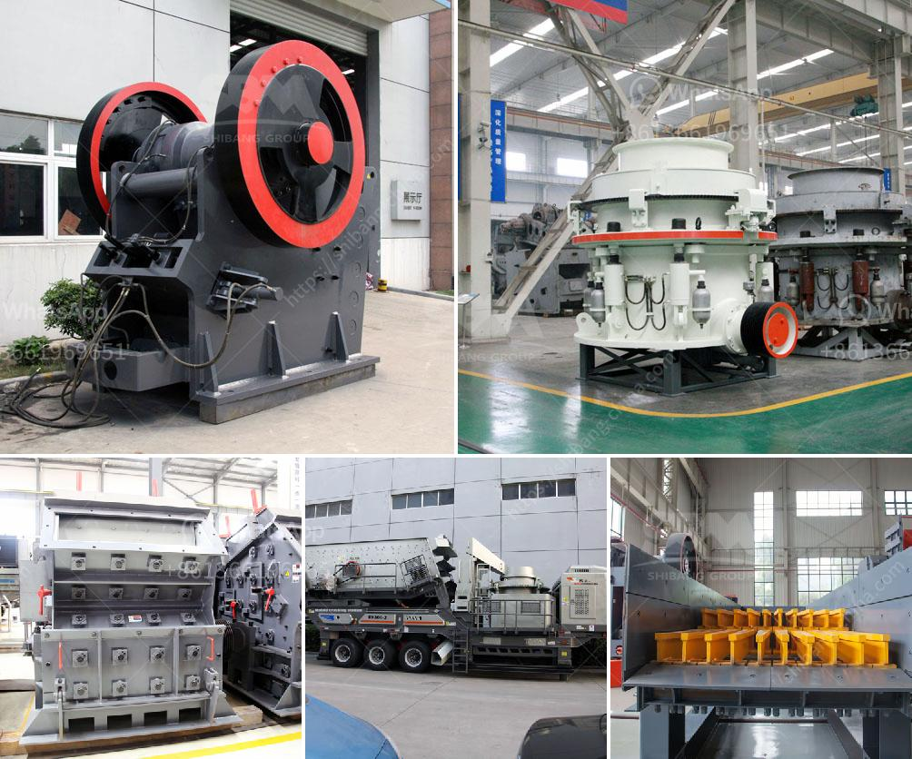

<h3>medium scale quarry crushing equipment</h3>
In today's fast-paced economy, small and medium-sized enterprises (SMEs) are constantly seeking ways to remain competitive. One thriving industry that offers immense potential is the quarrying and mining sector. Quarry crushing equipment plays a critical role in the extraction, processing, and transportation of materials, enabling companies to efficiently produce aggregates and other essential commodities.

For SMEs looking to explore this market, opting for medium-scale quarry crushing equipment can prove to be a game-changer. This machinery bridges the gap between small-scale operations and large enterprises, providing a cost-effective and versatile solution that can significantly boost productivity.

One major advantage of medium-scale quarry crushing equipment is its ability to handle a wide range of different feed materials. Whether it is limestone, granite, basalt, or any other rock type, this machinery can effectively crush and process them into the required specifications. This versatility ensures that companies can cater to various customer demands and provide diverse products, strengthening their market presence.

Moreover, medium-scale quarry crushing equipment can handle larger quantities of materials compared to smaller machinery. With its higher processing capacity, SMEs can efficiently meet larger orders and customer demands while minimizing delays and ensuring timely deliveries. This capability allows businesses to scale up their operations and tackle more significant projects, resulting in increased revenue and improved profitability.

Equally important is the operational efficiency brought about by medium-scale quarry crushing equipment. These machines are specifically designed to perform heavy-duty tasks, ensuring uninterrupted performance and minimal downtime. This reliability is crucial for SMEs to establish a solid reputation and build long-term relationships with clients, as it instills confidence in their ability to consistently deliver high-quality materials.

Moreover, the medium-scale machinery often comes equipped with advanced automation and control systems. These features streamline the crushing process, optimizing performance, and improving energy efficiency. Additionally, these systems minimize human error and enhance safety measures, creating a healthier and more productive working environment for employees.

It is also worth mentioning that investing in medium-scale quarry crushing equipment provides SMEs with a competitive edge over their smaller counterparts. This type of machinery unlocks economies of scale, reducing production costs per tonne. Consequently, businesses can offer their products at more competitive prices without compromising on quality, attracting a larger customer base and securing a greater market share.

Furthermore, medium-scale quarry crushing equipment is relatively easier to finance compared to large-scale machinery. SMEs often have better access to funding and can harness it to upgrade their operations. By acquiring advanced equipment, businesses can stay ahead of competitors and position themselves as industry leaders, thereby gaining a significant strategic advantage.

In conclusion, SMEs venturing into the quarrying and mining sector should seriously consider investing in medium-scale quarry crushing equipment. Its ability to process diverse feed materials, handle larger quantities, and operate with high efficiency makes it a vital tool for businesses aiming to establish a competitive presence in this industry. With the right equipment, SMEs can seize opportunities, maximize profitability, and contribute to sustainable economic growth.
<h3>Contact us</h3><ul><li><strong>Whatsapp:&nbsp;<a href="https://wa.me/8613661969651">+8613661969651</a></strong></li><li><a href="https://swt.shibang-china.com/?git&amp;zhl&amp;medium scale quarry crushing equipment"><strong>Online Service(chat now)</strong></a></li></ul><h3>Related</h3><ul><li><a href='quartz crusher machinery.md'>quartz crusher machinery</a></li><li><a href='gold milling plant cost.md'>gold milling plant cost</a></li><li><a href='diagram of stone crusher operation.md'>diagram of stone crusher operation</a></li><li><a href='grinding or crushing for gypsum pdf.md'>grinding or crushing for gypsum pdf</a></li><li><a href='manufacturing process of mica crusher.md'>manufacturing process of mica crusher</a></li></ul>