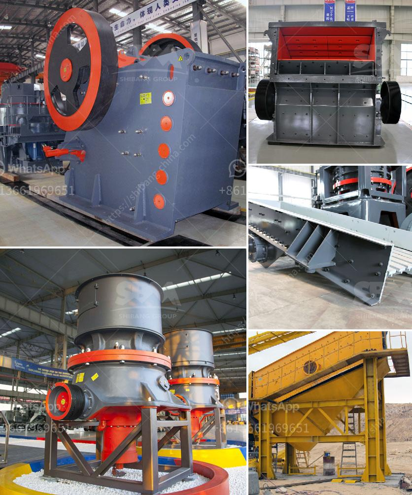

<h3>mica pearl process flowchart</h3>
Mica pearl is a unique material that has been widely used in various industries for its stunning shimmering effect. It is a natural mineral with a layered structure that allows it to reflect and refract light, creating a pearlescent appearance. The process of obtaining mica pearl involves several steps, from mining the raw material to processing it into the final product. In this article, we will explore the process flowchart of mica pearl production.

The first step in the process is mining. Mica is found in large deposits around the world and is primarily obtained through open-pit mining. This involves the extraction of mica ore from the earth using heavy machinery and tools. The mining process can vary depending on the location and type of mica deposit, but typically involves drilling, blasting, and hauling the ore to the processing facility.

Once mined, the mica ore goes through a series of crushing and grinding processes to break it down into smaller particles. The ore is usually crushed into a fine powder to facilitate the separation of mica from other minerals. Grinding mills are commonly used for this purpose, where the ore is pulverized to the desired consistency.

After grinding, the mica ore undergoes a process called flotation. This process involves mixing the ground ore with water and various chemicals, such as collectors and frothers, to separate the mica from the other minerals present. The mixture is then agitated in flotation tanks, where air bubbles are introduced. The mica particles adhere to the air bubbles and rise to the surface, forming a froth layer. This froth is collected and further processed to obtain the mica concentrate.

The mica concentrate obtained from flotation is then subjected to various refining processes to remove impurities and improve its quality. One of the common refining methods is magnetic separation, which utilizes magnets to separate mica from any remaining iron-bearing minerals. The concentrate is passed through magnetic separators, where the magnetic particles are attracted to the magnet, leaving behind the purified mica.

The purified mica is then dried to reduce its moisture content and prepared for further processing. Depending on the intended application, the mica can be further processed into different forms, such as flakes or powder. This can involve additional grinding or milling processes to achieve the desired particle size and uniformity.

Finally, the processed mica is packed and ready to be shipped to various industries. Mica pearl is widely used in cosmetics, paints, plastics, and automotive industries for its unique reflective properties and lustrous appearance. It is a versatile material that adds a touch of elegance and sophistication to various products.

In conclusion, the process flowchart of mica pearl production involves several steps, from mining the raw material to processing it into the final product. Each step is crucial in obtaining high-quality mica pearl with the desired characteristics. The process includes mining, crushing, grinding, flotation, refining, drying, and final processing. Mica pearl's captivating shimmer and iridescence make it a popular choice in many industries, contributing to the creation of visually appealing and aesthetically pleasing products.
<h3>Contact us</h3><ul><li><strong>Whatsapp:&nbsp;<a href="https://wa.me/8613661969651">+8613661969651</a></strong></li><li><a href="https://swt.shibang-china.com/?git&amp;zhl&amp;mica pearl process flowchart"><strong>Online Service(chat now)</strong></a></li></ul><h3>Related</h3><ul><li><a href='malaysia companies that manufacture crushing machines.md'>malaysia companies that manufacture crushing machines</a></li><li><a href='jaw crusher price in kenya.md'>jaw crusher price in kenya</a></li><li><a href='hammer mill sale in malaysia.md'>hammer mill sale in malaysia</a></li><li><a href='stone crushing machines in uk.md'>stone crushing machines in uk</a></li><li><a href='crusher stone peru.md'>crusher stone peru</a></li></ul>