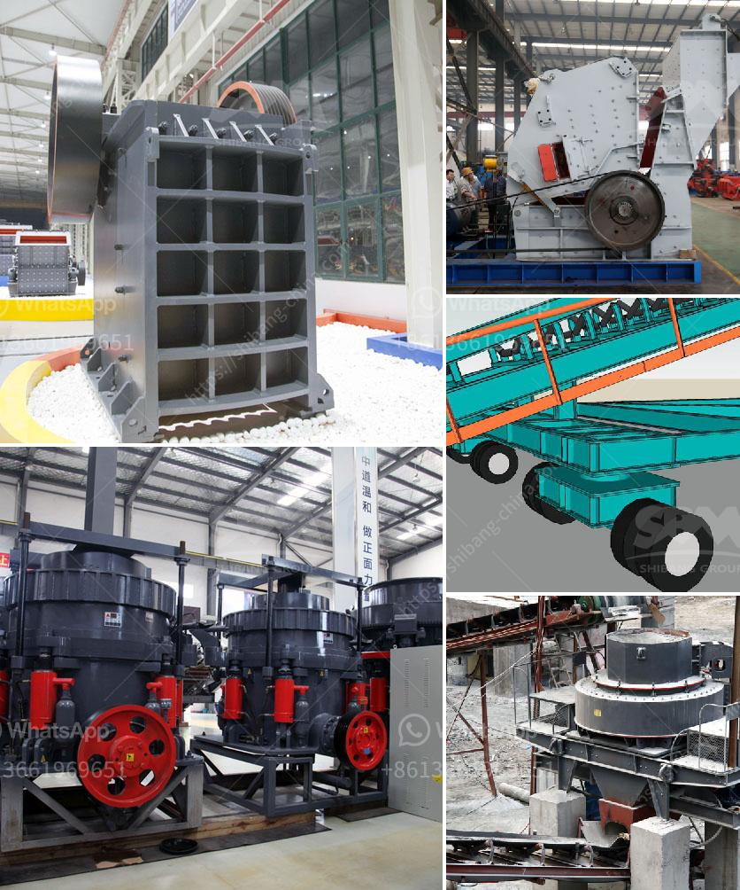

<h3>mica powder mill malaysia</h3>
Mica is a naturally occurring mineral known for its reflective and shimmering properties. It is widely used in various industries, including cosmetics, paints, plastics, and automotive coatings. In recent years, the demand for mica powder has been steadily increasing in Malaysia, leading to the establishment of several mica powder mills in the country.

Mica powder mills are specialized facilities that grind mica crystals into fine powder form, which is then used in various applications. These mills use advanced grinding technology to ensure a high quality and consistent output. The mica powder produced by these mills is valued for its excellent properties, including its luster, heat resistance, electrical insulation, and chemical stability.

One of the leading mica powder mills in Malaysia is ABC Mica Powder Mill. Located in the industrial zone of Kuala Lumpur, this mill has been operating for over a decade and has gained a reputation for its superior quality mica powder. The mill sources its raw materials from local mica mines, ensuring a sustainable and traceable supply chain.

ABC Mica Powder Mill boasts state-of-the-art machinery and equipment, designed to maximize efficiency and productivity. The mill operates using a closed circuit grinding system, which ensures that the mica particles are uniformly ground to the desired fineness. This system also helps minimize energy consumption and reduce environmental impact.

In addition to its sophisticated grinding technology, ABC Mica Powder Mill has implemented strict quality control measures. Every batch of mica powder is tested for its chemical composition, particle size distribution, and other physical properties to ensure it meets the required specifications. This commitment to quality has earned the mill the trust and loyalty of its customers.

The applications of mica powder are vast and diverse. In the cosmetics industry, it is commonly used as a base for facial and body powders, giving them a smooth and silky texture. Mica powder is also used in the production of automotive coatings, providing a protective and decorative finish to vehicles. Additionally, it is a key ingredient in the manufacturing of electrical cables and insulation materials, thanks to its excellent electrical insulation properties.

The establishment of mica powder mills in Malaysia has not only catered to the growing demand within the country but has also contributed to the economy. These mills have created job opportunities, both directly and indirectly, and have boosted the local mining industry. Furthermore, the availability of locally produced mica powder has reduced the reliance on imported materials, promoting self-sufficiency and reducing costs for manufacturers.

In conclusion, the rise of mica powder mills in Malaysia has played a significant role in meeting the increasing demand for mica powder in various industries. These mills utilize advanced grinding technology, strict quality control measures, and sustainable sourcing practices to produce high-quality mica powder. With its wide range of applications and economic contributions, the future of the mica powder industry in Malaysia looks promising.
<h3>Contact us</h3><ul><li><strong>Whatsapp:&nbsp;<a href="https://wa.me/8613661969651">+8613661969651</a></strong></li><li><a href="https://swt.shibang-china.com/?git&amp;zhl&amp;mica powder mill malaysia"><strong>Online Service(chat now)</strong></a></li></ul><h3>Related</h3><ul><li><a href='clinker grinding machine.md'>clinker grinding machine</a></li><li><a href='stone crusher equipment for sale.md'>stone crusher equipment for sale</a></li><li><a href='limestone jaw crusher sizes.md'>limestone jaw crusher sizes</a></li><li><a href='working principle of pebble mill.md'>working principle of pebble mill</a></li><li><a href='talc powder production.md'>talc powder production</a></li></ul>