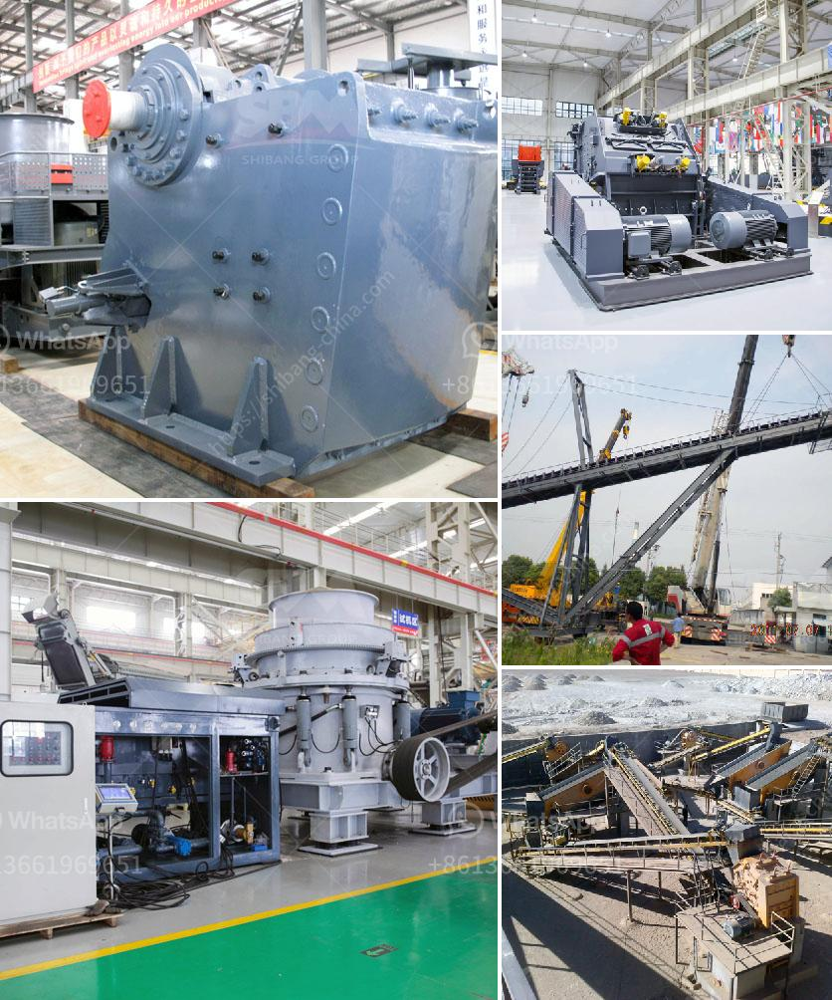

<h3>mica processing plant in jharkhand</h3>
Mica is a mineral used in a variety of industries, including electrical insulation, paint, cosmetics, and construction. It is primarily sourced from the northeastern state of Jharkhand in India, where mica deposits can be found in abundance. One of the leading mica processing plants in Jharkhand is operated by ABC Mining Company.

The mica processing plant in Jharkhand is a modern facility with state-of-the-art technology. It is well equipped to process mica sourced from the nearby mines, ensuring a steady supply of high-quality mica products. The plant follows strict quality control measures at every stage of the processing, from extraction to packaging, to ensure that the end products meet international standards.

The mica processing plant employs a skilled workforce, including engineers, technicians, and other personnel, who are trained in handling the delicate mica mineral. They ensure that there is minimal loss during the processing, thus maximizing the yield. The plant also focuses on sustainable mining practices, ensuring that the environment is not harmed during the extraction process.

One of the major challenges in mica processing is the removal of impurities, such as quartz, feldspar, and iron oxides. The plant utilizes advanced techniques to separate these impurities from the mica, resulting in a purer end product. This high-quality mica is then further processed into various forms, including flakes, powder, and blocks, based on customer requirements.

The mica products processed at the plant are widely used across industries. The electrical insulation industry utilizes mica sheets and tapes for insulation purposes in transformers, motors, and electrical equipment. The cosmetics industry relies on mica powder for its shimmering and reflective properties in various cosmetic products. Additionally, mica is used in the automotive, construction, and paint industries, among others.

The mica processing plant in Jharkhand not only contributes to the local economy but also supports the global demand for high-quality mica products. It plays a crucial role in ensuring a sustainable supply of this versatile mineral to industries worldwide. The plant's commitment to quality, sustainability, and efficient processing techniques makes it a key player in the mica industry.
<h3>Contact us</h3><ul><li><strong>Whatsapp:&nbsp;<a href="https://wa.me/8613661969651">+8613661969651</a></strong></li><li><a href="https://swt.shibang-china.com/?git&amp;zhl&amp;mica processing plant in jharkhand"><strong>Online Service(chat now)</strong></a></li></ul><h3>Related</h3><ul><li><a href='limestone grinding mill.md'>limestone grinding mill</a></li><li><a href='coal processing plant maintenance.md'>coal processing plant maintenance</a></li><li><a href='sand screening machine philippines.md'>sand screening machine philippines</a></li><li><a href='grinding machines for brick.md'>grinding machines for brick</a></li><li><a href='slag drying and grinding technique india crusher.md'>slag drying and grinding technique india crusher</a></li></ul>