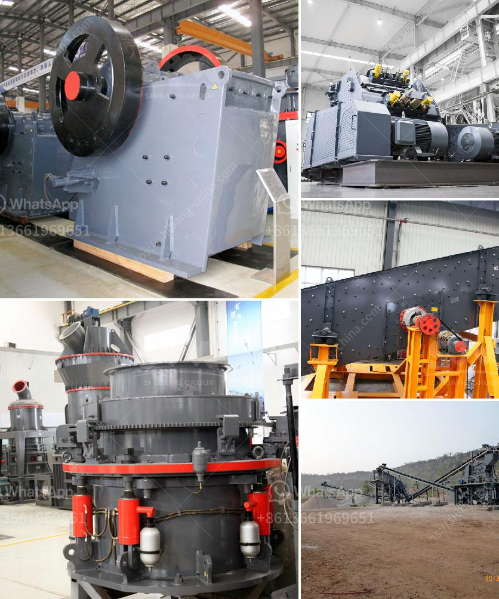

<h3>mill balls for mining</h3>
Mill balls, also known as grinding media, are one of the key factors affecting the efficiency of grinding equipment in mining operations. Grinding is a process where material is reduced in size through mechanical forces and abrasion. As a primary method of size reduction, grinding plays a crucial role in mineral processing.

Mill balls are typically made of steel or other ferrous alloys and come in various shapes and sizes. They are designed to withstand the impact and abrasion caused by the grinding process. The efficiency of grinding equipment is greatly influenced by the quality and composition of the mill balls used.

One of the most important properties of mill balls is hardness. Hardness determines the level of abrasion resistance, as well as the potential for breakage during grinding operations. High-quality mill balls are characterized by their ability to maintain their shape and hardness even under rigorous grinding conditions.

The composition of mill balls also affects their performance. Different alloying elements can be added to improve properties like hardness, toughness, or resistance to corrosion. Common alloying elements include carbon, chromium, manganese, and molybdenum. The choice of composition depends on the specific requirements of the grinding operation and the type of material being processed.

Another important consideration is the size and shape of the mill balls. The size of the balls directly impacts the grinding efficiency, as larger balls have a greater impact force and can break larger particles more effectively. Conversely, smaller balls provide a greater surface area for grinding and are more efficient for fine grinding operations.

The shape of the mill balls can also influence grinding efficiency. For example, balls with a spherical shape generally provide better grinding performance compared to irregularly shaped balls. Spherical balls have a more uniform distribution of impact forces, resulting in more efficient particle breakage.

Furthermore, the type and grade of the steel used for manufacturing mill balls play a crucial role in their performance. High-quality steel with the appropriate heat treatment ensures the balls have the desired properties, such as high hardness and resistance to wear and impact. Steel balls for grinding are usually produced through a casting and forging process to achieve the required shape and strength.

Due to the harsh conditions experienced during grinding, mill balls are subject to wear and tear. Media failure can occur due to excessive abrasion, breakage, or spalling. Regular inspection and maintenance are essential to ensure the mill balls are replaced when necessary, preventing inefficient grinding and potential damage to the equipment.

In conclusion, mill balls are vital components of grinding equipment in mining operations. Choosing the right mill balls, with the appropriate hardness, composition, size, and shape, is crucial for achieving optimum grinding efficiency. Regular maintenance and replacement of worn mill balls are necessary to ensure optimal performance and prolong the lifespan of grinding equipment.
<h3>Contact us</h3><ul><li><strong>Whatsapp:&nbsp;<a href="https://wa.me/8613661969651">+8613661969651</a></strong></li><li><a href="https://swt.shibang-china.com/?git&amp;zhl&amp;mill balls for mining"><strong>Online Service(chat now)</strong></a></li></ul><h3>Related</h3><ul><li><a href='how to build a manganese beneficiation plant.md'>how to build a manganese beneficiation plant</a></li><li><a href='companies crushing plant.md'>companies crushing plant</a></li><li><a href='stone crushing production process.md'>stone crushing production process</a></li><li><a href='200tph mobile crusher prices used.md'>200tph mobile crusher prices used</a></li><li><a href='stone crusher conveyor belts.md'>stone crusher conveyor belts</a></li></ul>