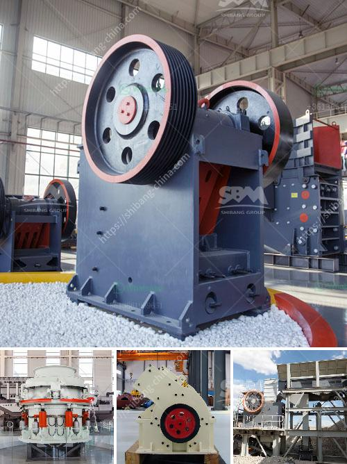

<h3>mill for barite powder</h3>
Barite is a mineral that commonly occurs in nature as veins or beds. It is a dense, chemically inert mineral that is widely used in various industries. Its primary application is as a weighting agent in drilling fluids in the oil and gas industry. However, barite powder also plays a vital role in other sectors such as paints, plastics, rubber, and pharmaceuticals. To meet the increasing demand for high-quality barite powder, mills specifically designed for its production have been developed.

A mill for barite powder is a type of industrial equipment used to crush, grind, and classify barite powder. The fineness of the finished product can be adjusted from 325 to 3000 meshes, making it suitable for a wide range of applications. These mills use different grinding mechanisms to achieve the desired particle size.

One of the commonly used mills for barite powder is the Raymond mill. This mill combines crushing, grinding, and air classification into a single unit, offering high grinding efficiency and fine particle size distribution. The grinding roller and grinding ring are made of wear-resistant materials, ensuring a long service life. Additionally, the air blower and analyzer are located above the grinding chamber, minimizing the dust emission and enhancing the product quality.

Another mill commonly used for barite powder is the ultrafine mill. This mill uses high-speed rotation and air friction to grind barite into ultrafine particles. It is particularly suitable for producing fine and ultrafine barite powder, which is required in industries such as plastics, rubbers, and paints. The ultrafine mill has a more complex structure than the Raymond mill but offers greater grinding efficiency and finer particle size.

In addition to these two mills, there are other types available, such as ball mills and vertical mills. These mills are often used in combination to achieve different particle sizes and characteristics required by various industries. Some mills can even be customized to meet specific process requirements, allowing for greater flexibility in production.

The use of mills for barite powder production offers several advantages. Firstly, it enhances the productivity and efficiency of the manufacturing process. With the ability to adjust the particle size, manufacturers can tailor the powder to their specific needs. Secondly, it improves the quality of the final product. The fine grinding process ensures a more uniform particle size distribution, resulting in better product performance. Lastly, it reduces energy consumption by optimizing the grinding process, providing a more sustainable solution.

In conclusion, mills for barite powder production are essential equipment in various industries. They offer high grinding efficiency, fine particle size control, and improved product quality. Manufacturers can choose from a variety of mills depending on their specific requirements. Investing in a mill for barite powder production can enhance productivity, improve product quality, and contribute to a sustainable manufacturing process.
<h3>Contact us</h3><ul><li><strong>Whatsapp:&nbsp;<a href="https://wa.me/8613661969651">+8613661969651</a></strong></li><li><a href="https://swt.shibang-china.com/?git&amp;zhl&amp;mill for barite powder"><strong>Online Service(chat now)</strong></a></li></ul><h3>Related</h3><ul><li><a href='small rock crusher.md'>small rock crusher</a></li><li><a href='price jaw crusher price stone crusher.md'>price jaw crusher price stone crusher</a></li><li><a href='estimated cost of setting up a quarry.md'>estimated cost of setting up a quarry</a></li><li><a href='crushing plant for sale in tanzania.md'>crushing plant for sale in tanzania</a></li><li><a href='tons per hour mobile crushers.md'>tons per hour mobile crushers</a></li></ul>