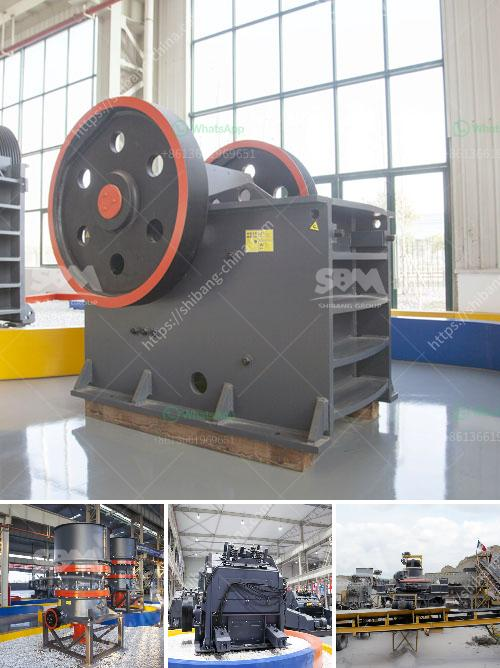

<h3>mill gypsum for sale in india</h3>
Mill gypsum is a widely used construction material that has gained immense popularity in recent years, not only in India but also around the world. Known for its durability, versatility, and cost-effectiveness, mill gypsum is a staple ingredient in the construction industry.

India, being one of the fastest-growing economies and with a significant infrastructure demand, has witnessed a surge in the need for quality construction materials. Mill gypsum has emerged as a reliable choice for builders and contractors due to its exceptional properties.

Mill gypsum is primarily obtained from natural gypsum, a mineral widely available in many parts of India. The raw gypsum is subjected to a milling process, which involves grinding it into a fine powder. This powder is then heated to eliminate any remaining moisture, resulting in a product that is highly stable and suitable for various construction applications.

One of the key advantages of mill gypsum is its outstanding fire resistance. It contains chemically combined water, which acts as a fire-resistant barrier and slows down the spread of flames. This makes it an ideal material for building fire-rated walls, ceilings, and partitions that enhance the safety of structures.

Additionally, mill gypsum offers excellent sound insulation properties, making it a popular choice for noise-sensitive areas such as theaters, recording studios, and conference rooms. Its dense composition effectively absorbs sound waves, reducing reverberation and creating a quiet environment.

Another significant advantage of mill gypsum is its ability to regulate humidity levels. It has hygroscopic properties, meaning it can absorb and release moisture according to the surrounding conditions. This makes it ideal for areas prone to high humidity or those requiring controlled moisture levels, such as basements, bathrooms, and kitchens.

The versatility of mill gypsum is further evident in its application as a decorative material. It can be easily molded and shaped into various designs, allowing architects and interior designers to create visually appealing structures. The smooth surface of mill gypsum also offers an excellent base for painting, wall papers, or other decorative finishes.

In India, the availability of mill gypsum for sale is widespread due to abundant reserves of gypsum in the country. Major gypsum-producing states such as Rajasthan, Gujarat, and Jammu and Kashmir contribute significantly to the production of mill gypsum. These areas have well-established gypsum mines and processing plants that ensure a steady supply of high-quality mill gypsum.

The market for mill gypsum in India is highly competitive, with numerous manufacturers and suppliers offering their products. As a buyer, it is essential to consider the quality, price, and reliability of the supplier. It is advisable to choose a reputable supplier who meets industry standards and has a proven track record of delivering high-quality mill gypsum.

In conclusion, mill gypsum is a versatile and durable construction material that has gained popularity in India due to its outstanding fire resistance, sound insulation properties, humidity regulation, and aesthetic appeal. With abundant reserves and a competitive market, mill gypsum for sale in India is easily accessible, making it an excellent choice for builders and contractors looking for quality construction materials.
<h3>Contact us</h3><ul><li><strong>Whatsapp:&nbsp;<a href="https://wa.me/8613661969651">+8613661969651</a></strong></li><li><a href="https://swt.shibang-china.com/?git&amp;zhl&amp;mill gypsum for sale in india"><strong>Online Service(chat now)</strong></a></li></ul><h3>Related</h3><ul><li><a href='conveyor belts manufacturers south africa.md'>conveyor belts manufacturers south africa</a></li><li><a href='cost of grinder machine mining crusher.md'>cost of grinder machine mining crusher</a></li><li><a href='sand washing machine in saudi arabia.md'>sand washing machine in saudi arabia</a></li><li><a href='famous manganese cone crusher parts made in luoyang china.md'>famous manganese cone crusher parts made in luoyang china</a></li><li><a href='categories of conveyor belts.md'>categories of conveyor belts</a></li></ul>